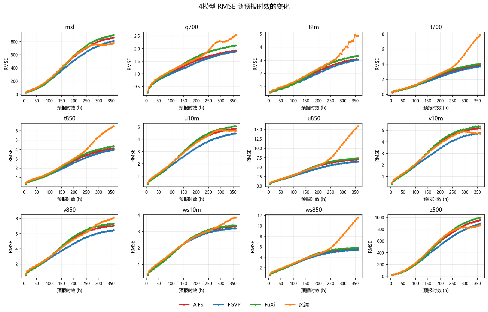
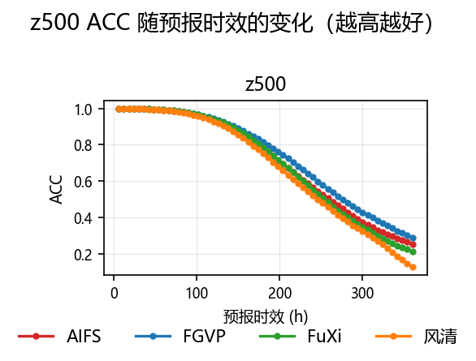
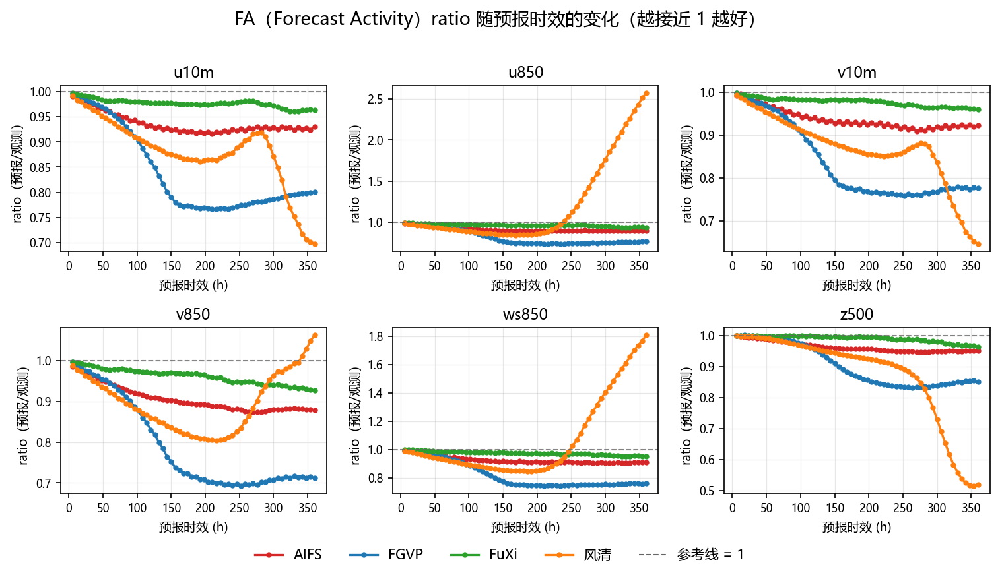
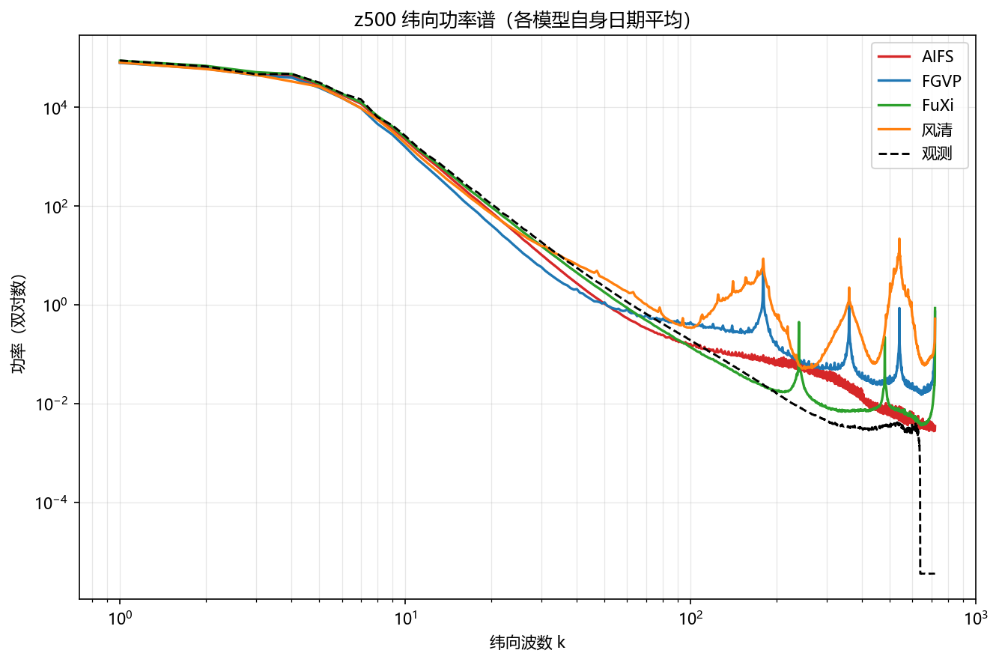

# XMETAI 确定性四模型评估检验报告（单成员）

**归档：weather_rmse_single_aifs / weather_rmse_single_fuxi / weather_rmse_single_fgvp / weather_rmse_single_fengqing**

报告日期：2026-09-15    评估层级：输出级复核

## 报告定位与衔接

报告类型：确定性单成员预报（single/det）。本报告对 AIFS、FGVP、FuXi、风清四个模型的确定性预报做统一的 RMSE / ACC / FA / 频谱对比，四者使用同一套派生指标口径（相对 RMSE、平均排名分、FA 偏差、频谱对数 RMS），变量、lead 网格与派生要素全部对齐。

> **⚠ 本版是"先看量级"的临时版，不是可用于结论的对比。**
> 四份归档的起报日**互不相交**：风清只有 2025 上半年（20250102–20250630），
> AIFS / FGVP / FuXi 只有下半年（20250701 起）。共同日期为 **0 天**。
> 因此本报告取消了骨架规定的"共同日期裁切"，所有统计都在**各模型自己的全部日期**上计算；
> 配对检验（Wilcoxon + Holm）因无同日样本对而**无法进行**，相关表格保留结构、填 "—"。
> 上半年是冬春、下半年是夏秋，环流 regime 不同，z500、温度、850 hPa 风场的 RMSE
> 本身就存在季节性系统差异。**下面所有模型间的数值差异都被时段差异污染，
> 不能解释为模型能力差异。** 等日期对齐后必须重跑。

本报告中的FA指Forecast Activity，统一使用全程6–360h、60个lead，不对FA做短中长时效分段；分时效分析仅用于RMSE。

# 1. 结论摘要

- 本版**不具备模型选型效力**：风清（2025 上半年）与 AIFS / FGVP / FuXi（下半年）的起报日交集为 0，任何跨模型的数值比较都同时包含了季节差异。
- 风清在 12 个共享 RMSE 变量中的 6 个上相对 RMSE 超过 110（u850 128.8、t700 126.2、ws850 120.7、t850 119.0、t2m 114.9、q700 110.9），综合相对 RMSE 111.06，四者中最大；但这与它独占冬春时段直接相关，不能据此判定其精度最差。
- FGVP 综合相对 RMSE 91.25 为四者最小，在 12 个变量**全部**低于四模型几何均值；但它在 FA 偏差（16.71 pp，第 3）与频谱对数 RMS（157.24×100，第 3）两项上均居中下游。
- AIFS 是唯一没有明显短板的模型：综合相对 RMSE 98.18（第 2）、ACC 70.74%（第 2）、FA 偏差 6.98 pp（第 2）、频谱对数 RMS 111.66×100（第 1），**平均排名分 1.75 为四者最优**，优于 FGVP 的 2.00。
- FuXi 的 FA 偏差 2.54 pp 为四者最小，全程 FA ratio 均值 0.975 最接近 1，但相对 RMSE 101.07 与 ACC 69.87% 均排第 3。
- 风清在 360 h 的 u850 FA ratio 达到 2.5691（其余三家 0.767–0.941），850 hPa 风场的活动度在长时效被显著高估；同时其 z500 ratio 仅 0.5187（其余 0.852–0.963），低层与高层出现方向相反的系统性偏差。
- 逐时效领先统计：FGVP 49 个 lead、FuXi 11 个 lead、AIFS 与风清均为 0 个；但 6–48 h 的领先者是 FuXi（6 h 92.43 对 FGVP 101.99），FGVP 的优势从 72 h 才开始建立。

# 2. 样本与完整性

**样本与完整性**

| **模型** | **有效日期数** | **日期范围** | **共同日期** | **非共同日期** |
| --- | --- | --- | --- | --- |
| AIFS | 169 | 20250701–20251216 | 0 | 169 |
| FGVP | 184 | 20250701–20251231 | 0 | 184 |
| FuXi | 184 | 20250701–20251231 | 0 | 184 |
| 风清 | 180 | 20250102–20250630 | 0 | 180 |

**完整性检查**

| **模型** | **n_ok/n_dates** | **summary 行数** | **日期集合** | **缺失文件** | **NaN RMSE** | **额外目录** |
| --- | --- | --- | --- | --- | --- | --- |
| AIFS | 169/169 | 169 | 连续至 20251216 | 无 | 无 | 无 |
| FGVP | 184/184 | 184 | 连续至 20251231 | 无 | 无 | 无 |
| FuXi | 184/184 | 184 | 连续至 20251231 | 无 | 无 | 无 |
| 风清 | 180/180 | 180 | 连续至 20250630 | 无 | 无 | 无 |

四份归档的 `summary.csv` 行数与有效日期数一一相等，12 个共享变量的逐日 RMSE 均无整列为 NaN 的情况，变量覆盖完整，没有发现缺文件或残缺场次。

两两日期交集进一步确认了时段不相交这一前提：AIFS ∩ FuXi = 169、AIFS ∩ FGVP = 169、FuXi ∩ FGVP = 184，而风清与其余三者的交集**均为 0**。

**归档口径说明**：四个目录都是 `--summarize-det` 的批次聚合产物，只含聚合表（`summary.csv` + `mean_*.csv`），不含 `<YYYYMMDD>/` 逐日目录，也不含 `batch_meta.json`。因此逐日 ACC 与逐日频谱不可得，第 5 节的 ACC 与频谱只能从跨日平均表上计算，与"逐日求指标再平均"不等价。

## 指标口径说明（FA）

本报告中的FA仅指Forecast Activity。为避免与降水二分类指标False Alarm（同样缩写为FA）混淆，FA统一采用全程6–360h、共60个lead的统计结果，不做短、中、长时效分段；文中的分时效比较仅针对RMSE，并明确排除u850。

# 3. 总体模型表现

**四模型总体指标**

| **排名** | **模型** | **相对 RMSE** | **ACC (%)** | **FA 偏差(全程, pp)** | **频谱 RMS×100** | **平均排名分** |
| --- | --- | --- | --- | --- | --- | --- |
| 1 | FGVP | 91.25 | 73.63 | 16.71 | 157.24 | 2.00 |
| 2 | AIFS | 98.18 | 70.74 | 6.98 | 111.66 | 1.75 |
| 3 | FuXi | 101.07 | 69.87 | 2.54 | 113.63 | 2.25 |
| 4 | 风清 | 111.06 | 67.49 | 17.15 | 224.63 | 4.00 |

**综合相对 RMSE 配对 Wilcoxon + Holm 检验**

| **比较** | **相对变化 A vs B (%)** | **Holm 显著** | **显著优者** | **Holm p** |
| --- | --- | --- | --- | --- |
| AIFS vs FGVP | — | — | — | — |
| AIFS vs FuXi | — | — | — | — |
| AIFS vs 风清 | — | — | — | — |
| FGVP vs FuXi | — | — | — | — |
| FGVP vs 风清 | — | — | — | — |
| FuXi vs 风清 | — | — | — | — |

相对RMSE为100时表示四模型几何均值基线；越低越好。**上表六对比较全部无法进行**：Wilcoxon 符号秩检验是配对检验，要求同一日期上两个模型都有取值，而四份归档的日期集合两两不相交（风清与其余三者的交集均为 0），样本对为空。本报告不采用非配对检验替代，以免得到与口径不符的显著性结论。排名提示句：FGVP 的综合相对 RMSE 最低，但平均排名分最高的却是 AIFS（1.75 对 2.00），两个口径给出不同答案，说明单看 RMSE 会遗漏 FA 与频谱上的差异。

# 4. RMSE 分变量结果

**分变量 RMSE（各模型自身日期平均）**

| **变量** | **AIFS** | **FGVP** | **FuXi** | **风清** | **Best** |
| --- | --- | --- | --- | --- | --- |
| msl | 480.007 | **440.946** | 491.882 | 469.468 | FGVP |
| q700 | 1.361 | **1.282** | 1.439 | 1.560 | FGVP |
| t2m | 1.953 | **1.874** | 2.046 | 2.354 | FGVP |
| t700 | 2.221 | **2.099** | 2.316 | 3.014 | FGVP |
| t850 | 2.448 | **2.309** | 2.536 | 3.062 | FGVP |
| u10m | 3.169 | **2.855** | 3.245 | 3.170 | FGVP |
| u850 | 4.544 | **4.114** | 4.683 | 6.225 | FGVP |
| v10m | 3.336 | **3.013** | 3.405 | 3.277 | FGVP |
| v850 | 4.579 | **4.130** | 4.716 | 4.754 | FGVP |
| ws10m | 2.326 | **2.245** | 2.322 | 2.405 | FGVP |
| ws850 | 3.923 | **3.749** | 3.986 | 4.995 | FGVP |
| z500 | 502.680 | **461.864** | 517.978 | 502.050 | FGVP |

**分变量配对检验显著性汇总**

| **模型对** | **A 显著更优变量数** | **B 显著更优变量数** | **无显著差异** | **总变量数** |
| --- | --- | --- | --- | --- |
| AIFS vs FGVP | — | — | — | 12 |
| AIFS vs FuXi | — | — | — | 12 |
| AIFS vs 风清 | — | — | — | 12 |
| FGVP vs FuXi | — | — | — | 12 |
| FGVP vs 风清 | — | — | — | 12 |
| FuXi vs 风清 | — | — | — | 12 |

同样因日期不相交而无法做配对检验。第 6.2 节给 A、B 两列补上模型名。

# 5. ACC、FA（Forecast Activity，全程6–360h）与频谱

**四模型 ACC、FA 与频谱**

| **模型** | **ACC (%)** | **FA 偏差(全程, pp)** | **频谱对数 RMS×100** |
| --- | --- | --- | --- |
| AIFS | 70.74 | 6.98 | 111.66 |
| FGVP | 73.63 | 16.71 | 157.24 |
| FuXi | 69.87 | 2.54 | 113.63 |
| 风清 | 67.49 | 17.15 | 224.63 |

**ACC 配对检验**

| **比较** | **ACC 差 A-B (pp)** | **Holm 显著** | **显著优者** | **Holm p** |
| --- | --- | --- | --- | --- |
| AIFS vs FGVP | — | — | — | — |
| AIFS vs FuXi | — | — | — | — |
| AIFS vs 风清 | — | — | — | — |
| FGVP vs FuXi | — | — | — | — |
| FGVP vs 风清 | — | — | — | — |
| FuXi vs 风清 | — | — | — | — |

ACC 数值特征句：四者在 6 h 的 ACC 全部落在 99.97–99.98%，几乎无差别；差异从中期才开始拉开——120 h 时 FGVP 94.40%、FuXi 94.22%、AIFS 93.63%、风清 92.85%，到 240 h 变为 FGVP 62.08%、AIFS 56.66%、FuXi 55.16%、风清 52.00%，360 h 进一步降到 FGVP 28.66%、AIFS 25.37%、FuXi 21.05%、风清 12.75%。风清在 240 h 与 360 h 的 ACC 明显低于其余三者，与它在 t700、u850 上的 RMSE 偏高一致。四者的首时效 ACC 均超过 99.0% 的饱和阈值，见第 6.3 节。

FA 方面，按全程 ratio 均值与 1 的距离排序为 FuXi 0.975、风清 0.965、AIFS 0.930、FGVP 0.833，FuXi 最接近理想值；但风清的偏离方向与其余三家相反——其 360 h 的 u850 ratio 为 2.5691、ws850 为 1.8066，而 u10m 0.6974、z500 0.5187，低层风场活动度被高估、高层位势与地面风被低估。

# 6. 异常与风险

## 6.1 u850 异常偏高

**各模型自身日期平均 u850 RMSE**

| **模型** | **平均 u850 RMSE** |
| --- | --- |
| FGVP | 4.114 |
| AIFS | 4.544 |
| FuXi | 4.683 |
| 风清 | 6.225 |

**逐时效倍数（风清 / 其他三模型中位数）**

| **Lead (h)** | **风清 / 其他三模型中位数** |
| --- | --- |
| 6 | 1.240 |
| 12 | 1.131 |
| 18 | 1.139 |
| 24 | 1.125 |
| 30 | 1.128 |
| 36 | 1.116 |
| 42 | 1.116 |
| 48 | 1.109 |
| 54 | 1.104 |
| 60 | 1.095 |
| 66 | 1.085 |
| 72 | 1.073 |
| 78 | 1.060 |
| 84 | 1.049 |
| 90 | 1.039 |
| 96 | 1.033 |
| 102 | 1.022 |
| 108 | 1.013 |
| 114 | 1.005 |
| 120 | 1.002 |
| 126 | 1.002 |
| 132 | 1.000 |
| 138 | 1.001 |
| 144 | 1.000 |
| 150 | 1.000 |
| 156 | 0.998 |
| 162 | 0.999 |
| 168 | 0.996 |
| 174 | 0.996 |
| 180 | 0.994 |
| 186 | 0.997 |
| 192 | 0.999 |
| 198 | 1.003 |
| 204 | 1.009 |
| 210 | 1.020 |
| 216 | 1.034 |
| 222 | 1.052 |
| 228 | 1.074 |
| 234 | 1.102 |
| 240 | 1.131 |
| 246 | 1.169 |
| 252 | 1.210 |
| 258 | 1.263 |
| 264 | 1.315 |
| 270 | 1.378 |
| 276 | 1.437 |
| 282 | 1.504 |
| 288 | 1.562 |
| 294 | 1.628 |
| 300 | 1.688 |
| 306 | 1.749 |
| 312 | 1.801 |
| 318 | 1.867 |
| 324 | 1.926 |
| 330 | 1.987 |
| 336 | 2.038 |
| 342 | 2.103 |
| 348 | 2.156 |
| 354 | 2.207 |
| 360 | 2.244 |

异常判读与建议句：u850 是四模型中离散度最大的变量，风清的值（6.225）是其余三家（4.114–4.683）的 1.35 倍，被判定为异常变量。该倍数随预报时效呈**明显的 U 形**：6 h 为 1.240，随后单调下降，在 150–190 h 降到 0.994–1.000 —— 也就是说**在中时效区间风清的 u850 反而略优于其余三家的中位数**；此后转为单调上升，到 360 h 达到 2.244，是中时效谷底的 2.26 倍。因此风清的 u850 问题不是全局性的，而是**两端高、中间平**：短时效的 1.24 倍可以用冬季 850 hPa 风场本身更强来解释，真正需要解释的是中时效之后那条持续抬升的尾巴——它从 198 h 的 1.003 起几乎线性地涨到 360 h 的 2.244，与第 5 节中该时段 ratio 高达 2.5691（活动度被大幅高估）方向一致。**但必须强调：风清独占冬春时段，而 850 hPa 风场的 RMSE 具有强季节性，这个 1.35 倍里有多少来自季节、多少来自模型，本版数据无法拆分。**

## 6.2 变量覆盖不完整

**声明变量数与汇总变量数**

| **模型** | **声明变量数** | **汇总变量数** | **汇总缺失变量** |
| --- | --- | --- | --- |
| AIFS | 12 | 12 | 无 |
| FGVP | 13 | 13 | 无 |
| FuXi | 12 | 12 | 无 |
| 风清 | 12 | 12 | 无 |

变量覆盖判读句：四者的声明变量数与汇总变量数完全一致，没有任何一侧出现声明了却没落盘的情况。FGVP 比其他三家多一个 d2m（13 对 12），它不在四者共有的 12 个变量里，因此不参与综合相对 RMSE 与分变量对比；其余 12 个共享变量为 msl、q700、t2m、t700、t850、u10m、u850、v10m、v850、ws10m、ws850、z500。

## 6.3 ACC 定义风险

ACC 定义判读句：四模型首时效 ACC 均在 99.97% 以上，超过 99.0% 的饱和阈值。在这种饱和区间内，ACC 的绝对值差异没有区分度，也不能反映预报质量——四者在 6 h 的差距（99.9682%–99.9753%）远小于任何合理的数值噪声。本报告的 ACC 对比结论只应在 120 h 之后使用，240 h 及以后差异才真正展开。此外，本报告只有逐 lead 的 ACC 平均表，没有逐日 ACC，因此无法给出 ACC 的离散度或置信区间。

## 6.4 原始场独立复算不足

复算充分性判读句：本报告的全部数字均来自四个批次聚合目录中的 `summary.csv` 与 `mean_*.csv`，这些表由 `--summarize-det` 一次算出，**没有对原始预报场与 ERA5 目标场做任何独立复算**。因此本报告只能验证四个模型之间的相对关系，不能验证聚合表本身的正确性。特别地，风清的 q 存在单位口径问题（其推理框架输出 kg/kg，与 FuXi/FGVP 的 g/kg 相反，评测侧需要 `pred_q_scale` 匹配），本版未能独立核对 q700 的绝对量级是否落在合理范围。在日期对齐重跑时，建议对至少一个日期做原始场复算作为交叉验证。

# 7. 验收建议

- **本版不通过验收、不用于选型。** 四份归档起报日不相交（风清上半年、其余下半年），共同日期为 0，全部跨模型数值比较受季节差异污染，配对检验无法进行。
- 补数据时优先补风清的 2025 下半年（只涉及 1 个模型），其次是补 AIFS / FGVP / FuXi 的上半年（3 个模型）；两者取其一即可让共同日期非空。
- 日期对齐后重新生成上一年度口径的报告，届时第 3、4、5 节的配对检验表才能填实数。
- 本版可用于排查工程问题，不可用于回答"哪个模型更准"。
- 建议补一份逐日 ACC 与逐日频谱的输出，否则 ACC 与频谱的配对检验永远做不了，频谱对数 RMS 也只能停留在跨日平均口径。
- 风清的 u850 相对倍数在 198–360 h 之间从 1.003 单调涨到 2.244，且 360 h 的 FA ratio 达 2.5691，建议单独复算一个长时效日期确认，排除聚合或长时效数据截断的问题。

# 8. 四模型具体对比说明

本节在各自日期、12 个共享RMSE变量、1 个 ACC 变量（z500）、6 个FA ratio变量和7个频谱变量的统一口径下，对4个模型进行逐项比较。所有配对检验均使用Wilcoxon符号秩检验并进行Holm多重校正；统计显著不代表业务差异一定具有实际重要性。**本版因无共同日期，配对检验全部无法进行，本节只给描述性统计。**

**四模型综合对比**

| **模型** | **综合相对RMSE** | **ACC** | **FA偏差(pp)** | **频谱对数RMS×100** | **主要优势** | **主要短板** |
| --- | --- | --- | --- | --- | --- | --- |
| FGVP | 91.25（第1） | 73.63%（第1） | 16.71（第3） | 157.24（第3） | RMSE 全面领先，12 变量全部最优 | FA 活动度明显偏低（360 h u850 ratio 0.767），小尺度能量偏强 |
| AIFS | 98.18（第2） | 70.74%（第2） | 6.98（第2） | 111.66（第1） | 无短板，平均排名分 1.75 最优，频谱最接近观测 | 无单项第一，RMSE 与 FGVP 有稳定差距 |
| FuXi | 101.07（第3） | 69.87%（第3） | 2.54（第1） | 113.63（第2） | FA 偏差最小，全程 ratio 均值 0.975 最接近 1 | RMSE 与 ACC 均排第 3，360 h ACC 仅 21.05% |
| 风清 | 111.06（第4） | 67.49%（第4） | 17.15（第4） | 224.63（第4） | 6 h 路径外无明显优势项 | 四项指标全部垫底；长时效 u850 活动度失控、z500 活动度不足 |

## 8.1 逐模型结论

- **FGVP**：综合相对 RMSE 91.25 为四者最低，12 个共享变量全部取得最小值，其中 u850（85.15）、t700（87.88）、t850（89.71）相对优势最大。但它的 FA 偏差 16.71 pp 和频谱对数 RMS 157.24×100 均排第 3，360 h 的 u850 ratio 低至 0.767、v850 低至 0.713，说明其预报场在长时效偏平滑、活动度不足，同时 z500 在波数 100 的谱能量为 0.445（观测 0.192），小尺度能量反而偏强。
- **AIFS**：综合相对 RMSE 98.18 排第 2，ACC 70.74% 排第 2，FA 偏差 6.98 pp 排第 2，频谱对数 RMS 111.66×100 排第 1，四项指标全部进入前二，平均排名分 1.75 为四者最优。它在 12 个变量中没有一项取得最小值，但也没有一项超过 103（最大为 v10m 102.51），是四者中表现最均衡的。
- **FuXi**：FA 偏差 2.54 pp 为四者最小，全程 FA ratio 均值 0.975 最接近理想值 1，360 h 的 u850 ratio 0.941 也是四者中最接近 1 的。代价是 RMSE 与 ACC 均排第 3：综合相对 RMSE 101.07，ACC 69.87%，360 h 的 ACC 仅 21.05%，低于 AIFS 的 25.37% 和 FGVP 的 28.66%。
- **风清**：四项总体指标全部垫底，综合相对 RMSE 111.06、ACC 67.49%、FA 偏差 17.15 pp、频谱对数 RMS 224.63×100。12 个变量中 6 个相对 RMSE 超过 110，u850（128.84）、t700（126.20）偏差最大；240 h 与 360 h 的 ACC 分别为 52.00% 与 12.75%，长时效衰减最快。**风清是唯一覆盖 2025 上半年的模型，上述劣势与冬春季节直接相关，不能据此判定其真实精度最差。**

## 8.2 关键配对差异

**关键配对差异**

| **模型对** | **综合差异** | **显著更优变量数** | **解释** |
| --- | --- | --- | --- |
| AIFS vs FGVP | — | — | 无共同日期，配对检验不可做；描述性差异：综合相对 RMSE 98.18 对 91.25，FGVP 低 6.93 |
| AIFS vs FuXi | — | — | 无共同日期，配对检验不可做；描述性差异：综合相对 RMSE 98.18 对 101.07，AIFS 低 2.89 |
| AIFS vs 风清 | — | — | 日期完全不相交（交集 0），连描述性差异都被季节混淆，差异 98.18 对 111.06 不可解释 |
| FGVP vs FuXi | — | — | 无共同日期，配对检验不可做；描述性差异：综合相对 RMSE 91.25 对 101.07，FGVP 低 9.82 |
| FGVP vs 风清 | — | — | 日期完全不相交（交集 0），差异 91.25 对 111.06 不可解释 |
| FuXi vs 风清 | — | — | 日期完全不相交（交集 0），差异 101.07 对 111.06 不可解释 |

# 9. u850 敏感性分析与分时效对比

u850 是第 6.1 节判定的异常变量，本节检验它是否主导了总体排序。

**含/不含u850两种口径**

| **口径** | **AIFS** | **FGVP** | **FuXi** | **风清** | **结论** |
| --- | --- | --- | --- | --- | --- |
| 含u850 | 98.18 | 91.25 | 101.07 | 111.06 | FGVP < AIFS < FuXi < 风清 |
| 不含u850 | 98.55 | 91.81 | 101.45 | 109.44 | FGVP < AIFS < FuXi < 风清 |

敏感性结论句：剔除 u850 后四者的综合相对 RMSE 变化很小（AIFS +0.37、FGVP +0.55、FuXi +0.37、风清 −1.62），**排序完全不变**。说明 u850 的异常虽然幅度大，但它是单一变量，在 12 变量等权平均下不足以改变总体结论。风清是唯一因剔除而改善的模型（111.06 → 109.44），与其 u850 相对 RMSE 128.84 为四者最高一致。

**分时效段相对综合RMSE**

| **时效段** | **最佳模型** | **四模型相对综合RMSE排序（越低越好）** | **说明** |
| --- | --- | --- | --- |
| 6–120h | FGVP | FGVP 96.53 < FuXi 97.31 < AIFS 100.34 < 风清 106.14 | 短中期 FuXi 与 FGVP 接近，差距仅 0.79 |
| 126–240h | FGVP | FGVP 92.14 < AIFS 100.66 < 风清 103.77 < FuXi 103.99 | 中期 FGVP 拉开，AIFS 稳定第 2，FuXi 掉到第 4 |
| 246–360h | FGVP | FGVP 89.64 < AIFS 95.98 < FuXi 100.58 < 风清 117.48 | 长时效 FGVP 优势扩大，风清显著恶化 |

分时效口径说明句：本表用逐 lead 的平均 RMSE 先按段平均、再做相对化，与第 3 节"先逐日平均再相对化"略有差异，因为聚合表不含逐日逐 lead 的交叉数据。三段的最佳模型都是 FGVP，但 6–120 h 段的领先幅度很小（96.53 对 97.31），逐时效看该段实际由 FuXi 主导：6 h FuXi 92.43、24 h 94.79、48 h 95.25、72 h 与 FGVP 几乎并列（96.67 对 96.67），FGVP 从 96 h 起才稳定领先。风清在三段中分别排第 4、第 3、第 4，长时效段的 117.48 与 FGVP 的 89.64 相差 31%。

# 10. 总述结论

- 本版报告的全部跨模型结论都受时段差异污染，**唯一可靠的结论是工程性的**：四份归档的变量、lead 网格、派生要素完全对齐，聚合表本身完整无缺失，报告链路可以跑通；一旦日期对齐即可产出正式对比。
- 按时段拆开看，AIFS / FGVP / FuXi 三者（同为 2025 下半年）的相对关系是可信的：FGVP 综合相对 RMSE 91.25 最低，AIFS 98.18 居中，FuXi 101.07 最高；同时 AIFS 的平均排名分 1.75 优于 FGVP 的 2.00，因为 FGVP 在 FA（16.71 pp）与频谱（157.24×100）上明显落后。
- 三者内部的分工也很清楚：FGVP 强在 RMSE 与 ACC（73.63% 对 AIFS 70.74%、FuXi 69.87%），AIFS 强在频谱保真（111.66×100 为三者最优），FuXi 强在 FA 偏差（2.54 pp，约为 FGVP 的 1/6.6）。
- 短时效与中长时效的领先者不同：6–48 h 由 FuXi 领先（6 h 92.43 对 FGVP 101.99），FGVP 从 96 h 起接手并一路扩大到 360 h 的 88.67 对 FuXi 的 98.21。若业务上关心 48 h 以内的短期形势，FuXi 值得单独考察。
- 风清的数值全面偏低，但其观测窗口（冬春）本身 RMSE 基数更大。唯一值得单独追查的是它的 u850：相对其余三家中位数的倍数在 150–190 h 低到 0.994（该段反而更好），却在 198 h 之后单调抬升到 360 h 的 2.244，同时 360 h 的 FA ratio 达 2.5691，说明长时效 850 hPa 风场的活动度被大幅高估——这个"中时效正常、长时效失控"的形态不像季节效应，建议单独复算确认。
- 在所有指标上都不存在"一个模型全面最优"的情况：FGVP 拿 RMSE 第一、FuXi 拿 FA 第一、AIFS 拿频谱第一与排名分第一，**四模型对比必须按应用目标分别选型**。

# 11. 最终选型建议

**分场景选型建议**

| **应用目标** | **推荐模型** | **理由** |
| --- | --- | --- |
| 总体精度优先（RMSE / ACC） | FGVP | 综合相对 RMSE 91.25 最低，12 变量全部最优；ACC 73.63% 最高。但需接受其 FA 偏差 16.71 pp 与偏弱的长时效活动度 |
| 综合稳健、无单项短板 | AIFS | 四项指标全部进入前二，平均排名分 1.75 最优，频谱对数 RMS 111.66×100 最接近观测 |
| 预报场活动度保真（FA） | FuXi | FA 偏差 2.54 pp 最小，全程 ratio 均值 0.975，360 h 的 u850 ratio 0.941 最接近 1 |
| 48 h 以内短期形势 | FuXi | 6–48 h 逐时效相对综合 RMSE 均为最低（6 h 92.43、24 h 94.79、48 h 95.25） |
| 96 h 以上中长期 | FGVP | 96 h 起稳定领先，360 h 相对综合 RMSE 88.67，比 AIFS 低 5.0 |
| 风清 | 暂不选型 | 本次数据只覆盖 2025 上半年，与其余三家不可比；且长时效 u850 存在待确认的异常 |

> **上表基于时段不齐的数据，仅供内部排查参考，不得作为业务选型依据。**
> 日期对齐后必须重跑本报告。

# 附录：四模型曲线图

本附录使用四个模型**各自的**全部日期（AIFS 169 天、FGVP 184 天、FuXi 184 天、风清 180 天；四者共同日期为 0，故无法使用共同日期）。以下每张图均包含 AIFS、FGVP、FuXi、风清四条模型曲线。正文统计表与图中曲线使用同一批数据。

## 附 1 RMSE：12个变量四模型曲线

每幅子图包含 AIFS、FGVP、FuXi、风清四条曲线。

图 1：12 个共享变量的 RMSE 随预报时效（6–360 h，每 6 h 一个点）变化曲线，四条颜色曲线对应四个模型，纵轴为 RMSE、横轴为预报时效。各模型使用自身可用日期平均。

## 附 2 z500 ACC：四模型曲线

四条曲线对应四个模型，纵轴越高越好。

图 2：z500 的 ACC 随预报时效变化曲线。四者在 6 h 均超过 99.97% 而重合，差异从 120 h 起展开，240 h 后快速下降；风清（2025 上半年）在 240 h 与 360 h 明显低于其余三者。

## 附 3 FA（Forecast Activity）：6个变量、全程6–360h 四模型曲线

每个子图均包含四条模型曲线，并覆盖全部60个lead（6–360h）；ratio越接近1越好。

图 3：6 个共享 FA 变量（u10m、u850、v10m、v850、ws850、z500）的 FA ratio 随预报时效变化曲线，参考线为 1.0。FGVP 在长时效系统性低于 1（360 h u850 0.767），风清的 u850 与 ws850 则在 300 h 后越过 1 并快速上升（360 h 分别为 2.569 与 1.807）。

## 附 4 z500 功率谱：四模型曲线

双对数坐标；四条颜色曲线对应四个模型的预测谱。观测谱为黑色虚线。

图 4：z500 纬向功率谱（各模型自身日期平均），横轴为波数、纵轴为谱能量，双对数坐标。在波数 1 处观测为 88727.7，FuXi 87586.9 最接近，AIFS 82274.7、风清 80852.9、FGVP 79336.1 依次偏低；在波数 100 处观测为 0.1921，AIFS 0.1613 与 FuXi 0.1395 偏低，FGVP 0.4450 与风清 0.3485 则明显偏高，说明两者在小尺度上能量偏强。
