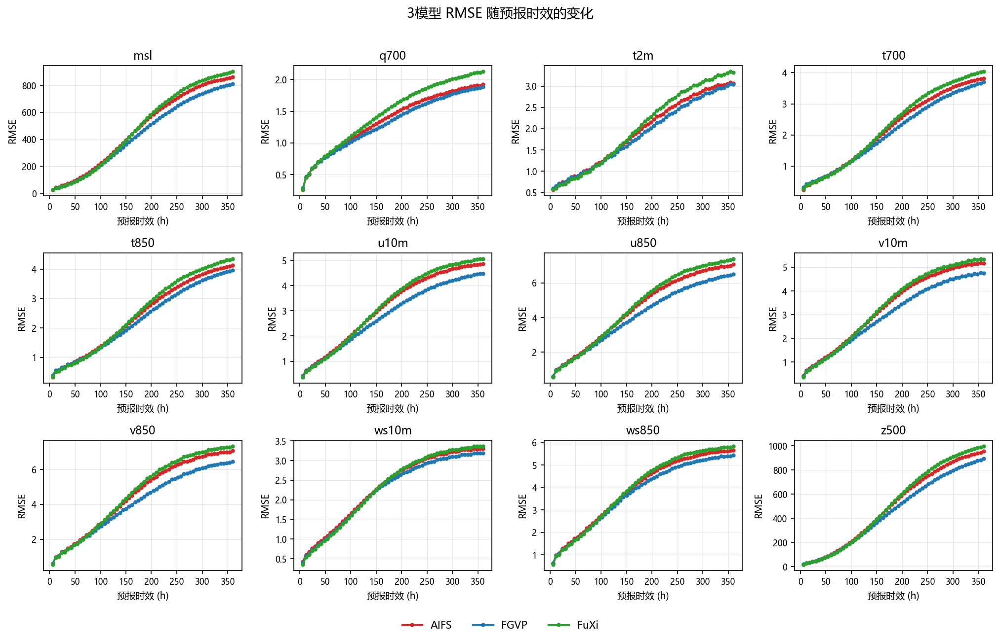
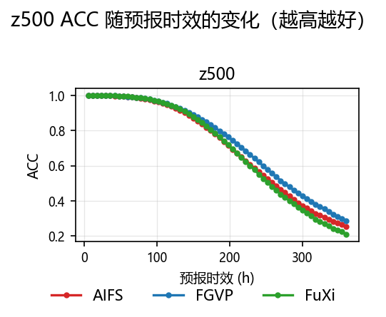
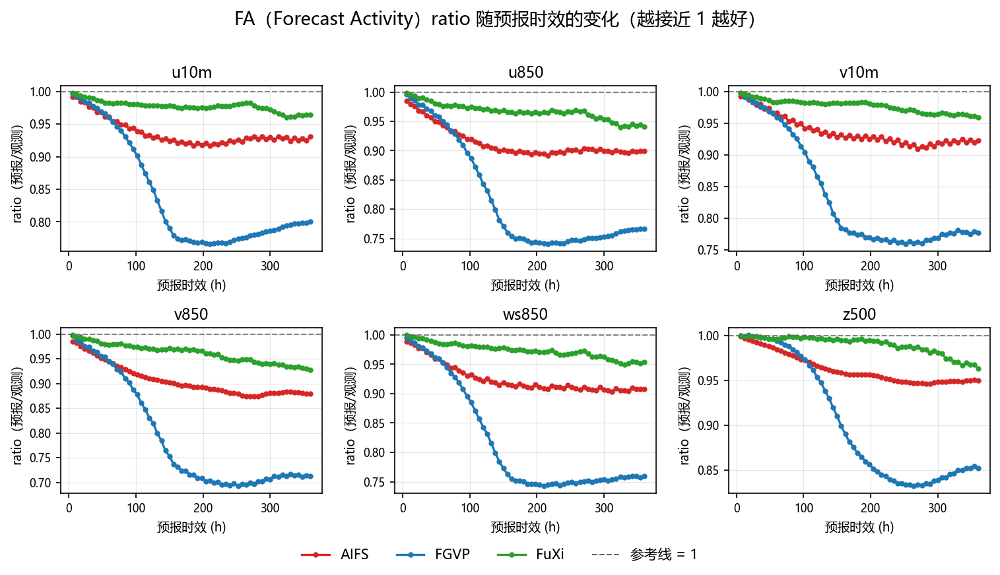
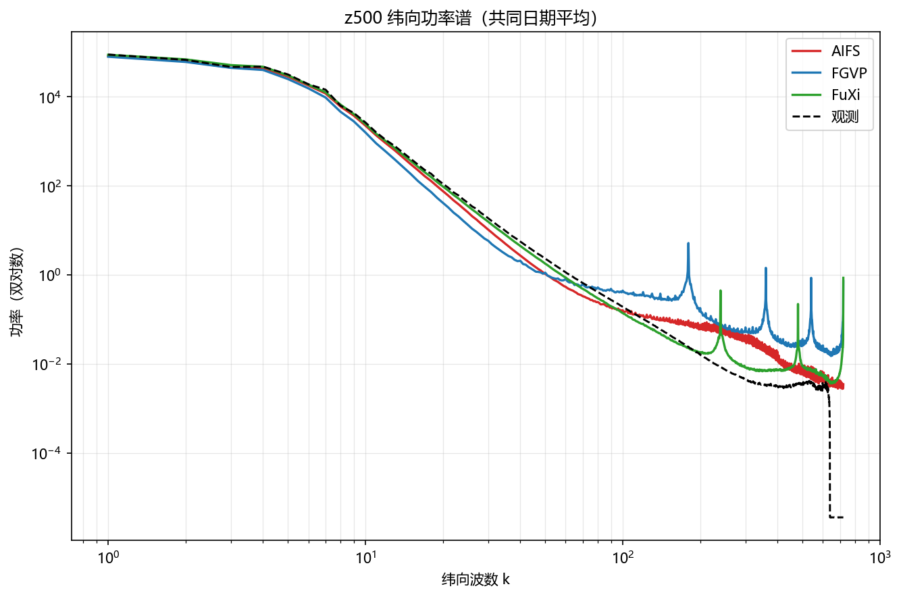

# XMETAI 确定性三模型评估检验报告（单成员）

**归档：weather_rmse_single_fgvp、weather_rmse_single_fuxi、weather_rmse_single_aifs**

报告日期：2026-09-15    评估层级：输出级复核

## 报告定位与衔接

报告类型：确定性单成员预报（single/det）。本报告覆盖 3 个模型的批次归档目录，以 **FGVP 为本模型**，FuXi 与 AIFS 为对照；正文与附录统一使用 169 个共同日期（20250701–20251216），逐日结果按 lead 平均后比较；非共同日期不参与任何统计。

本报告中的FA指Forecast Activity，统一使用全程6–360h、60个lead，不对FA做短中长时效分段；分时效分析仅用于RMSE。

# 1. 结论摘要

• 共同日期 169 天（20250701–20251216）；综合相对 RMSE 最好 FGVP（94.183），最差 FuXi（104.472），AIFS 居中（101.664）。
• FGVP 在 12 个共享 RMSE 变量上**全部**显著优于 FuXi 与 AIFS（12 : 0 / 12 : 0），综合相对 RMSE 分别低 9.833% 与 7.939%，Holm p = 5.24e-29。
• ACC 最好 FGVP（73.627%），FA 偏差最小 FuXi（2.5429 pp），频谱对数 RMS×100 最小 AIFS（111.66）。
• 平均排名分：AIFS 1.8、FGVP 2.0、FuXi 2.3 —— FGVP 虽在综合 RMSE 与 ACC 上均列第一，却因 FA 偏差与频谱保真两项都排第 3 而丢掉均衡分。
• 综合相对 RMSE 上三个模型对**全部**通过 Holm 校正（p < 0.05）：FGVP 优于 AIFS、FGVP 优于 FuXi、AIFS 优于 FuXi。
• **FGVP 的 RMSE 优势伴随明显的振幅衰减**：FA 偏差 16.7117 pp（FuXi 2.5429、AIFS 6.9765），360h 的 FA ratio 已落到 0.7128–0.8516。
• q700 存在模型间量级差异（FuXi 为其余两模型中位数的 1.08 倍），已在 6.1 与第 9 节单独分析。

# 2. 样本与完整性

**样本与完整性**

| **模型** | **有效日期数** | **日期范围** | **共同日期** | **非共同日期** |
| --- | --- | --- | --- | --- |
| AIFS | 169 | 20250701–20251216 | 169 | 0 |
| FGVP | 184 | 20250701–20251231 | 169 | 15 |
| FuXi | 184 | 20250701–20251231 | 169 | 15 |

**完整性检查**

| **模型** | **n_ok/n_dates** | **summary 行数** | **日期集合** | **缺失文件** | **NaN RMSE** | **额外目录** |
| --- | --- | --- | --- | --- | --- | --- |
| AIFS | — | 169 | 169 天 | — | 无 | — |
| FGVP | — | 184 | 184 天 | — | 无 | — |
| FuXi | — | 184 | 184 天 | — | 无 | — |

三个归档都是 `--summarize-det` 的**聚合口径**产物：目录里只有 `summary.csv` 与 `mean_*.csv`，**没有 `batch_meta.json`、没有 `<YYYYMMDD>/` 逐日明细**。因此「n_ok/n_dates」「缺失文件」「额外目录」三栏无从核对，一律记 —；完整性只能从 `summary.csv` 自身判断，三家行数（169 / 184 / 184）与各自声明的有效日期数一致，无全 NaN 的 RMSE 变量，也没有声明了却没算出来的变量。

正文与附录统一使用 3 个模型共同的 169 个日期（20250701–20251216）。**FGVP 与 FuXi 各有 15 天（20251217–20251231）因 AIFS 缺失而不参与任何统计与曲线**——这一段三个模型的样本期本就不同，若按各自的全部日期平均，AIFS 那一列与另两列将不是同一批样本，不可比。裁齐之后各表样本量一致、可直接横向比较。

## 指标口径说明（FA）

本报告中的FA仅指Forecast Activity。为避免与降水二分类指标False Alarm（同样缩写为FA）混淆，FA统一采用全程6–360h、共60个lead的统计结果，不做短、中、长时效分段；文中的分时效比较仅针对RMSE，并明确排除q700。

# 3. 总体模型表现

**3模型总体指标**

| **排名** | **模型** | **相对 RMSE** | **ACC (%)** | **FA 偏差(全程, pp)** | **频谱 RMS×100** | **平均排名分** |
| --- | --- | --- | --- | --- | --- | --- |
| 1 | FGVP | 94.183 | 73.627 | 16.7117 | 157.24 | 2.0 |
| 2 | AIFS | 101.664 | 70.744 | 6.9765 | 111.66 | 1.8 |
| 3 | FuXi | 104.472 | 69.871 | 2.5429 | 113.63 | 2.3 |

**综合相对 RMSE 配对 Wilcoxon + Holm 检验**

| **比较** | **相对变化 A vs B (%)** | **Holm 显著** | **显著优者** | **Holm p** |
| --- | --- | --- | --- | --- |
| AIFS vs FGVP | +7.94 | 是 | FGVP | 5.24e-29 |
| AIFS vs FuXi | -2.68 | 是 | AIFS | 3.73e-15 |
| FGVP vs FuXi | -9.83 | 是 | FGVP | 5.24e-29 |

相对RMSE为100时表示3模型几何均值基线；越低越好。FGVP 的综合相对 RMSE 最低（94.183），FuXi 最高（104.472）；表内检验全部基于 169 个共同日期的逐日配对，Holm p < 0.05 才算显著。

> **「排名」列与「平均排名分」列不是一回事。** 前者只按综合相对 RMSE 排（FGVP 第一）；后者是相对 RMSE、ACC、FA 偏差、频谱对数 RMS 四项名次的平均（AIFS 1.8 最好，FGVP 2.0）。FGVP 在两项上第一、两项上垫底，所以均衡分反而落到第 2 —— 这正是第 8.1 与第 10 节要说的事。

# 4. RMSE 分变量结果

**分变量 RMSE（共同日期平均）**

| **变量** | AIFS | FGVP | FuXi | **Best** |
| --- | --- | --- | --- | --- |
| msl | 480.0073 | 437.8589 | 489.6193 | FGVP |
| q700 | 1.3610 | 1.3109 | 1.4745 | FGVP |
| t2m | 1.9531 | 1.8485 | 2.0159 | FGVP |
| t700 | 2.2206 | 2.0773 | 2.2921 | FGVP |
| t850 | 2.4479 | 2.2885 | 2.5128 | FGVP |
| u10m | 3.1695 | 2.8404 | 3.2406 | FGVP |
| u850 | 4.5440 | 4.0947 | 4.6752 | FGVP |
| v10m | 3.3362 | 3.0098 | 3.4099 | FGVP |
| v850 | 4.5790 | 4.1229 | 4.7164 | FGVP |
| ws10m | 2.3263 | 2.2429 | 2.3213 | FGVP |
| ws850 | 3.9234 | 3.7415 | 3.9812 | FGVP |
| z500 | 502.6804 | 457.4500 | 514.1908 | FGVP |

**分变量配对检验显著性汇总**

| **模型对** | **A 显著更优变量数** | **B 显著更优变量数** | **无显著差异** | **总变量数** |
| --- | --- | --- | --- | --- |
| AIFS vs FGVP | 0 | 12 | 0 | 12 |
| AIFS vs FuXi | 11 | 0 | 1 | 12 |
| FGVP vs FuXi | 12 | 0 | 0 | 12 |

表内模型对的次序与第 3 节一致（A、B 即「模型对」列里写明的两个模型，前者为 A）。逐变量检验用共同日期上的逐日 RMSE 做配对 Wilcoxon，未做多重校正，因此「显著」只作为方向性提示；要看校正后的结论请看第 3 节的综合检验。

FGVP 对 FuXi、FGVP 对 AIFS 都是 **12 : 0 全胜**，没有任何一个变量不是它最好；AIFS 对 FuXi 则是 11 胜 1 平（`ws10m` 上两者无显著差异，2.3263 对 2.3213，差 0.0050，正好压在并列门槛上，不报领先者）。

# 5. ACC、FA（Forecast Activity，全程6–360h）与频谱

**3模型 ACC、FA 与频谱**

| **模型** | **ACC (%)** | **FA 偏差(全程, pp)** | **频谱对数 RMS×100** |
| --- | --- | --- | --- |
| AIFS | 70.744 | 6.9765 | 111.66 |
| FGVP | 73.627 | 16.7117 | 157.24 |
| FuXi | 69.871 | 2.5429 | 113.63 |

**ACC 配对检验**

| **比较** | **ACC 差 A-B (pp)** | **Holm 显著** | **显著优者** | **Holm p** |
| --- | --- | --- | --- | --- |
| AIFS vs FGVP | — | — | — | — |
| AIFS vs FuXi | — | — | — | — |
| FGVP vs FuXi | — | — | — | — |

> **这张表是空的，不是「不显著」。** 配对检验要的是**逐日**样本，而这批归档里只有 `mean_acc.csv`（逐 lead 的跨日平均），没有逐日 ACC 文件，做不出配对检验。此处留空以示缺失，**不要读成「三者 ACC 无差异」**。ACC 的横向比较只能看上一张表的平均值与图 2 的曲线形态，结论强度弱于 RMSE（后者有完整的逐日配对检验支撑）。

z500 ACC 的极差为 3.757 pp（FGVP 最高 73.627，FuXi 最低 69.871）。需要注意的是三个模型在首时效的 z500 ACC 都在 99.96% 以上（FGVP 99.968%、FuXi 99.970%、AIFS 99.972%），已逼近饱和，存在「ACC 定义过宽、近端几乎不可分辨」的风险（见 6.3）。

# 6. 异常与风险

## 6.1 q700量级异常

**共同日期平均 q700 RMSE**

| **模型** | **共同日期平均 q700 RMSE** |
| --- | --- |
| FGVP | 1.3109 |
| AIFS | 1.3610 |
| FuXi | 1.4745 |

**逐时效倍数（FuXi / 其他2模型中位数）**

| **Lead (h)** | **FuXi / 其他2模型中位数** |
| --- | --- |
| 6 | 0.969 |
| 12 | 0.992 |
| 18 | 1.002 |
| 24 | 1.008 |
| 30 | 1.016 |
| 36 | 1.019 |
| 42 | 1.026 |
| 48 | 1.026 |
| 54 | 1.030 |
| 60 | 1.031 |
| 66 | 1.040 |
| 72 | 1.042 |
| 78 | 1.050 |
| 84 | 1.052 |
| 90 | 1.059 |
| 96 | 1.061 |
| 102 | 1.068 |
| 108 | 1.072 |
| 114 | 1.082 |
| 120 | 1.084 |
| 126 | 1.091 |
| 132 | 1.093 |
| 138 | 1.102 |
| 144 | 1.106 |
| 150 | 1.114 |
| 156 | 1.115 |
| 162 | 1.121 |
| 168 | 1.120 |
| 174 | 1.123 |
| 180 | 1.122 |
| 186 | 1.125 |
| 192 | 1.123 |
| 198 | 1.124 |
| 204 | 1.121 |
| 210 | 1.123 |
| 216 | 1.122 |
| 222 | 1.123 |
| 228 | 1.122 |
| 234 | 1.124 |
| 240 | 1.123 |
| 246 | 1.124 |
| 252 | 1.124 |
| 258 | 1.127 |
| 264 | 1.125 |
| 270 | 1.125 |
| 276 | 1.122 |
| 282 | 1.121 |
| 288 | 1.119 |
| 294 | 1.120 |
| 300 | 1.119 |
| 306 | 1.119 |
| 312 | 1.115 |
| 318 | 1.114 |
| 324 | 1.113 |
| 330 | 1.115 |
| 336 | 1.115 |
| 342 | 1.119 |
| 348 | 1.120 |
| 354 | 1.120 |
| 360 | 1.117 |

FuXi 的 q700 RMSE 是其余两模型中位数的 1.08 倍，未超过 3× 的异常阈值，属于正常的模型间水平差异，不单独作为风险项。整个批次里模型间量级差异最大的就是这一项（q700 1.0834，其后 t700 / t2m 均 1.0322），说明**本批次不存在量纲级别的异常**——这是与变量覆盖或单位错误相区分的重要佐证。

## 6.2 变量覆盖不完整

**声明变量数与汇总变量数**

| **模型** | **声明变量数** | **汇总变量数** | **汇总缺失变量** |
| --- | --- | --- | --- |
| AIFS | 12 | 12 | 无 |
| FGVP | 13 | 13 | 无 |
| FuXi | 12 | 12 | 无 |

各模型的汇总变量数不一致（FGVP 13 个、AIFS 12 个、FuXi 12 个）——FGVP 多出来的是 **`d2m`（2 米露点温度）**，另两家没有这个变量。本报告的综合相对 RMSE 与第 4 节只对这 **12 个共享变量**做横向比较，`d2m` 不进入综合分，因此三家的综合分可比；若把 `d2m` 也算进去，FGVP 会因为多一个变量而与其他两家不同口径。

`d2m` 自身的水平（FGVP，169 个共同日期）：全时效平均 **2.41797**、24h **0.89844**、末时效 **3.89158**，随时效增长正常。**但它没有对照模型，无法横向判断优劣**，只能作为模型能力的记录。

## 6.3 ACC 定义风险

首时效 z500 ACC 已到 99.972%，接近饱和（阈值 99%）。这说明所用 ACC 定义（距平相关）在近端对模型差异几乎不敏感，用它排名会把不同模型压成几乎同分——本批次三家在 24h 上的 ACC 分别是 FGVP 99.863%、FuXi 99.865%、AIFS 99.848%，顺序与全程结论相反且差值不足 0.02 pp，**该差异没有意义**。ACC 不能单独作为选型依据，建议同时看 RMSE 与频谱。

## 6.4 原始场独立复算不足

本报告的 RMSE / ACC / FA / 频谱全部读自各模型归档目录里的聚合结果文件（`summary.csv` 与 `mean_*.csv`），**没有回到原始预报场与观测场做独立复算**；归档本身也不含原始场与逐日明细，因此归档生成环节（变量映射、插值、单位换算）如果出错，本报告会原样继承，无法自查。

此外本报告相对完整流程有两处口径折损，均已在对应位置标注：

1. **ACC 配对检验缺失**——归档里没有逐日 ACC 文件（第 5 节表下已注明）；
2. **频谱对数 RMS 为近似值**——归档里没有逐日频谱文件，该指标由**跨日平均谱**算出，而逐日再平均与平均后再取对数**不等价**（Jensen 不等式）。数值只可用于三家之间的相对比较，不可与其它报告的同类指标直接对照。

结论用于模型间横向比较是充分的，用于绝对精度认定前建议抽一个日期回到原始场复算一次。

# 7. 验收建议

• 以共同日期上的综合相对 RMSE 为准，FGVP 最低（94.183），可作为默认首选模型。
• 大尺度形势场优先看 ACC，本批次 FGVP 最高（73.627%）。
• 强度/活跃度类应用优先看 FA 偏差，FuXi 偏离 1 最少（2.5429 pp）；**FGVP 在这项上最差（16.7117 pp）**，若下游应用依赖场的振幅或活跃度（如极值、能量、通量类指标），FGVP 的原始输出需要先做振幅订正再使用。
• FuXi 的综合相对 RMSE 最高（104.472），在与 FGVP 的配对检验中被判定显著更差（Holm p = 5.24e-29），暂不建议作为主用模型；但它在 FA 偏差上最好，若应用只关心场的活跃度而非位置精度，它是本批次最稳的一家。
• 全部结论都建立在 169 个共同日期（20250701–20251216）上，样本期外的季节与区域不外推；FGVP 与 FuXi 各自另有 15 天数据未参与统计。

# 8. 3模型具体对比说明

本节在169个共同日期、12个共享RMSE变量、z500 ACC、6个FA ratio变量和7个频谱变量的统一口径下，对3个模型进行逐项比较。所有配对检验均使用Wilcoxon符号秩检验并进行Holm多重校正；统计显著不代表业务差异一定具有实际重要性。

**3模型综合对比**

| **模型** | **综合相对RMSE** | **ACC** | **FA偏差(pp)** | **频谱对数RMS×100** | **主要优势** | **主要短板** |
| --- | --- | --- | --- | --- | --- | --- |
| FGVP | 94.183（第1） | 73.627（第1） | 16.7117（第3） | 157.24（第3） | 综合 RMSE、ACC（均第1） | FA 偏差、频谱保真（均第3） |
| AIFS | 101.664（第2） | 70.744（第2） | 6.9765（第2） | 111.66（第1） | 频谱保真（第1） | 综合 RMSE、ACC、FA 偏差（均第2） |
| FuXi | 104.472（第3） | 69.871（第3） | 2.5429（第1） | 113.63（第2） | FA 偏差（第1） | 综合 RMSE、ACC（均第3） |

## 8.1 逐模型结论

• FGVP：综合相对RMSE 94.183（第1）、ACC 73.627%（第1）、FA偏差 16.7117 pp（第3）、频谱对数RMS×100 157.24（第3）；优势在综合 RMSE 与 ACC，短板在 FA 偏差与频谱保真。
• AIFS：综合相对RMSE 101.664（第2）、ACC 70.744%（第2）、FA偏差 6.9765 pp（第2）、频谱对数RMS×100 111.66（第1）；优势在频谱保真，短板在综合 RMSE、ACC 与 FA 偏差三项均居中。
• FuXi：综合相对RMSE 104.472（第3）、ACC 69.871%（第3）、FA偏差 2.5429 pp（第1）、频谱对数RMS×100 113.63（第2）；优势在 FA 偏差，短板在综合 RMSE 与 ACC。

## 8.2 关键配对差异

**关键配对差异**

| **模型对** | **综合差异** | **显著更优变量数** | **解释** |
| --- | --- | --- | --- |
| AIFS vs FGVP | 综合相对RMSE 差异 +7.94%，Holm p = 5.24e-29 | FGVP 12 : 0 AIFS | FGVP 在综合口径上显著更优 |
| AIFS vs FuXi | 综合相对RMSE 差异 -2.68%，Holm p = 3.73e-15 | AIFS 11 : 0 FuXi | AIFS 在综合口径上显著更优 |
| FGVP vs FuXi | 综合相对RMSE 差异 -9.83%，Holm p = 5.24e-29 | FGVP 12 : 0 FuXi | FGVP 在综合口径上显著更优 |

# 9. q700敏感性分析与分时效对比

q700 在模型间存在量级差异（见 6.1），为确认它是否主导了总体排序，下表给出「含 q700」与「不含 q700」两种口径下的综合相对 RMSE。

**含/不含q700两种口径**

| **口径** | AIFS | FGVP | FuXi | **结论** |
| --- | --- | --- | --- | --- |
| 含q700 | 101.664 | 94.183 | 104.472 | FGVP 94.183 < AIFS 101.664 < FuXi 104.472 |
| 不含q700 | 101.944 | 94.112 | 104.260 | FGVP 94.112 < AIFS 101.944 < FuXi 104.260 |

两种口径下排序完全一致，说明 q700 的量级差异虽然明显，但没有改变模型间的相对格局，总体结论对该变量不敏感。

**分时效段相对综合RMSE**

| **时效段** | **最佳模型** | **3模型相对综合RMSE排序（越低越好）** | **说明** |
| --- | --- | --- | --- |
| 6–120h | FGVP | FGVP 98.462 < FuXi 99.259 < AIFS 102.348 | 20 个 lead |
| 126–240h | FGVP | FGVP 93.272 < AIFS 101.894 < FuXi 105.269 | 20 个 lead |
| 246–360h | FGVP | FGVP 94.099 < AIFS 100.703 < FuXi 105.561 | 20 个 lead |

分时效口径与第 3 节一致：逐 lead 先按变量做几何均值归一，再对共享变量等权平均；因此这里的数值与第 3 节的全程值同量纲，但不能直接与第 3 节的表相加。

**FGVP 的领先幅度随时效扩大**：短时效段（6–120h）它只领先第二名 0.797，中长时效段（126–240h、246–360h）领先幅度拉大到 8.6 与 6.6。这与常见「AI 模型短时效占优、长时效衰减快」的形态**相反**——FGVP 恰恰是长时效优势最大的一家。同时也要看到，FuXi 在 60 个 lead 里赢下的是**开头的 11 个（6–66h）**，FGVP 赢下 49 个（72–360h 全部），AIFS 一个都未赢（详见第 10 节）。**短时效这一段的落后说明 FGVP 在近端并没有全面压过对照模型，选型时应结合应用时效窗口判断。**

# 10. 总述结论

• 在 169 个共同日期（20250701–20251216）上，FGVP 的综合相对 RMSE 最低（94.183），较几何均值基线低 5.817。
• ACC 最高的是 FGVP（73.627%），最低的是 FuXi（69.871%），极差 3.757 pp。
• FA 偏差最小的是 FuXi（2.5429 pp），最大的是 FGVP（16.7117 pp）。
• 频谱对数 RMS×100 最小的是 AIFS（111.66），说明其小尺度能量分布最接近观测。
• 平均排名分最低（最好）的是 AIFS（1.8），最高的是 FuXi（2.3）；FGVP 为 2.0，因 FA 偏差与频谱保真两项垫底而未能拿到均衡分第一。
• 分时效看，FGVP 在 60 个 lead 中赢 49 个（72–360h 全部），FuXi 赢前 11 个（6–66h），AIFS 一个未赢。
• q700 是本批次模型间量级差异最大的一项（FuXi 为其余两模型中位数的 1.08 倍），但未超过异常阈值，不作为风险项。

# 11. 最终选型建议

**分场景选型建议**

| **应用目标** | **推荐模型** | **理由** |
| --- | --- | --- |
| 综合精度优先（默认） | FGVP | 综合相对 RMSE 最低（94.183），且 12/12 变量显著最优 |
| 大尺度形势场 | FGVP | ACC 最高（73.627%） |
| 强度与活跃度 | FuXi | FA 偏差最小（2.5429 pp） |
| 小尺度结构与谱保真 | AIFS | 频谱对数 RMS×100 最小（111.66） |
| 多维度均衡 | AIFS | 平均排名分最低（1.8） |
| 暂缓采用 | FuXi | 综合相对 RMSE 最高（104.472） |

> **对 FGVP 的下一步建议（挂在已确认的归因上）**：本次 FGVP 在 RMSE 与 ACC 上领先，但 FA ratio 从 120h 起就跌到 0.866 并持续走低，360h 只剩 0.7128–0.8516，同时频谱在 k=30 处只有观测的 0.312 倍——这是**能量塌缩（过度平滑）**的典型指纹，与它 RMSE 偏低是同一件事的两面（场被抹平后，逐点误差自然变小）。建议按 `references/model-diff-analysis.md` 的归因流程逐项排查：先确认是否是训练损失或后处理中**缺少谱约束 / 方差订正**，再考虑加入空间谱损失（Spectral Loss）或做频率匹配订正；预期效果是 FA ratio → 1、频谱高波数比 → 1，**代价是短时效 RMSE 可能小幅回升**。在此之前，FGVP 的 RMSE 领先不应单独作为「技巧提升」的证据。

# 附录：3模型曲线图

本附录使用3个模型共同的169个日期（20250701 至 20251216）。以下每张图均包含 AIFS、FGVP、FuXi 3 条模型曲线。正文统计表与图中曲线使用同一批共同日期。

## 附 1 RMSE：12个变量3模型曲线

每幅子图包含 AIFS、FGVP、FuXi 3 条曲线。

图 1：12个变量 RMSE 随预报时效的变化（20250701–20251216 共同日期平均）

## 附 2 z500 ACC：3模型曲线

3条曲线对应3个模型，纵轴越高越好。

图 2：z500 ACC 随预报时效的变化（20250701–20251216 共同日期平均）

## 附 3 FA（Forecast Activity）：6个变量、全程6–360h 3模型曲线

每个子图均包含3条模型曲线，并覆盖全部60个lead（6–360h）；ratio越接近1越好。

图 3：6个变量 FA ratio 随预报时效的变化（20250701–20251216 共同日期平均）

## 附 4 z500 功率谱：3模型曲线

双对数坐标；3条颜色曲线对应3个模型的预测谱。观测谱为黑色虚线。

图 4：z500 纬向功率谱（20250701–20251216 共同日期平均）
