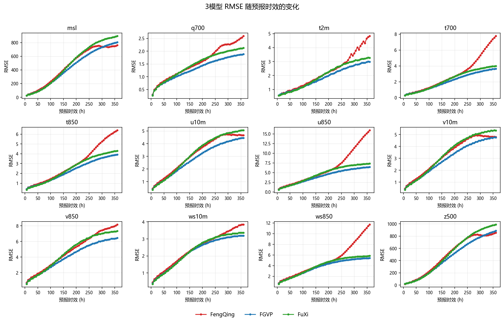
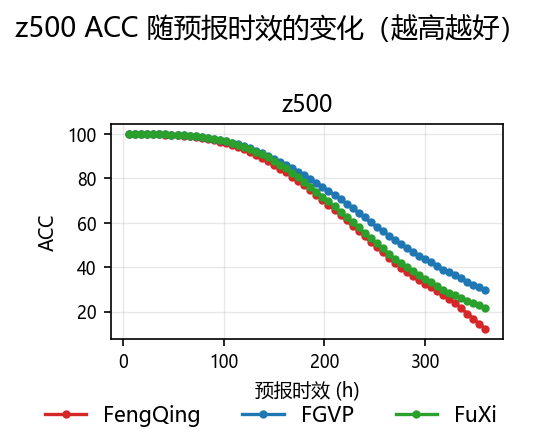
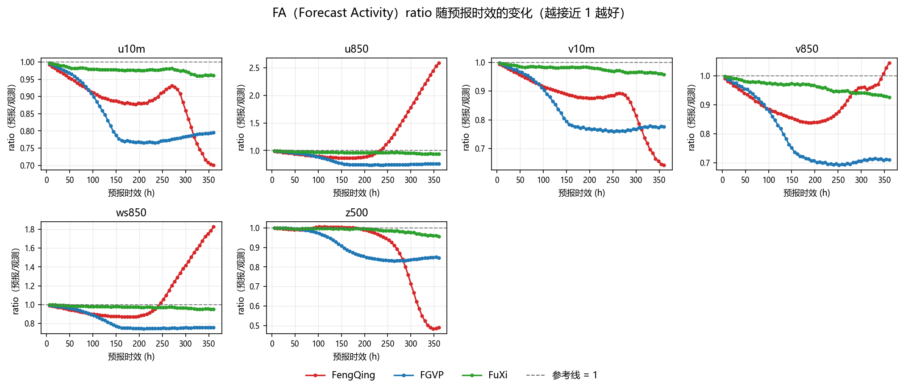
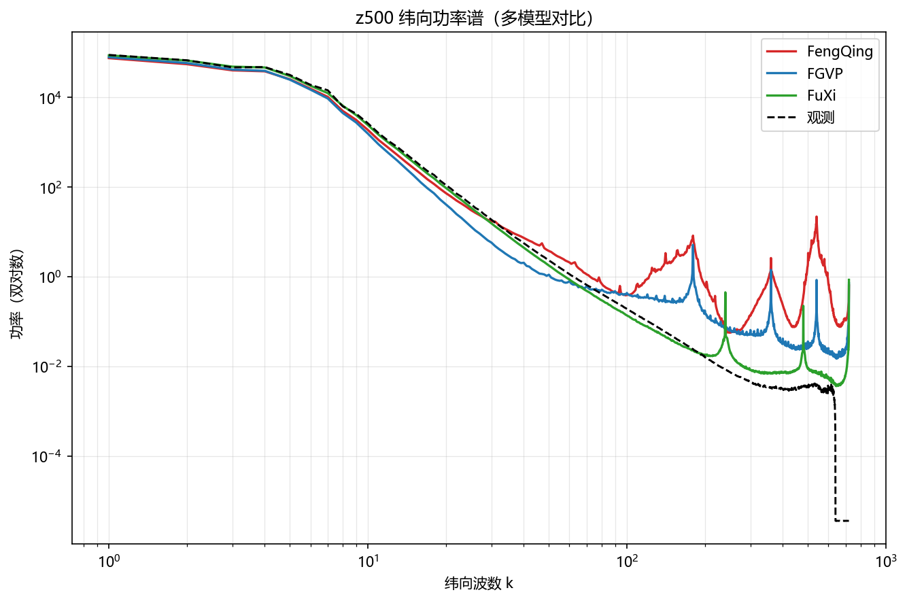

# XMETAI 确定性三模型评估检验报告（单成员）

**归档：FengQing、FGVP、FuXi**

报告日期：20251216    评估层级：输出级复核

## 报告定位与衔接

报告类型：确定性单成员预报（single/det）。本报告覆盖 3 个模型的批次归档目录，正文与附录统一使用 169 个共同日期（20250701–20251216），逐日结果按 lead 平均后比较；非共同日期不参与任何统计。

本报告中的FA指Forecast Activity，统一使用全程6–360h、60个lead，不对FA做短中长时效分段；分时效分析仅用于RMSE。

# 1. 结论摘要

• 共同日期 169 天（20250701–20251216）；综合相对 RMSE 最好 FGVP（90.620），最差 FengQing（110.270）。
• ACC 最好 FGVP（73.839%），FA 偏差最小 FuXi（2.5536 pp），频谱对数 RMS×100 最小 FuXi（113.69）。
• 平均排名分：FuXi 1.5、FGVP 1.8、FengQing 2.8。
• 综合相对 RMSE 上通过 Holm 校正的显著差异：FengQing 优于 FGVP（p=0.0000）；FengQing 优于 FuXi（p=0.0000）；FGVP 优于 FuXi（p=0.0000）。
• u850 存在模型间量级差异（FengQing 为其余模型中位数的 1.34 倍），已在 6.1 与第 9 节单独分析。

# 2. 样本与完整性

**样本与完整性**

| **模型** | **有效日期数** | **日期范围** | **共同日期** | **非共同日期** |
| --- | --- | --- | --- | --- |
| FengQing | 169 | 20250701–20251216 | 169 | 0 |
| FGVP | 184 | 20250701–20251231 | 169 | 15 |
| FuXi | 184 | 20250701–20251231 | 169 | 15 |

**完整性检查**

| **模型** | **n_ok/n_dates** | **summary 行数** | **日期集合** | **缺失文件** | **NaN RMSE** | **额外目录** |
| --- | --- | --- | --- | --- | --- | --- |
| FengQing | 169/169 | 169 | 169 天（meta 列 169） | 无 | 无 | 180 |
| FGVP | 184/184 | 184 | 184 天（meta 列 184） | 无 | 无 | 180 |
| FuXi | 184/184 | 184 | 184 天（meta 列 184） | 无 | 无 | 180 |

所有模型的 batch_meta 都记录 n_ok = n_dates，没有失败起报点。正文与附录统一使用 169 个共同日期（20250701–20251216），非共同日期不参与任何统计与曲线，因此各表的样本量一致、可直接横向比较。

本次未提供各模型的声明变量清单（`--declared`），第 6.2 节的「声明变量数」一律记 —，只比较归档里实际算出来的变量。

## 指标口径说明（FA）

本报告中的FA仅指Forecast Activity。为避免与降水二分类指标False Alarm（同样缩写为FA）混淆，FA统一采用全程6–360h、共60个lead的统计结果，不做短、中、长时效分段；文中的分时效比较仅针对RMSE，并明确排除u850。

# 3. 总体模型表现

**3模型总体指标**

| **排名** | **模型** | **相对 RMSE** | **ACC (%)** | **FA 偏差(全程, pp)** | **频谱 RMS×100** | **平均排名分** |
| --- | --- | --- | --- | --- | --- | --- |
| 1 | FGVP | 90.620 | 73.839 | 16.8314 | 156.77 | 1.8 |
| 2 | FuXi | 100.541 | 69.927 | 2.5536 | 113.69 | 1.5 |
| 3 | FengQing | 110.270 | 68.159 | 16.3332 | 231.63 | 2.8 |

**综合相对 RMSE 配对 Wilcoxon + Holm 检验**

| **比较** | **相对变化 A vs B (%)** | **Holm 显著** | **显著优者** | **Holm p** |
| --- | --- | --- | --- | --- |
| FengQing vs FGVP | +21.74 | 是 | FGVP | 0.0000 |
| FengQing vs FuXi | +9.74 | 是 | FuXi | 0.0000 |
| FGVP vs FuXi | -9.86 | 是 | FGVP | 0.0000 |

相对RMSE为100时表示3模型几何均值基线；越低越好。FGVP 的综合相对 RMSE 最低（90.620），FengQing 最高（110.270）；表内检验全部基于 169 个共同日期的逐日配对，Holm p < 0.05 才算显著。

# 4. RMSE 分变量结果

**分变量 RMSE（共同日期平均）**

| **变量** | FengQing | FGVP | FuXi | **Best** |
| --- | --- | --- | --- | --- |
| msl | 465.7148 | 437.8588 | 489.6193 | FGVP |
| q700 | 1.5653 | 1.3109 | 1.4745 | FGVP |
| t2m | 2.2683 | 1.8485 | 2.0159 | FGVP |
| t700 | 2.9577 | 2.0773 | 2.2921 | FGVP |
| t850 | 2.9910 | 2.2885 | 2.5128 | FGVP |
| u10m | 3.1941 | 2.8404 | 3.2405 | FGVP |
| u850 | 6.2855 | 4.0947 | 4.6752 | FGVP |
| v10m | 3.3211 | 3.0098 | 3.4099 | FGVP |
| v850 | 4.8143 | 4.1229 | 4.7164 | FGVP |
| ws10m | 2.4333 | 2.2429 | 2.3213 | FGVP |
| ws850 | 5.0507 | 3.7415 | 3.9812 | FGVP |
| z500 | 496.9286 | 457.4500 | 514.1907 | FGVP |

**分变量配对检验显著性汇总**

| **模型对** | **A 显著更优变量数** | **B 显著更优变量数** | **无显著差异** | **总变量数** |
| --- | --- | --- | --- | --- |
| FengQing vs FGVP | 0 | 12 | 0 | 12 |
| FengQing vs FuXi | 4 | 8 | 0 | 12 |
| FGVP vs FuXi | 12 | 0 | 0 | 12 |

表内模型对的次序与第 3 节一致（A、B 即「模型对」列里写明的两个模型，前者为 A）。逐变量检验用共同日期上的逐日 RMSE 做配对 Wilcoxon，未做多重校正，因此「显著」只作为方向性提示；要看校正后的结论请看第 3 节的综合检验。

# 5. ACC、FA（Forecast Activity，全程6–360h）与频谱

**3模型 ACC、FA 与频谱**

| **模型** | **ACC (%)** | **FA 偏差(全程, pp)** | **频谱对数 RMS×100** |
| --- | --- | --- | --- |
| FengQing | 68.159 | 16.3332 | 231.63 |
| FGVP | 73.839 | 16.8314 | 156.77 |
| FuXi | 69.927 | 2.5536 | 113.69 |

**ACC 配对检验**

| **比较** | **ACC 差 A-B (pp)** | **Holm 显著** | **显著优者** | **Holm p** |
| --- | --- | --- | --- | --- |
| FengQing vs FGVP | -5.680 | 是 | FGVP | 0.0000 |
| FengQing vs FuXi | -1.768 | 是 | FuXi | 0.0000 |
| FGVP vs FuXi | +3.912 | 是 | FGVP | 0.0000 |

z500 ACC 的极差为 5.680 pp（FGVP 最高 73.839，FengQing 最低 68.159）。需要注意的是 FengQing 在首时效的 z500 ACC 达到 99.975%，已逼近饱和，存在「ACC 定义过宽、近端几乎不可分辨」的风险（见 6.3）。

# 6. 异常与风险

## 6.1 u850量级异常

| **模型** | **共同日期平均 u850 RMSE** |
| --- | --- |
| FengQing | 6.2855 |
| FuXi | 4.6752 |
| FGVP | 4.0947 |

**逐时效倍数（FengQing / 其他2模型中位数）**

| **Lead (h)** | **FengQing / 其他2模型中位数** |
| --- | --- |
| 6 | 1.227 |
| 12 | 1.147 |
| 18 | 1.153 |
| 24 | 1.133 |
| 30 | 1.137 |
| 36 | 1.124 |
| 42 | 1.122 |
| 48 | 1.115 |
| 54 | 1.112 |
| 60 | 1.103 |
| 66 | 1.096 |
| 72 | 1.089 |
| 78 | 1.084 |
| 84 | 1.076 |
| 90 | 1.071 |
| 96 | 1.068 |
| 102 | 1.064 |
| 108 | 1.060 |
| 114 | 1.058 |
| 120 | 1.056 |
| 126 | 1.054 |
| 132 | 1.052 |
| 138 | 1.049 |
| 144 | 1.048 |
| 150 | 1.049 |
| 156 | 1.050 |
| 162 | 1.051 |
| 168 | 1.051 |
| 174 | 1.052 |
| 180 | 1.052 |
| 186 | 1.053 |
| 192 | 1.056 |
| 198 | 1.063 |
| 204 | 1.070 |
| 210 | 1.081 |
| 216 | 1.093 |
| 222 | 1.111 |
| 228 | 1.132 |
| 234 | 1.163 |
| 240 | 1.193 |
| 246 | 1.235 |
| 252 | 1.277 |
| 258 | 1.332 |
| 264 | 1.382 |
| 270 | 1.447 |
| 276 | 1.507 |
| 282 | 1.572 |
| 288 | 1.629 |
| 294 | 1.698 |
| 300 | 1.758 |
| 306 | 1.820 |
| 312 | 1.874 |
| 318 | 1.941 |
| 324 | 1.998 |
| 330 | 2.056 |
| 336 | 2.104 |
| 342 | 2.166 |
| 348 | 2.215 |
| 354 | 2.266 |
| 360 | 2.304 |

FengQing 的 u850 RMSE 是其余模型中位数的 1.34 倍，未超过 3× 的异常阈值，属于正常的模型间水平差异，不单独作为风险项。

## 6.2 变量覆盖不完整

**声明变量数与汇总变量数**

| **模型** | **声明变量数** | **汇总变量数** | **汇总缺失变量** |
| --- | --- | --- | --- |
| FengQing | — | 12 | — |
| FGVP | — | 13 | — |
| FuXi | — | 12 | — |

各模型的汇总变量数不一致（FGVP 13 个、FengQing 12 个、FuXi 12 个），说明有模型没算全变量。本报告只对 12 个共享变量做横向比较，缺变量的模型在这些变量上的结论不完整，选型时需要一并考虑。

## 6.3 ACC 定义风险

首时效 z500 ACC 已到 99.975%，接近饱和（阈值 99%）。这说明所用 ACC 定义（距平相关）在近端对模型差异几乎不敏感，用它排名会把不同模型压成几乎同分，不能单独作为选型依据；建议同时看 RMSE 与频谱。

## 6.4 原始场独立复算不足

本报告的 RMSE / ACC / FA / 频谱全部读自各模型归档目录里的逐日结果文件，没有回到原始预报场与观测场做独立复算；因此归档生成环节（变量映射、插值、单位换算）如果出错，本报告会原样继承，无法自查。归档目录里也确实不含原始场（只有 summary.csv、batch_meta.json 与逐日结果 CSV），这一点无法在本报告内弥补。结论用于模型间横向比较是充分的，用于绝对精度认定前建议抽一个日期回到原始场复算一次。

# 7. 验收建议

• 以共同日期上的综合相对 RMSE 为准，FGVP 最低（90.620），可作为默认首选模型。
• 大尺度形势场优先看 ACC，本批次 FGVP 最高（73.839）。
• 强度/活跃度类应用优先看 FA 偏差，FuXi 偏离 1 最少（2.5536 pp）。
• FengQing 的综合相对 RMSE 最高（110.270），在与 FGVP 的配对检验中若被判定显著更差（见第 3 节），暂不建议作为主用模型。
• 全部结论都建立在 169 个共同日期（20250701–20251216）上，样本期外的季节与区域不外推。

# 8. 3模型具体对比说明

本节在169个共同日期、12个共享RMSE变量、z500 ACC、6个FA ratio变量和7个频谱变量的统一口径下，对3个模型进行逐项比较。所有配对检验均使用Wilcoxon符号秩检验并进行Holm多重校正；统计显著不代表业务差异一定具有实际重要性。

**3模型综合对比**

| **模型** | **综合相对RMSE** | **ACC** | **FA偏差(pp)** | **频谱对数RMS×100** | **主要优势** | **主要短板** |
| --- | --- | --- | --- | --- | --- | --- |
| FGVP | 90.620（第1） | 73.839（第1） | 16.8314（第3） | 156.77（第2） | 综合 RMSE（3模型第一） | FA 偏差（第3） |
| FuXi | 100.541（第2） | 69.927（第2） | 2.5536（第1） | 113.69（第1） | FA 偏差（3模型第一） | ACC（第2） |
| FengQing | 110.270（第3） | 68.159（第3） | 16.3332（第2） | 231.63（第3） | 各维度均无领先项（最好的一项FA 偏差也只是第2） | 频谱保真（第3） |

## 8.1 逐模型结论

• FGVP：综合相对RMSE 90.620（第1）、ACC 73.839%（第1）、FA偏差 16.8314 pp（第3）、频谱对数RMS×100 156.77（第2）；优势在综合 RMSE（3模型第一），短板在FA 偏差（第3）。
• FuXi：综合相对RMSE 100.541（第2）、ACC 69.927%（第2）、FA偏差 2.5536 pp（第1）、频谱对数RMS×100 113.69（第1）；优势在FA 偏差（3模型第一），短板在ACC（第2）。
• FengQing：综合相对RMSE 110.270（第3）、ACC 68.159%（第3）、FA偏差 16.3332 pp（第2）、频谱对数RMS×100 231.63（第3）；优势在各维度均无领先项（最好的一项FA 偏差也只是第2），短板在频谱保真（第3）。

## 8.2 关键配对差异

**关键配对差异**

| **模型对** | **综合差异** | **显著更优变量数** | **解释** |
| --- | --- | --- | --- |
| FengQing vs FGVP | 综合相对RMSE 差异 +21.74%，Holm p = 0.0000 | FengQing 0 : 12 FGVP | FGVP 在综合口径上显著更优 |
| FengQing vs FuXi | 综合相对RMSE 差异 +9.74%，Holm p = 0.0000 | FengQing 4 : 8 FuXi | FuXi 在综合口径上显著更优 |
| FGVP vs FuXi | 综合相对RMSE 差异 -9.86%，Holm p = 0.0000 | FGVP 12 : 0 FuXi | FGVP 在综合口径上显著更优 |

# 9. u850敏感性分析与分时效对比

u850 在模型间存在量级差异（见 6.1），为确认它是否主导了总体排序，下表给出「含 u850」与「不含 u850」两种口径下的综合相对 RMSE。

**含/不含u850两种口径**

| **口径** | FengQing | FGVP | FuXi | **结论** |
| --- | --- | --- | --- | --- |
| 含u850 | 110.270 | 90.620 | 100.541 | FGVP 90.620 < FuXi 100.541 < FengQing 110.270 |
| 不含u850 | 108.720 | 91.318 | 101.072 | FGVP 91.318 < FuXi 101.072 < FengQing 108.720 |

两种口径下排序完全一致，说明 u850 的量级差异虽然明显，但没有改变模型间的相对格局，总体结论对该变量不敏感。

**分时效段相对综合RMSE**

| **时效段** | **最佳模型** | **3模型相对综合RMSE排序（越低越好）** | **说明** |
| --- | --- | --- | --- |
| 6–120h | FuXi | FuXi 96.685 < FGVP 97.138 < FengQing 106.580 | 20 个 lead |
| 126–240h | FGVP | FGVP 92.500 < FengQing 103.955 < FuXi 104.070 | 20 个 lead |
| 246–360h | FGVP | FGVP 88.477 < FuXi 99.591 < FengQing 115.465 | 20 个 lead |

分时效口径与第 3 节一致：逐 lead 先按变量做几何均值归一，再对共享变量等权平均；因此这里的数值与第 3 节的全程值同量纲，但不能直接与第 3 节的表相加。

# 10. 总述结论

• 在 169 个共同日期（20250701–20251216）上，FGVP 的综合相对 RMSE 最低（90.620），较几何均值基线低 9.380。
• ACC 最高的是 FGVP（73.839%），最低的是 FengQing（68.159%），极差 5.680 pp。
• FA 偏差最小的是 FuXi（2.5536 pp），最大的是 FGVP（16.8314 pp）。
• 频谱对数 RMS×100 最小的是 FuXi（113.69），说明其小尺度能量分布最接近观测。
• 平均排名分最低（最好）的是 FuXi（1.5），最高的是 FengQing（2.8）。
• u850 的量级差异是本批次最需要先核实的一项（FengQing 为其余模型中位数的 1.34 倍），在单位与定义确认前，该变量相关结论只作参考。

# 11. 最终选型建议

**分场景选型建议**

| **应用目标** | **推荐模型** | **理由** |
| --- | --- | --- |
| 综合精度优先（默认） | FGVP | 综合相对 RMSE 最低（90.620） |
| 大尺度形势场 | FGVP | ACC 最高（73.839%） |
| 强度与活跃度 | FuXi | FA 偏差最小（2.5536 pp） |
| 小尺度结构与谱保真 | FuXi | 频谱对数 RMS×100 最小（113.69） |
| 多维度均衡 | FuXi | 平均排名分最低（1.5） |
| 暂缓采用 | FengQing | 综合相对 RMSE 最高（110.270） |

# 附录：3模型曲线图

本附录使用3个模型共同的169个日期（20250701 至 20251216）。以下每张图均包含 FengQing、FGVP、FuXi 3 条模型曲线。正文统计表与图中曲线使用同一批共同日期。

## 附 1 RMSE：12个变量3模型曲线

每幅子图包含 FengQing、FGVP、FuXi 3 条曲线。

图 1：12个变量 RMSE 随预报时效的变化（20250701–20251216 共同日期平均）

## 附 2 z500 ACC：3模型曲线

3条曲线对应3个模型，纵轴越高越好。

图 2：z500 ACC 随预报时效的变化（20250701–20251216 共同日期平均）

## 附 3 FA（Forecast Activity）：6个变量、全程6–360h 3模型曲线

每个子图均包含3条模型曲线，并覆盖全部60个lead（6–360h）；ratio越接近1越好。

图 3：6个变量 FA ratio 随预报时效的变化（20250701–20251216 共同日期平均）

## 附 4 z500 功率谱：3模型曲线

双对数坐标；3条颜色曲线对应3个模型的预测谱。观测谱为黑色虚线。

图 4：z500 纬向功率谱（20250701–20251216 共同日期平均）
