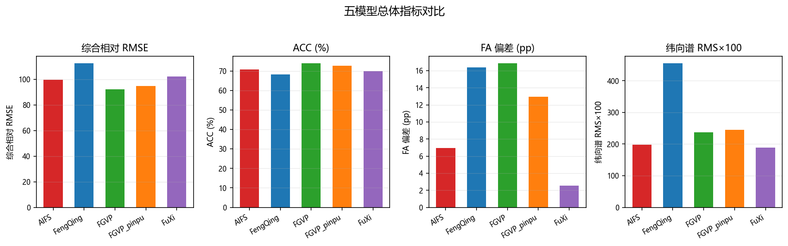
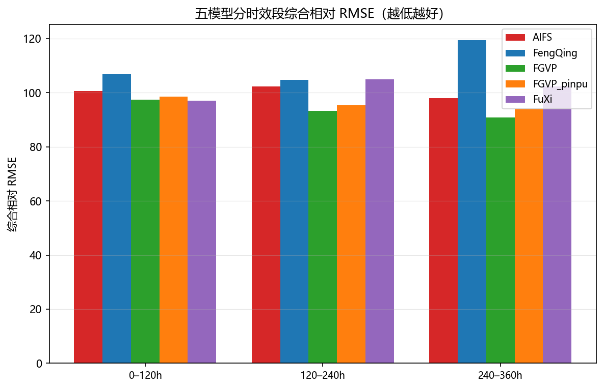
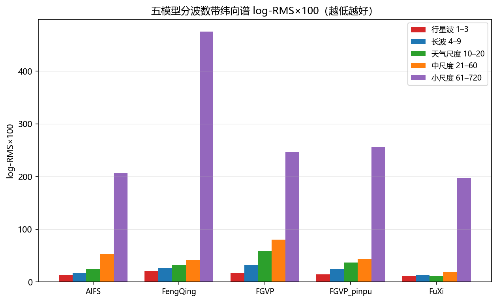
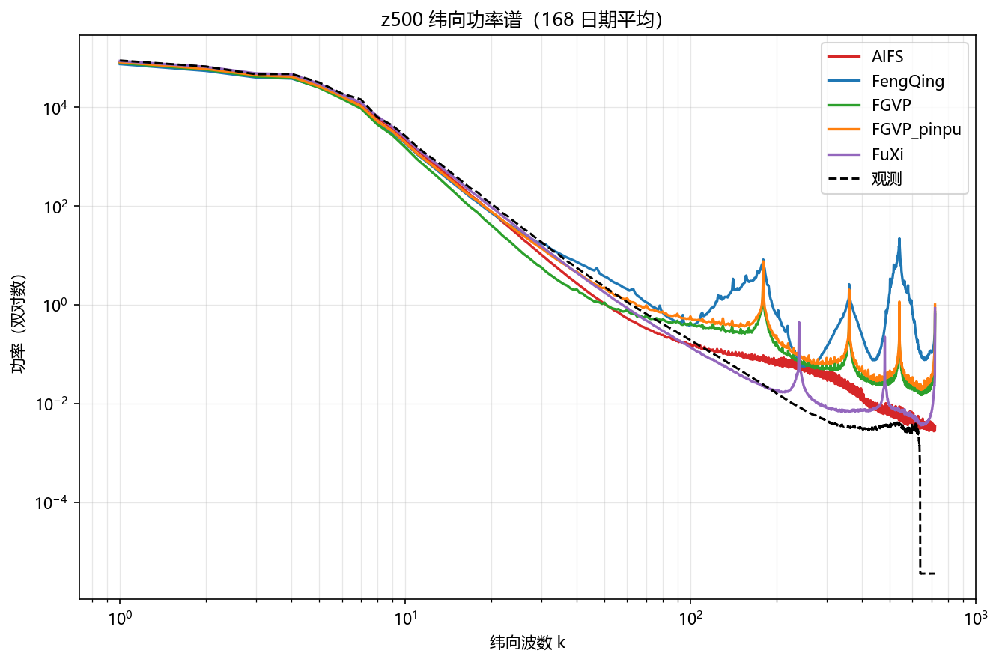
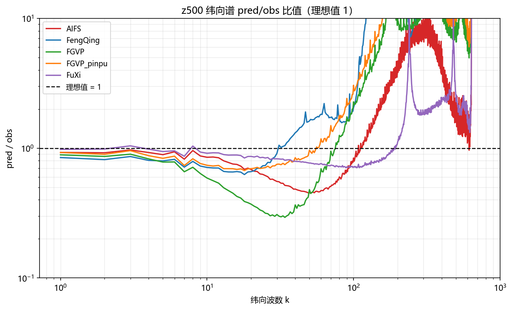

# XMETAI single（确定性版本）评估检验补充报告

AIFS、FGVP、FGVP_pinpu、FengQing、FuXi 五模型输出与纬向 FFT、球谐谱补充分析

数据归档：AIFS / FengQing / FGVP / FGVP_pinpu / FuXi 五个 single 批次归档

报告日期：20251215    模型：AIFS、FGVP、FGVP_pinpu、FengQing、FuXi    评估层级：输出级复核

**报告性质：补充分析。本报告不修订、不替代原输出级评估检验报告，仅补充五个 single 输出的统一重算、纬向 FFT 和球谐带功率谱结果。**

# 1. 结论摘要

• 五个归档完整性检查通过，共同日期 168 天（20250701–20251215），全部模型 `n_ok = n_dates`，无失败起报点。
• 综合相对 RMSE 最好 FGVP（92.298），最差 FengQing（112.502）；ACC 最高 FGVP（73.843%）。
• 幅度真实性（FA 偏差）最好 FuXi（2.5476 pp），最差 FGVP（16.8454 pp）。
• 纬向 FFT 谱（全波数 1–720）log-RMS×100 最小 FuXi（189.07），最大 FengQing（454.67）；匹配尺度 1–128 口径下最小 FuXi（23.37）。
• 球谐带功率谱：归档未含 `spherical_bands_*` 文件（`vfc/metrics/spectrum.py` 只有纬向 FFT，球谐带功率暂无代码支撑），**本批未出**。
• 主模型 FGVP_pinpu 相对 FGVP：纬向谱 log-RMS×100 236.98 → 245.15，变差 8.17；综合相对 RMSE 92.298 → 94.878。
• 异常变量检查：FengQing 的 u850 RMSE 为其余模型中位数的 1.38 倍，未超 3× 阈值。
• 选型取向：精度优先看综合相对 RMSE（FGVP），幅度与谱真实性优先看 FA 偏差（FuXi）与纬向谱（FuXi），三者不一定指向同一模型。

# 2. 数据范围与检验口径

| **模型** | **日期数** | **日期范围** | **共同日期** | **核心文件缺失** | **RMSE NaN（全区间）** |
| --- | --- | --- | --- | --- | --- |
| AIFS | 169 | 20250701–20251216 | 168 | 无 | 无 |
| FGVP | 184 | 20250701–20251231 | 168 | 无 | 15（全区间） |
| FGVP_pinpu | 168 | 20250701–20251215 | 168 | 无 | 无 |
| FengQing | 169 | 20250701–20251216 | 168 | 无 | 无 |
| FuXi | 184 | 20250701–20251231 | 168 | 无 | 15（全区间） |

FGVP 的 15 天 RMSE 为 NaN（20251217–20251231），其中 15 天落在共同窗口**之内**，需先查明原因。
FuXi 的 15 天 RMSE 为 NaN（20251217–20251231），其中 15 天落在共同窗口**之内**，需先查明原因。

所有统计均使用五个模型的共同168天和60个 lead（6–360h）。RMSE 使用12个共同变量；FA 使用所有模型都提供的六个变量：u10m、u850、v10m、v850、ws850、z500；功率谱使用七个变量：msl、t2m、t700、u850、v850、ws850、z500。全部五个模型在整个共同日期区间上都有完整归档，无缺席模型。

## 2.1 指标定义

| **指标** | **计算方式** | **方向** |
| --- | --- | --- |
| 综合相对 RMSE | 每个日期、每个变量先除以五模型几何均值，再对12个变量取几何平均；100 为五模型基线。 | 越低越好 |
| ACC | z500 每个日期60个 lead 的平均 ACC，再对所有日期取平均。 | 越高越好 |
| FA 偏差 | 六个变量、全部 lead 的 \|pred/obs−1\|，再按日期和要素平均，单位 pp。 | 越低越好 |
| 纬向谱 log-RMS×100 | 对七个变量的纬向 FFT 谱计算 RMS[ln(pred/obs)]×100；报告同时给出全波数 1–720 和匹配尺度 1–128。 | 越低越好 |
| 球谐带 log-RMS×100 | 五个球谐总阶数频带上计算 RMS[ln(pred/obs)]×100，是所有日期、变量、lead 的总均方根。 | 越低越好；本批未出 |
| 球谐带比偏差 | 所有频带、变量、lead 与日期上的 mean \|pred/obs−1\|，单位 %。 | 越低越好；本批未出 |

配对比较采用168个日度样本的 Wilcoxon 符号秩检验，并对同一指标族的10个模型对做 Holm 多重校正。统计显著不代表业务重要性。

# 3. 总体结果

| **模型** | **综合相对RMSE** | **ACC (%)** | **FA偏差 (pp)** | **纬向谱 RMS×100** | **球谐谱 RMS×100** | **球谐比偏差 (%)** |
| --- | --- | --- | --- | --- | --- | --- |
| FGVP | 92.298 | 73.843 | 16.8454 | 236.98 | — | — |
| FGVP_pinpu | 94.878 | 72.566 | 12.9546 | 245.15 | — | — |
| AIFS | 99.668 | 70.723 | 6.9712 | 197.73 | — | — |
| FuXi | 102.431 | 69.904 | 2.5476 | 189.07 | — | — |
| FengQing | 112.502 | 68.137 | 16.3585 | 454.67 | — | — |

相关图：

图 1：五模型的综合相对 RMSE、ACC、FA 偏差与纬向谱 log-RMS×100 对比（共同日期平均，柱高越低越好，ACC 除外）。

## 3.1 排序随评价目标变化

| **评价口径** | **模型排序（平均秩，越低越好）** | **第一** | **解释** |
| --- | --- | --- | --- |
| RMSE + ACC + FA | FGVP_pinpu 2.33 = FGVP 2.33 < AIFS 2.67 < FuXi 3.00 < FengQing 4.67 | FGVP、FGVP_pinpu（二者并列 2.33） | 只看精度、相关与幅度，不看谱分布 |
| RMSE + ACC + FA + 球谐带功率谱 | — | — | 球谐带功率谱本批未出，该口径无法计算；下表用纬向 FFT 谱代替 |
| RMSE + ACC + FA + 纬向 FFT 谱 | AIFS 2.50 = FGVP 2.50 = FuXi 2.50 < FGVP_pinpu 2.75 < FengQing 4.75 | AIFS、FGVP、FuXi（三者并列 2.50） | 在上一口径基础上加入纬向 FFT 谱保真度 |

这里的“平均秩”只是各项指标的等权汇总，不代替业务权重；写“=”表示两模型在该口径下平均秩并列，不代表指标完全相同。加入纬向谱后平均秩最低的是 AIFS、FGVP、FuXi（三者并列 2.50），不含谱口径是 FGVP、FGVP_pinpu（二者并列 2.33），两者不是同一组，说明谱保真度会改变模型取舍。两套口径的头部都出现并列，说明这组模型的整体水平接近，排名对指标权重的敏感度高，选型时需明确以哪一类应用为准。

# 4. RMSE 与时效表现

| **变量** | **AIFS** | **FengQing** | **FGVP** | **FGVP_pinpu** | **FuXi** | **最佳** |
| --- | --- | --- | --- | --- | --- | --- |
| msl | 479.9620 | 465.5104 | 437.6767 | 450.2348 | 489.7317 | FGVP |
| q700 | 1.3611 | 1.5652 | 1.3110 | 1.3485 | 1.4747 | FGVP |
| t2m | 1.9518 | 2.2653 | 1.8467 | 1.8858 | 2.0151 | FGVP |
| t700 | 2.2197 | 2.9568 | 2.0762 | 2.1724 | 2.2916 | FGVP |
| t850 | 2.4471 | 2.9899 | 2.2875 | 2.4043 | 2.5127 | FGVP |
| u10m | 3.1702 | 3.1942 | 2.8405 | 2.9209 | 3.2412 | FGVP |
| u850 | 4.5453 | 6.2858 | 4.0952 | 4.2279 | 4.6765 | FGVP |
| v10m | 3.3368 | 3.3210 | 3.0098 | 3.0947 | 3.4114 | FGVP |
| v850 | 4.5794 | 4.8132 | 4.1224 | 4.2554 | 4.7179 | FGVP |
| ws10m | 2.3267 | 2.4335 | 2.2433 | 2.2313 | 2.3219 | FGVP_pinpu |
| ws850 | 3.9240 | 5.0509 | 3.7419 | 3.7631 | 3.9823 | FGVP |
| z500 | 502.4707 | 496.5850 | 457.0878 | 475.7681 | 514.1336 | FGVP |

全局第一为 FGVP（综合相对 RMSE 92.298）；逐变量看，FGVP 在 11 个变量上最优、FGVP_pinpu 在 1 个变量上最优。逐变量 Wilcoxon 配对检验（未做多重校正，只作方向性提示）：AIFS vs FengQing 为 9 : 2（1 个变量无显著差异）；AIFS vs FGVP 为 0 : 12（0 个变量无显著差异）；AIFS vs FGVP_pinpu 为 0 : 12（0 个变量无显著差异）；AIFS vs FuXi 为 11 : 0（1 个变量无显著差异）；FengQing vs FGVP 为 0 : 12（0 个变量无显著差异）；FengQing vs FGVP_pinpu 为 0 : 12（0 个变量无显著差异）；FengQing vs FuXi 为 4 : 8（0 个变量无显著差异）；FGVP vs FGVP_pinpu 为 11 : 1（0 个变量无显著差异）；FGVP vs FuXi 为 12 : 0（0 个变量无显著差异）；FGVP_pinpu vs FuXi 为 12 : 0（0 个变量无显著差异）。

## 4.1 分时效综合相对 RMSE

| **时效段** | **AIFS** | **FengQing** | **FGVP** | **FGVP_pinpu** | **FuXi** | **最佳** |
| --- | --- | --- | --- | --- | --- | --- |
| 0–120h | 100.679 | 106.879 | 97.414 | 98.526 | 96.980 | FuXi |
| 120–240h | 102.305 | 104.819 | 93.288 | 95.321 | 104.976 | FGVP |
| 240–360h | 97.969 | 119.351 | 90.815 | 94.076 | 102.257 | FGVP |

口径与第 3 节一致：逐 lead 先按变量做几何均值归一，再对 12 个共享变量等权平均；未排除任何变量。

分时效看，0–120h 首选 FuXi；120–240h 首选 FGVP；240–360h 首选 FGVP。短时效与中长时效的领先者未必是同一个模型，选型时应按实际预报时效长度取。

图 2：五模型分时效段（6–120h / 126–240h / 246–360h）的综合相对 RMSE 对比。

# 5. 功率谱检验

归档保留两套功率谱定义：纬向 FFT 谱（`spectrum_*`）和球谐带功率（`spherical_bands_*`）。两者都只使用功率或功率谱，不包含相位；本报告分别给出完整结果，不用一套指标替代另一套。归档未含 `spherical_bands_*` 文件（`vfc/metrics/spectrum.py` 只有纬向 FFT，球谐带功率暂无代码支撑），**本批未出**。

## 5.1 球谐带分频结果

归档未含 `spherical_bands_*` 文件（`vfc/metrics/spectrum.py` 只有纬向 FFT，球谐带功率暂无代码支撑），**本批未出**。因此本节无表、无图，保留节位以便将来补数后直接填入。

## 5.2 球谐带分变量结果

归档未含 `spherical_bands_*` 文件（`vfc/metrics/spectrum.py` 只有纬向 FFT，球谐带功率暂无代码支撑），**本批未出**。本节同 5.1，一并留空。

## 5.3 球谐带配对检验

归档未含 `spherical_bands_*` 文件（`vfc/metrics/spectrum.py` 只有纬向 FFT，球谐带功率暂无代码支撑），**本批未出**。本节同 5.1，一并留空。

## 5.4 纬向 FFT 功率谱（完整）

纬向 FFT 对每个纬圈做一维 rFFT，经度方向波数 k=1..720，k=0 的纬向平均已置零。纬向谱与球谐谱不是同一种变换：纬向谱保留完整 1–720 波数，球谐带只汇总到总阶数 128。为避免把超高频近零观测功率的影响与可训练频带混为一谈，本节同时给出全波数和 1–128 匹配尺度结果。

| **口径** | **AIFS** | **FengQing** | **FGVP** | **FGVP_pinpu** | **FuXi** | **最佳** | **解释** |
| --- | --- | --- | --- | --- | --- | --- | --- |
| 全波数 1–720 | 197.73 | 454.67 | 236.98 | 245.15 | 189.07 | FuXi | 包含极高波数；受近零观测功率与数值端点影响较大 |
| 匹配尺度 1–128 | 62.72 | 48.19 | 78.52 | 56.78 | 23.37 | FuXi | 与球谐损失的最高阶数同范围，适合与球谐带对照 |

## 5.4.1 五个波数带结果

| **波数带** | **AIFS logRMS** | **AIFS 能量比** | **FengQing logRMS** | **FengQing 能量比** | **FGVP logRMS** | **FGVP 能量比** | **FGVP_pinpu logRMS** | **FGVP_pinpu 能量比** | **FuXi logRMS** | **FuXi 能量比** | **最佳** |
| --- | --- | --- | --- | --- | --- | --- | --- | --- | --- | --- | --- |
| 行星波 1–3 | 13.09 | 0.9423 | 20.47 | 0.8470 | 17.77 | 0.8898 | 14.66 | 0.9283 | 11.80 | 1.0048 | FuXi |
| 长波 4–9 | 16.62 | 0.9116 | 26.54 | 0.7990 | 32.31 | 0.7788 | 24.71 | 0.8347 | 13.30 | 0.9695 | FuXi |
| 天气尺度 10–20 | 24.36 | 0.8278 | 31.76 | 0.8511 | 58.53 | 0.6079 | 37.36 | 0.7182 | 11.75 | 0.9257 | FuXi |
| 中尺度 21–60 | 52.68 | 0.6659 | 41.13 | 1.2012 | 80.17 | 0.4958 | 43.55 | 0.6889 | 19.06 | 0.8649 | FuXi |
| 小尺度 61–720 | 206.03 | 0.5714 | 474.63 | 28.1764 | 246.46 | 0.9825 | 255.61 | 1.2902 | 197.37 | 0.8169 | FuXi |

波数带按行星尺度到小尺度划分。log-RMS 最低的模型在行星波段是 FuXi、长波段是 FuXi、天气尺度段是 FuXi、中尺度段是 FuXi、小尺度段是 FuXi；能量比为该波数带内预测谱与观测谱的平均功率之比（先沿波数取平均再相除），越接近 1 表示该尺度上的能量越不偏。高波数段（小尺度 61–720）的 log-RMS 普遍高于低波数段，是纬向谱指标的固有特征：高波数观测功率接近零，比值的对数发散，这一段的绝对值不宜与低波数段直接比较；能量比在同一段仍有意义，因为它不依赖逐波数的分母。

图 3：五模型分波数带（行星波 / 长波 / 天气尺度 / 中尺度 / 小尺度）的纬向谱 log-RMS×100 对比。

## 5.4.2 平均功率谱与比值曲线

下列曲线是168个日度功率谱的平均。黑线为 ERA5，彩色线为五个模型的预测谱；比值为 pred/obs，理想值为 1，图中断面显示范围限定为 0.1–10。变量取 z500。

图 4：z500 纬向功率谱（168 个共同日期平均，双对数坐标）。

图 5：z500 纬向谱 pred/obs 比值随波数的变化（纵轴限定 0.1–10）。

## 5.4.3 1–128 波数逐变量结果

| **变量** | **AIFS** | **FengQing** | **FGVP** | **FGVP_pinpu** | **FuXi** | **最佳** |
| --- | --- | --- | --- | --- | --- | --- |
| msl | 18.32 | 27.93 | 26.84 | 15.47 | 6.09 | FuXi |
| t2m | 23.26 | 18.22 | 13.79 | 8.50 | 4.04 | FuXi |
| t700 | 96.44 | 95.09 | 96.42 | 41.04 | 47.74 | FGVP_pinpu |
| u850 | 95.01 | 28.77 | 115.16 | 92.74 | 30.40 | FengQing |
| v850 | 84.24 | 43.14 | 114.92 | 89.10 | 25.53 | FuXi |
| ws850 | 70.02 | 25.23 | 98.48 | 75.84 | 21.81 | FuXi |
| z500 | 51.72 | 98.96 | 84.04 | 74.77 | 27.96 | FuXi |

全波数 1–720 口径下的模型排序为 FuXi < AIFS < FGVP < FGVP_pinpu < FengQing，1–128 匹配尺度口径下为 FuXi < FengQing < FGVP_pinpu < AIFS < FGVP，两者不一致，说明高波数段（近零观测功率主导）会改变排序，涉及业务可训练尺度时应以匹配尺度口径为准。

## 5.5 FGVP_pinpu 相对 FGVP 的频谱专项对比

本节为FGVP_pinpu（主模型）与FGVP（对照）的逐项对比，用于判断频谱优化是否落地。

| **波数带** | **FGVP logRMS** | **FGVP_pinpu logRMS** | **变化（负为好）** | **判定** |
| --- | --- | --- | --- | --- |
| 行星波 1–3 | 17.77 | 14.66 | -3.11 | 改善 |
| 长波 4–9 | 32.31 | 24.71 | -7.61 | 改善 |
| 天气尺度 10–20 | 58.53 | 37.36 | -21.17 | 改善 |
| 中尺度 21–60 | 80.17 | 43.55 | -36.61 | 改善 |
| 小尺度 61–720 | 246.46 | 255.61 | 9.15 | 变差 |

**两种口径的总量**

| **口径** | **FGVP** | **FGVP_pinpu** | **变化（负为好）** |
| --- | --- | --- | --- |
| 全波数 1–720 | 236.98 | 245.15 | 8.17 |
| 匹配尺度 1–128 | 78.52 | 56.78 | -21.74 |
| 综合相对 RMSE | 92.298 | 94.878 | 2.58 |
| ACC (%) | 73.843 | 72.566 | -1.28 |
| FA 偏差 (pp) | 16.8454 | 12.9546 | -3.8907 |

**配对检验（纬向谱 log-RMS，逐日）**：Wilcoxon 符号秩检验 p = 0.0000（Holm 校正后），显著优者为 FGVP。

在全部五个模型中，FGVP_pinpu 的纬向谱 log-RMS×100 排名第 4，FGVP 排名第 3。

# 6. 异常与数据质量风险

## 6.1 FengQing u850 量级检查（未检出异常）

| **Lead (h)** | **AIFS** | **FengQing** | **FGVP** | **FGVP_pinpu** | **FuXi** | **FengQing / 其余四模型中位数** |
| --- | --- | --- | --- | --- | --- | --- |
| 6 | 0.5997 | 0.7336 | 0.6302 | 0.6312 | 0.5657 | 1.193 |
| 12 | 0.9775 | 1.0910 | 0.9724 | 0.9718 | 0.9306 | 1.122 |
| 18 | 1.0659 | 1.1807 | 1.0432 | 1.0427 | 1.0055 | 1.132 |
| 24 | 1.2830 | 1.4019 | 1.2504 | 1.2501 | 1.2239 | 1.121 |
| 30 | 1.3391 | 1.4571 | 1.2921 | 1.2929 | 1.2705 | 1.127 |
| 36 | 1.5012 | 1.6198 | 1.4501 | 1.4528 | 1.4320 | 1.116 |
| 42 | 1.5769 | 1.6975 | 1.5199 | 1.5248 | 1.5054 | 1.115 |
| 48 | 1.7522 | 1.8758 | 1.6871 | 1.6940 | 1.6792 | 1.110 |
| 54 | 1.8221 | 1.9448 | 1.7499 | 1.7601 | 1.7478 | 1.108 |
| 60 | 1.9686 | 2.0874 | 1.8902 | 1.9042 | 1.8969 | 1.098 |
| 66 | 2.0656 | 2.1837 | 1.9811 | 1.9977 | 2.0040 | 1.091 |
| 72 | 2.2490 | 2.3612 | 2.1466 | 2.1655 | 2.1914 | 1.084 |
| 78 | 2.3458 | 2.4527 | 2.2285 | 2.2514 | 2.3002 | 1.078 |
| 84 | 2.5052 | 2.6032 | 2.3722 | 2.3980 | 2.4671 | 1.070 |
| 90 | 2.6322 | 2.7250 | 2.4842 | 2.5128 | 2.6053 | 1.065 |
| 96 | 2.8242 | 2.9047 | 2.6489 | 2.6797 | 2.7931 | 1.062 |
| 102 | 2.9396 | 3.0106 | 2.7397 | 2.7735 | 2.9204 | 1.057 |
| 108 | 3.1043 | 3.1679 | 2.8797 | 2.9161 | 3.0967 | 1.054 |
| 114 | 3.2437 | 3.3038 | 2.9947 | 3.0353 | 3.2549 | 1.052 |
| 120 | 3.4336 | 3.4848 | 3.1524 | 3.1958 | 3.4524 | 1.051 |
| 126 | 3.5494 | 3.5932 | 3.2375 | 3.2847 | 3.5845 | 1.052 |
| 132 | 3.7128 | 3.7453 | 3.3665 | 3.4137 | 3.7574 | 1.051 |
| 138 | 3.8590 | 3.8831 | 3.4801 | 3.5289 | 3.9233 | 1.051 |
| 144 | 4.0458 | 4.0671 | 3.6328 | 3.6831 | 4.1276 | 1.052 |
| 150 | 4.1618 | 4.1835 | 3.7152 | 3.7666 | 4.2660 | 1.055 |
| 156 | 4.3205 | 4.3389 | 3.8366 | 3.8894 | 4.4295 | 1.057 |
| 162 | 4.4594 | 4.4842 | 3.9463 | 4.0059 | 4.5876 | 1.059 |
| 168 | 4.6484 | 4.6630 | 4.0937 | 4.1631 | 4.7796 | 1.058 |
| 174 | 4.7657 | 4.7828 | 4.1824 | 4.2643 | 4.9116 | 1.059 |
| 180 | 4.9136 | 4.9258 | 4.3031 | 4.3964 | 5.0662 | 1.058 |
| 186 | 5.0411 | 5.0698 | 4.4139 | 4.5205 | 5.2123 | 1.060 |
| 192 | 5.2124 | 5.2491 | 4.5563 | 4.6750 | 5.3853 | 1.062 |
| 198 | 5.3153 | 5.3814 | 4.6357 | 4.7674 | 5.4912 | 1.067 |
| 204 | 5.4411 | 5.5451 | 4.7442 | 4.8869 | 5.6200 | 1.074 |
| 210 | 5.5442 | 5.7203 | 4.8433 | 4.9976 | 5.7378 | 1.085 |
| 216 | 5.6863 | 5.9405 | 4.9777 | 5.1417 | 5.8963 | 1.097 |
| 222 | 5.7521 | 6.1228 | 5.0457 | 5.2207 | 5.9811 | 1.116 |
| 228 | 5.8431 | 6.3503 | 5.1397 | 5.3245 | 6.0801 | 1.137 |
| 234 | 5.9212 | 6.6218 | 5.2252 | 5.4217 | 6.1694 | 1.168 |
| 240 | 6.0488 | 6.9483 | 5.3455 | 5.5539 | 6.3071 | 1.198 |
| 246 | 6.1053 | 7.2691 | 5.4011 | 5.6211 | 6.3736 | 1.240 |
| 252 | 6.1898 | 7.6290 | 5.4826 | 5.7101 | 6.4656 | 1.282 |
| 258 | 6.2516 | 8.0583 | 5.5538 | 5.7869 | 6.5445 | 1.339 |
| 264 | 6.3577 | 8.5174 | 5.6631 | 5.9011 | 6.6606 | 1.390 |
| 270 | 6.3992 | 8.9778 | 5.7035 | 5.9468 | 6.7047 | 1.454 |
| 276 | 6.4688 | 9.4417 | 5.7655 | 6.0145 | 6.7654 | 1.513 |
| 282 | 6.5141 | 9.9288 | 5.8205 | 6.0801 | 6.8133 | 1.577 |
| 288 | 6.6076 | 10.4323 | 5.9146 | 6.1833 | 6.8973 | 1.631 |
| 294 | 6.6343 | 10.9084 | 5.9396 | 6.2165 | 6.9138 | 1.698 |
| 300 | 6.6895 | 11.3905 | 5.9921 | 6.2767 | 6.9645 | 1.757 |
| 306 | 6.7307 | 11.8679 | 6.0376 | 6.3277 | 7.0032 | 1.818 |
| 312 | 6.8160 | 12.3733 | 6.1245 | 6.4183 | 7.0817 | 1.870 |
| 318 | 6.8259 | 12.8449 | 6.1479 | 6.4451 | 7.0883 | 1.936 |
| 324 | 6.8598 | 13.3136 | 6.2020 | 6.5031 | 7.1268 | 1.993 |
| 330 | 6.8805 | 13.7684 | 6.2419 | 6.5416 | 7.1502 | 2.052 |
| 336 | 6.9465 | 14.2506 | 6.3195 | 6.6197 | 7.2250 | 2.101 |
| 342 | 6.9392 | 14.6883 | 6.3266 | 6.6254 | 7.2304 | 2.166 |
| 348 | 6.9693 | 15.1146 | 6.3690 | 6.6615 | 7.2745 | 2.218 |
| 354 | 6.9939 | 15.5202 | 6.4006 | 6.6827 | 7.2913 | 2.270 |
| 360 | 7.0692 | 15.9468 | 6.4737 | 6.7529 | 7.3611 | 2.307 |

FengQing 的 u850 RMSE 是其余模型中位数的 1.38 倍，未超过 3× 的异常阈值，属于正常的模型间水平差异，不单独作为风险项，但也说明该变量的模型间可比性弱于其他变量。

## 6.2 FA 幅度偏差

六个 FA 变量的幅度偏差（100×mean\|pred/obs−1\|）为：AIFS 6.9712 pp、FengQing 16.3585 pp、FGVP 16.8454 pp、FGVP_pinpu 12.9546 pp、FuXi 2.5476 pp。偏差最小（幅度最真实）的是 FuXi，偏差最大的是 FGVP。FA 偏差是绝对值口径，丢掉了「偏强/偏弱」的方向，只能说明幅度失真多少，不能据此断言某个模型偏平滑或偏噪；要判方向需回到逐日 pred/obs 比值。

## 6.3 原始场独立复算不足（中高优先级）

本报告的纬向谱、综合相对 RMSE、ACC 与 FA 全部读自各模型归档目录里的逐日结果文件，没有回到原始预报场与观测场做独立复算。归档目录只含 `summary.csv`、`batch_meta.json` 与逐日结果 CSV，不含原始场，这一点无法在本报告内弥补。因此归档生成环节（变量映射、插值、单位换算、谱变换）如果出错，本报告会原样继承且无法自查。结论用于模型间横向比较是充分的；用于绝对谱保真度认定前，建议抽一个日期回到原始场复算一次谱。

## 6.4 ACC 定义风险（中高优先级）

z500 的首时效 ACC 已达 99.975%（最高模型 FGVP 全程 73.843%）。距平相关系数在近端接近饱和，对模型差异几乎不敏感，用它排名会把不同模型压成几乎同分，不能单独作为选型依据；建议与 RMSE、纬向谱三项同看。

# 7. 验收结论与选型建议

| **目标** | **推荐** | **结论依据** |
| --- | --- | --- |
| 综合精度优先（默认） | FGVP | 综合相对 RMSE 最低（92.298） |
| 大尺度形势场 | FGVP | ACC 最高（73.843%） |
| 幅度与谱真实性优先 | FuXi | 纬向谱 log-RMS×100 最低（189.07） |
| 强度与活跃度 | FuXi | FA 偏差最小（2.5476 pp） |
| 多维度均衡 | AIFS | 综合排名分最低（2.25） |
| 暂缓采用 | FengQing | 综合相对 RMSE 最高（112.502） |
| 谱优化版本（FGVP_pinpu） | FGVP_pinpu | 纬向谱 log-RMS×100 245.15，综合相对 RMSE 94.878 |

**总体判定：在 168 个共同日期（20250701–20251215）上，FGVP 的综合相对 RMSE 最低、FGVP 的 ACC 最高、FuXi 的纬向谱保真度最好、FuXi 的幅度最真实；四个口径没有指向同一个模型，验收时应按实际业务目标取权重，不宜只凭单一指标定论。**

# 附录：数据与复算证据

| **项目** | **值** |
| --- | --- |
| 归档文件 | AIFS / FengQing / FGVP / FGVP_pinpu / FuXi 五个 single 批次归档 |
| 归档大小 | 1098.6 MB |
| SHA-256 | —（多目录归档，未逐文件计算） |
| 模型 | AIFS、FengQing、FGVP、FGVP_pinpu、FuXi |
| 共同日期 | 168 天，20250701–20251215 |
| lead | 60 个，6–360h，间隔 6h |
| 分析结果目录 | report\五模型纬向FFT与球谐谱补充分析报告 |

**本补充报告不修订、不替代原评估报告；全部结论仅来自用户指定归档中的五个 single 输出，归档未含球谐带功率谱文件，相关章节已标注「本批未出」。**

## 附：图件清单

1. `overall_summary.png`（overall_summary）
2. `rmse_by_lead_range.png`（rmse_by_lead_range）
3. `zonal_spectrum_bands.png`（zonal_spectrum_bands）
4. `mean_power_spectrum.png`（mean_power_spectrum）
5. `spectrum_ratio.png`（spectrum_ratio）

