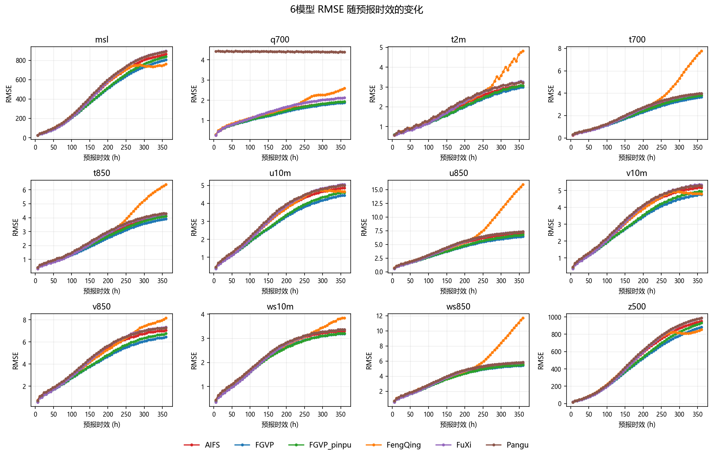
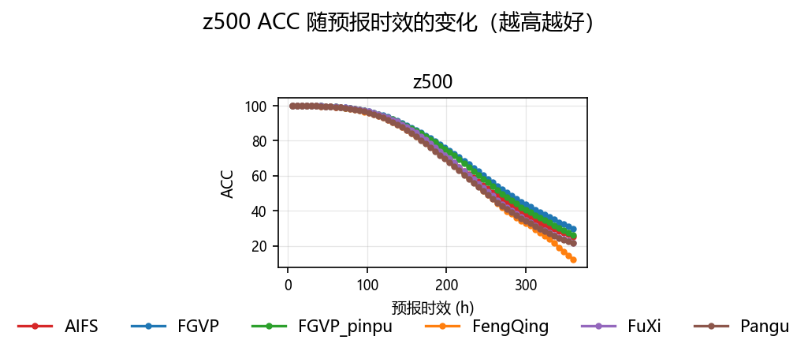
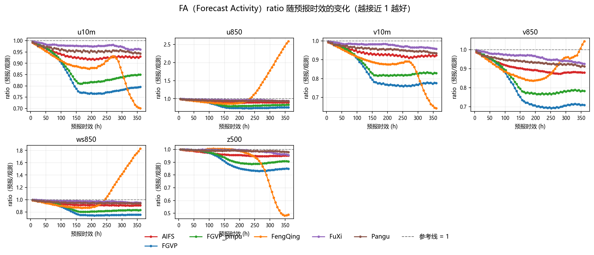
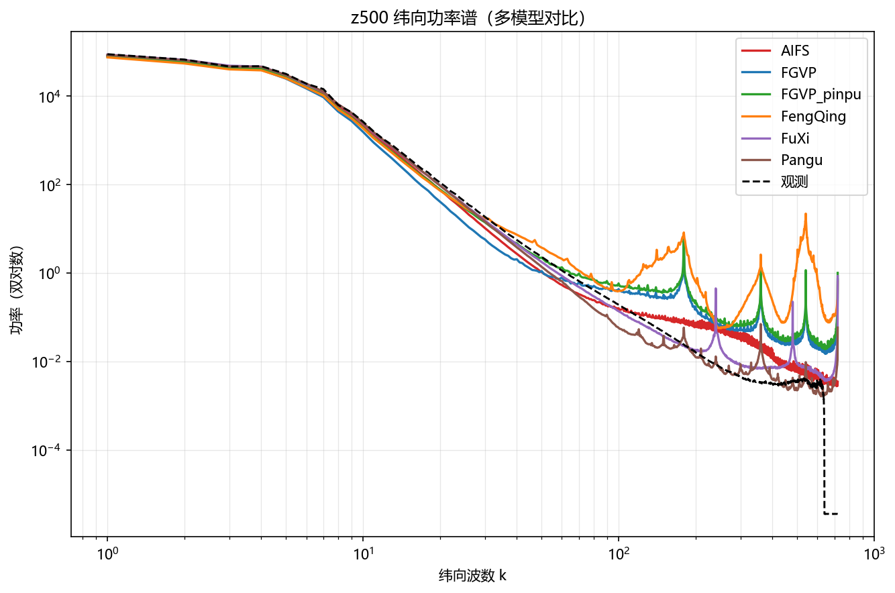

# XMETAI 确定性六模型评估检验报告（单成员）

**归档：AIFS / FGVP / FGVP_pinpu / FengQing / FuXi / Pangu 六个 single 批次归档**

报告日期：20251215    评估层级：输出级复核

## 报告定位与衔接

报告类型：确定性单成员预报（single/det）。本报告覆盖 6 个模型的批次归档目录，正文与附录统一使用 168 个共同日期（20250701–20251215），逐日结果按 lead 平均后比较；非共同日期不参与任何统计。

本报告中的FA指Forecast Activity，统一使用全程6–360h、60个lead，不对FA做短中长时效分段；分时效分析仅用于RMSE。

# 1. 结论摘要

• 共同日期 168 天（20250701–20251215）；综合相对 RMSE 最好 FGVP（90.290），最差 Pangu（116.911）。
• ACC 最好 FGVP（73.843%），FA 偏差最小 FuXi（2.5476 pp），频谱对数 RMS×100 最小 Pangu（101.21）。
• 平均排名分：AIFS 2.8、FGVP 3.0、FuXi 3.0、FGVP_pinpu 3.2、Pangu 3.5、FengQing 5.5。
• 综合相对 RMSE 上通过 Holm 校正的显著差异：FGVP 优于 AIFS（p=0.0000）；FGVP_pinpu 优于 AIFS（p=0.0000）；AIFS 优于 FengQing（p=0.0000）；AIFS 优于 FuXi（p=0.0000）；AIFS 优于 Pangu（p=0.0000）；FGVP 优于 FGVP_pinpu（p=0.0000）；FGVP 优于 FengQing（p=0.0000）；FGVP 优于 FuXi（p=0.0000）；FGVP 优于 Pangu（p=0.0000）；FGVP_pinpu 优于 FengQing（p=0.0000）；FGVP_pinpu 优于 FuXi（p=0.0000）；FGVP_pinpu 优于 Pangu（p=0.0000）；FuXi 优于 FengQing（p=0.0000）；FengQing 优于 Pangu（p=0.0000）；FuXi 优于 Pangu（p=0.0000）。
• q700 存在模型间量级差异（Pangu 为其余模型中位数的 3.11 倍），已在 6.1 与第 9 节单独分析。

# 2. 样本与完整性

**样本与完整性**

| **模型** | **有效日期数** | **日期范围** | **共同日期** | **非共同日期** |
| --- | --- | --- | --- | --- |
| AIFS | 169 | 20250701–20251216 | 168 | 1 |
| FGVP | 184 | 20250701–20251231 | 168 | 16 |
| FGVP_pinpu | 168 | 20250701–20251215 | 168 | 0 |
| FengQing | 169 | 20250701–20251216 | 168 | 1 |
| FuXi | 184 | 20250701–20251231 | 168 | 16 |
| Pangu | 169 | 20250701–20251216 | 168 | 1 |

**完整性检查**

| **模型** | **n_ok/n_dates** | **summary 行数** | **日期集合** | **缺失文件** | **NaN RMSE** | **额外目录** |
| --- | --- | --- | --- | --- | --- | --- |
| AIFS | 169/169 | 169 | 169 天（meta 列 169） | 无 | 无 | 180 |
| FGVP | 184/184 | 184 | 184 天（meta 列 184） | 无 | 无 | 180 |
| FGVP_pinpu | 168/168 | 168 | 168 天（meta 列 168） | 无 | 无 | 180 |
| FengQing | 169/169 | 169 | 169 天（meta 列 169） | 无 | 无 | 180 |
| FuXi | 184/184 | 184 | 184 天（meta 列 184） | 无 | 无 | 180 |
| Pangu | 169/169 | 169 | 169 天（meta 列 169） | 无 | 无 | 180 |

所有模型的 batch_meta 都记录 n_ok = n_dates，没有失败起报点。正文与附录统一使用 168 个共同日期（20250701–20251215），非共同日期不参与任何统计与曲线，因此各表的样本量一致、可直接横向比较。

本次未提供各模型的声明变量清单（`--declared`），第 6.2 节的「声明变量数」一律记 —，只比较归档里实际算出来的变量。

## 指标口径说明（FA）

本报告中的FA仅指Forecast Activity。为避免与降水二分类指标False Alarm（同样缩写为FA）混淆，FA统一采用全程6–360h、共60个lead的统计结果，不做短、中、长时效分段；文中的分时效比较仅针对RMSE，并明确排除q700。

# 3. 总体模型表现

**6模型总体指标**

| **排名** | **模型** | **相对 RMSE** | **ACC (%)** | **FA 偏差(全程, pp)** | **频谱 RMS×100** | **平均排名分** |
| --- | --- | --- | --- | --- | --- | --- |
| 1 | FGVP | 90.290 | 73.843 | 16.8454 | 156.75 | 3.0 |
| 2 | FGVP_pinpu | 92.813 | 72.566 | 12.9546 | 165.67 | 3.2 |
| 3 | AIFS | 97.547 | 70.723 | 6.9712 | 111.72 | 2.8 |
| 4 | FuXi | 100.177 | 69.904 | 2.5476 | 113.69 | 3.0 |
| 5 | FengQing | 110.132 | 68.137 | 16.3585 | 231.63 | 5.5 |
| 6 | Pangu | 116.911 | 68.886 | 4.1924 | 101.21 | 3.5 |

**综合相对 RMSE 配对 Wilcoxon + Holm 检验**

| **比较** | **相对变化 A vs B (%)** | **Holm 显著** | **显著优者** | **Holm p** |
| --- | --- | --- | --- | --- |
| AIFS vs FGVP | +8.05 | 是 | FGVP | 0.0000 |
| AIFS vs FGVP_pinpu | +5.11 | 是 | FGVP_pinpu | 0.0000 |
| AIFS vs FengQing | -11.47 | 是 | AIFS | 0.0000 |
| AIFS vs FuXi | -2.62 | 是 | AIFS | 0.0000 |
| AIFS vs Pangu | -16.59 | 是 | AIFS | 0.0000 |
| FGVP vs FGVP_pinpu | -2.72 | 是 | FGVP | 0.0000 |
| FGVP vs FengQing | -18.06 | 是 | FGVP | 0.0000 |
| FGVP vs FuXi | -9.87 | 是 | FGVP | 0.0000 |
| FGVP vs Pangu | -22.80 | 是 | FGVP | 0.0000 |
| FGVP_pinpu vs FengQing | -15.77 | 是 | FGVP_pinpu | 0.0000 |
| FGVP_pinpu vs FuXi | -7.35 | 是 | FGVP_pinpu | 0.0000 |
| FGVP_pinpu vs Pangu | -20.64 | 是 | FGVP_pinpu | 0.0000 |
| FengQing vs FuXi | +10.00 | 是 | FuXi | 0.0000 |
| FengQing vs Pangu | -5.78 | 是 | FengQing | 0.0000 |
| FuXi vs Pangu | -14.35 | 是 | FuXi | 0.0000 |

相对RMSE为100时表示6模型几何均值基线；越低越好。FGVP 的综合相对 RMSE 最低（90.290），Pangu 最高（116.911）；表内检验全部基于 168 个共同日期的逐日配对，Holm p < 0.05 才算显著。

# 4. RMSE 分变量结果

**分变量 RMSE（共同日期平均）**

| **变量** | AIFS | FGVP | FGVP_pinpu | FengQing | FuXi | Pangu | **Best** |
| --- | --- | --- | --- | --- | --- | --- | --- |
| msl | 479.9620 | 437.6767 | 450.2348 | 465.5104 | 489.7317 | 500.9796 | FGVP |
| q700 | 1.3611 | 1.3110 | 1.3485 | 1.5652 | 1.4747 | 4.4053 | FGVP |
| t2m | 1.9518 | 1.8467 | 1.8858 | 2.2653 | 2.0151 | 2.0845 | FGVP |
| t700 | 2.2197 | 2.0762 | 2.1724 | 2.9568 | 2.2916 | 2.3579 | FGVP |
| t850 | 2.4471 | 2.2875 | 2.4043 | 2.9899 | 2.5127 | 2.6176 | FGVP |
| u10m | 3.1702 | 2.8405 | 2.9209 | 3.1942 | 3.2412 | 3.3156 | FGVP |
| u850 | 4.5453 | 4.0952 | 4.2279 | 6.2858 | 4.6765 | 4.7849 | FGVP |
| v10m | 3.3368 | 3.0098 | 3.0947 | 3.3210 | 3.4114 | 3.4808 | FGVP |
| v850 | 4.5794 | 4.1224 | 4.2554 | 4.8132 | 4.7179 | 4.7960 | FGVP |
| ws10m | 2.3267 | 2.2433 | 2.2313 | 2.4335 | 2.3219 | 2.3854 | FGVP_pinpu |
| ws850 | 3.9240 | 3.7419 | 3.7631 | 5.0509 | 3.9823 | 4.0789 | FGVP |
| z500 | 502.4707 | 457.0878 | 475.7681 | 496.5850 | 514.1336 | 525.6539 | FGVP |

**分变量配对检验显著性汇总**

| **模型对** | **A 显著更优变量数** | **B 显著更优变量数** | **无显著差异** | **总变量数** |
| --- | --- | --- | --- | --- |
| AIFS vs FGVP | 0 | 12 | 0 | 12 |
| AIFS vs FGVP_pinpu | 0 | 12 | 0 | 12 |
| AIFS vs FengQing | 9 | 2 | 1 | 12 |
| AIFS vs FuXi | 11 | 0 | 1 | 12 |
| AIFS vs Pangu | 12 | 0 | 0 | 12 |
| FGVP vs FGVP_pinpu | 11 | 1 | 0 | 12 |
| FGVP vs FengQing | 12 | 0 | 0 | 12 |
| FGVP vs FuXi | 12 | 0 | 0 | 12 |
| FGVP vs Pangu | 12 | 0 | 0 | 12 |
| FGVP_pinpu vs FengQing | 12 | 0 | 0 | 12 |
| FGVP_pinpu vs FuXi | 12 | 0 | 0 | 12 |
| FGVP_pinpu vs Pangu | 12 | 0 | 0 | 12 |
| FengQing vs FuXi | 4 | 8 | 0 | 12 |
| FengQing vs Pangu | 5 | 6 | 1 | 12 |
| FuXi vs Pangu | 12 | 0 | 0 | 12 |

表内模型对的次序与第 3 节一致（A、B 即「模型对」列里写明的两个模型，前者为 A）。逐变量检验用共同日期上的逐日 RMSE 做配对 Wilcoxon，未做多重校正，因此「显著」只作为方向性提示；要看校正后的结论请看第 3 节的综合检验。

# 5. ACC、FA（Forecast Activity，全程6–360h）与频谱

**6模型 ACC、FA 与频谱**

| **模型** | **ACC (%)** | **FA 偏差(全程, pp)** | **频谱对数 RMS×100** |
| --- | --- | --- | --- |
| AIFS | 70.723 | 6.9712 | 111.72 |
| FGVP | 73.843 | 16.8454 | 156.75 |
| FGVP_pinpu | 72.566 | 12.9546 | 165.67 |
| FengQing | 68.137 | 16.3585 | 231.63 |
| FuXi | 69.904 | 2.5476 | 113.69 |
| Pangu | 68.886 | 4.1924 | 101.21 |

**ACC 配对检验**

| **比较** | **ACC 差 A-B (pp)** | **Holm 显著** | **显著优者** | **Holm p** |
| --- | --- | --- | --- | --- |
| AIFS vs FGVP | -3.120 | 是 | FGVP | 0.0000 |
| AIFS vs FGVP_pinpu | -1.842 | 是 | FGVP_pinpu | 0.0000 |
| AIFS vs FengQing | +2.586 | 是 | AIFS | 0.0000 |
| AIFS vs FuXi | +0.819 | 是 | AIFS | 0.0454 |
| AIFS vs Pangu | +1.837 | 是 | AIFS | 0.0000 |
| FGVP vs FGVP_pinpu | +1.278 | 是 | FGVP | 0.0000 |
| FGVP vs FengQing | +5.706 | 是 | FGVP | 0.0000 |
| FGVP vs FuXi | +3.939 | 是 | FGVP | 0.0000 |
| FGVP vs Pangu | +4.957 | 是 | FGVP | 0.0000 |
| FGVP_pinpu vs FengQing | +4.429 | 是 | FGVP_pinpu | 0.0000 |
| FGVP_pinpu vs FuXi | +2.662 | 是 | FGVP_pinpu | 0.0000 |
| FGVP_pinpu vs Pangu | +3.680 | 是 | FGVP_pinpu | 0.0000 |
| FengQing vs FuXi | -1.767 | 是 | FuXi | 0.0002 |
| FengQing vs Pangu | -0.749 | 是 | Pangu | 0.0454 |
| FuXi vs Pangu | +1.018 | 是 | FuXi | 0.0454 |

z500 ACC 的极差为 5.706 pp（FGVP 最高 73.843，FengQing 最低 68.137）。需要注意的是 Pangu 在首时效的 z500 ACC 达到 99.978%，已逼近饱和，存在「ACC 定义过宽、近端几乎不可分辨」的风险（见 6.3）。

# 6. 异常与风险

## 6.1 q700量级异常

| **模型** | **共同日期平均 q700 RMSE** |
| --- | --- |
| Pangu | 4.4053 |
| FengQing | 1.5652 |
| FuXi | 1.4747 |
| AIFS | 1.3611 |
| FGVP_pinpu | 1.3485 |
| FGVP | 1.3110 |

**逐时效倍数（Pangu / 其他5模型中位数）**

| **Lead (h)** | **Pangu / 其他5模型中位数** |
| --- | --- |
| 6 | 15.259 |
| 12 | 9.419 |
| 18 | 8.585 |
| 24 | 7.332 |
| 30 | 6.962 |
| 36 | 6.347 |
| 42 | 6.140 |
| 48 | 5.731 |
| 54 | 5.547 |
| 60 | 5.269 |
| 66 | 5.144 |
| 72 | 4.880 |
| 78 | 4.750 |
| 84 | 4.561 |
| 90 | 4.462 |
| 96 | 4.270 |
| 102 | 4.158 |
| 108 | 4.028 |
| 114 | 3.948 |
| 120 | 3.804 |
| 126 | 3.714 |
| 132 | 3.624 |
| 138 | 3.561 |
| 144 | 3.451 |
| 150 | 3.376 |
| 156 | 3.307 |
| 162 | 3.255 |
| 168 | 3.168 |
| 174 | 3.106 |
| 180 | 3.053 |
| 186 | 3.010 |
| 192 | 2.939 |
| 198 | 2.887 |
| 204 | 2.849 |
| 210 | 2.817 |
| 216 | 2.759 |
| 222 | 2.719 |
| 228 | 2.694 |
| 234 | 2.672 |
| 240 | 2.628 |
| 246 | 2.598 |
| 252 | 2.583 |
| 258 | 2.569 |
| 264 | 2.532 |
| 270 | 2.506 |
| 276 | 2.496 |
| 282 | 2.482 |
| 288 | 2.448 |
| 294 | 2.419 |
| 300 | 2.413 |
| 306 | 2.400 |
| 312 | 2.374 |
| 318 | 2.348 |
| 324 | 2.343 |
| 330 | 2.333 |
| 336 | 2.310 |
| 342 | 2.289 |
| 348 | 2.289 |
| 354 | 2.282 |
| 360 | 2.260 |

Pangu 的 q700 RMSE 是其余模型中位数的 3.11 倍，超出「同量级」的可接受范围（阈值 3×）。该差异在所有 lead 上一致存在，不是个别时效的抖动，更像是量纲/单位或变量定义层面的问题，而不是预报质量问题——建议核对 q700 的预报与观测是否使用了同一套单位与层次定义后再采信该变量的结论。

## 6.2 变量覆盖不完整

**声明变量数与汇总变量数**

| **模型** | **声明变量数** | **汇总变量数** | **汇总缺失变量** |
| --- | --- | --- | --- |
| AIFS | — | 12 | — |
| FGVP | — | 13 | — |
| FGVP_pinpu | — | 12 | — |
| FengQing | — | 12 | — |
| FuXi | — | 12 | — |
| Pangu | — | 12 | — |

各模型的汇总变量数不一致（AIFS 12 个、FGVP 13 个、FGVP_pinpu 12 个、FengQing 12 个、FuXi 12 个、Pangu 12 个），说明有模型没算全变量。本报告只对 12 个共享变量做横向比较，缺变量的模型在这些变量上的结论不完整，选型时需要一并考虑。

## 6.3 ACC 定义风险

首时效 z500 ACC 已到 99.972%，接近饱和（阈值 99%）。这说明所用 ACC 定义（距平相关）在近端对模型差异几乎不敏感，用它排名会把不同模型压成几乎同分，不能单独作为选型依据；建议同时看 RMSE 与频谱。

## 6.4 原始场独立复算不足

本报告的 RMSE / ACC / FA / 频谱全部读自各模型归档目录里的逐日结果文件，没有回到原始预报场与观测场做独立复算；因此归档生成环节（变量映射、插值、单位换算）如果出错，本报告会原样继承，无法自查。归档目录里也确实不含原始场（只有 summary.csv、batch_meta.json 与逐日结果 CSV），这一点无法在本报告内弥补。结论用于模型间横向比较是充分的，用于绝对精度认定前建议抽一个日期回到原始场复算一次。

# 7. 验收建议

• 以共同日期上的综合相对 RMSE 为准，FGVP 最低（90.290），可作为默认首选模型。
• 大尺度形势场优先看 ACC，本批次 FGVP 最高（73.843）。
• 强度/活跃度类应用优先看 FA 偏差，FuXi 偏离 1 最少（2.5476 pp）。
• Pangu 的综合相对 RMSE 最高（116.911），在与 FGVP 的配对检验中若被判定显著更差（见第 3 节），暂不建议作为主用模型。
• 全部结论都建立在 168 个共同日期（20250701–20251215）上，样本期外的季节与区域不外推。

# 8. 6模型具体对比说明

本节在168个共同日期、12个共享RMSE变量、z500 ACC、6个FA ratio变量和7个频谱变量的统一口径下，对6个模型进行逐项比较。所有配对检验均使用Wilcoxon符号秩检验并进行Holm多重校正；统计显著不代表业务差异一定具有实际重要性。

**6模型综合对比**

| **模型** | **综合相对RMSE** | **ACC** | **FA偏差(pp)** | **频谱对数RMS×100** | **主要优势** | **主要短板** |
| --- | --- | --- | --- | --- | --- | --- |
| FGVP | 90.290（第1） | 73.843（第1） | 16.8454（第6） | 156.75（第4） | 综合 RMSE（6模型第一） | FA 偏差（第6） |
| FGVP_pinpu | 92.813（第2） | 72.566（第2） | 12.9546（第4） | 165.67（第5） | 综合 RMSE（第2） | 频谱保真（第5） |
| AIFS | 97.547（第3） | 70.723（第3） | 6.9712（第3） | 111.72（第2） | 频谱保真（第2） | FA 偏差（第3） |
| FuXi | 100.177（第4） | 69.904（第4） | 2.5476（第1） | 113.69（第3） | FA 偏差（6模型第一） | ACC（第4） |
| FengQing | 110.132（第5） | 68.137（第6） | 16.3585（第5） | 231.63（第6） | 各维度均无领先项（最好的一项综合 RMSE也只是第5） | 频谱保真（第6） |
| Pangu | 116.911（第6） | 68.886（第5） | 4.1924（第2） | 101.21（第1） | 频谱保真（6模型第一） | 综合 RMSE（第6） |

## 8.1 逐模型结论

• FGVP：综合相对RMSE 90.290（第1）、ACC 73.843%（第1）、FA偏差 16.8454 pp（第6）、频谱对数RMS×100 156.75（第4）；优势在综合 RMSE（6模型第一），短板在FA 偏差（第6）。
• FGVP_pinpu：综合相对RMSE 92.813（第2）、ACC 72.566%（第2）、FA偏差 12.9546 pp（第4）、频谱对数RMS×100 165.67（第5）；优势在综合 RMSE（第2），短板在频谱保真（第5）。
• AIFS：综合相对RMSE 97.547（第3）、ACC 70.723%（第3）、FA偏差 6.9712 pp（第3）、频谱对数RMS×100 111.72（第2）；优势在频谱保真（第2），短板在FA 偏差（第3）。
• FuXi：综合相对RMSE 100.177（第4）、ACC 69.904%（第4）、FA偏差 2.5476 pp（第1）、频谱对数RMS×100 113.69（第3）；优势在FA 偏差（6模型第一），短板在ACC（第4）。
• FengQing：综合相对RMSE 110.132（第5）、ACC 68.137%（第6）、FA偏差 16.3585 pp（第5）、频谱对数RMS×100 231.63（第6）；优势在各维度均无领先项（最好的一项综合 RMSE也只是第5），短板在频谱保真（第6）。
• Pangu：综合相对RMSE 116.911（第6）、ACC 68.886%（第5）、FA偏差 4.1924 pp（第2）、频谱对数RMS×100 101.21（第1）；优势在频谱保真（6模型第一），短板在综合 RMSE（第6）。

## 8.2 关键配对差异

**关键配对差异**

| **模型对** | **综合差异** | **显著更优变量数** | **解释** |
| --- | --- | --- | --- |
| AIFS vs FGVP | 综合相对RMSE 差异 +8.05%，Holm p = 0.0000 | AIFS 0 : 12 FGVP | FGVP 在综合口径上显著更优 |
| AIFS vs FGVP_pinpu | 综合相对RMSE 差异 +5.11%，Holm p = 0.0000 | AIFS 0 : 12 FGVP_pinpu | FGVP_pinpu 在综合口径上显著更优 |
| AIFS vs FengQing | 综合相对RMSE 差异 -11.47%，Holm p = 0.0000 | AIFS 9 : 2 FengQing | AIFS 在综合口径上显著更优 |
| AIFS vs FuXi | 综合相对RMSE 差异 -2.62%，Holm p = 0.0000 | AIFS 11 : 0 FuXi | AIFS 在综合口径上显著更优 |
| AIFS vs Pangu | 综合相对RMSE 差异 -16.59%，Holm p = 0.0000 | AIFS 12 : 0 Pangu | AIFS 在综合口径上显著更优 |
| FGVP vs FGVP_pinpu | 综合相对RMSE 差异 -2.72%，Holm p = 0.0000 | FGVP 11 : 1 FGVP_pinpu | FGVP 在综合口径上显著更优 |
| FGVP vs FengQing | 综合相对RMSE 差异 -18.06%，Holm p = 0.0000 | FGVP 12 : 0 FengQing | FGVP 在综合口径上显著更优 |
| FGVP vs FuXi | 综合相对RMSE 差异 -9.87%，Holm p = 0.0000 | FGVP 12 : 0 FuXi | FGVP 在综合口径上显著更优 |
| FGVP vs Pangu | 综合相对RMSE 差异 -22.80%，Holm p = 0.0000 | FGVP 12 : 0 Pangu | FGVP 在综合口径上显著更优 |
| FGVP_pinpu vs FengQing | 综合相对RMSE 差异 -15.77%，Holm p = 0.0000 | FGVP_pinpu 12 : 0 FengQing | FGVP_pinpu 在综合口径上显著更优 |
| FGVP_pinpu vs FuXi | 综合相对RMSE 差异 -7.35%，Holm p = 0.0000 | FGVP_pinpu 12 : 0 FuXi | FGVP_pinpu 在综合口径上显著更优 |
| FGVP_pinpu vs Pangu | 综合相对RMSE 差异 -20.64%，Holm p = 0.0000 | FGVP_pinpu 12 : 0 Pangu | FGVP_pinpu 在综合口径上显著更优 |
| FengQing vs FuXi | 综合相对RMSE 差异 +10.00%，Holm p = 0.0000 | FengQing 4 : 8 FuXi | FuXi 在综合口径上显著更优 |
| FengQing vs Pangu | 综合相对RMSE 差异 -5.78%，Holm p = 0.0000 | FengQing 5 : 6 Pangu | FengQing 在综合口径上显著更优 |
| FuXi vs Pangu | 综合相对RMSE 差异 -14.35%，Holm p = 0.0000 | FuXi 12 : 0 Pangu | FuXi 在综合口径上显著更优 |

# 9. q700敏感性分析与分时效对比

q700 在模型间存在量级差异（见 6.1），为确认它是否主导了总体排序，下表给出「含 q700」与「不含 q700」两种口径下的综合相对 RMSE。

**含/不含q700两种口径**

| **口径** | AIFS | FGVP | FGVP_pinpu | FengQing | FuXi | Pangu | **结论** |
| --- | --- | --- | --- | --- | --- | --- | --- |
| 含q700 | 97.547 | 90.290 | 92.813 | 110.132 | 100.177 | 116.911 | FGVP 90.290 < FGVP_pinpu 92.813 < AIFS 97.547 < FuXi 100.177 < FengQing 110.132 < Pangu 116.911 |
| 不含q700 | 99.153 | 91.504 | 94.055 | 111.793 | 101.416 | 104.035 | FGVP 91.504 < FGVP_pinpu 94.055 < AIFS 99.153 < FuXi 101.416 < Pangu 104.035 < FengQing 111.793 |

两种口径下排序发生变化，说明 q700 主导了总体排序；在 q700 的单位与定义核对清楚之前，不应据此对相关模型下最终结论。

**分时效段相对综合RMSE**

| **时效段** | **最佳模型** | **6模型相对综合RMSE排序（越低越好）** | **说明** |
| --- | --- | --- | --- |
| 6–120h | FuXi | FuXi 93.722 < FGVP 94.209 < FGVP_pinpu 95.283 < AIFS 97.423 < FengQing 103.379 < Pangu 134.685 | 20 个 lead |
| 126–240h | FGVP | FGVP 90.847 < FGVP_pinpu 92.812 < AIFS 99.663 < FengQing 102.073 < FuXi 102.190 < Pangu 119.099 | 20 个 lead |
| 246–360h | FGVP | FGVP 89.533 < FGVP_pinpu 92.751 < AIFS 96.621 < FuXi 100.791 < Pangu 109.889 < FengQing 117.903 | 20 个 lead |

分时效口径与第 3 节一致：逐 lead 先按变量做几何均值归一，再对共享变量等权平均；因此这里的数值与第 3 节的全程值同量纲，但不能直接与第 3 节的表相加。

# 10. 总述结论

• 在 168 个共同日期（20250701–20251215）上，FGVP 的综合相对 RMSE 最低（90.290），较几何均值基线低 9.710。
• ACC 最高的是 FGVP（73.843%），最低的是 FengQing（68.137%），极差 5.706 pp。
• FA 偏差最小的是 FuXi（2.5476 pp），最大的是 FGVP（16.8454 pp）。
• 频谱对数 RMS×100 最小的是 Pangu（101.21），说明其小尺度能量分布最接近观测。
• 平均排名分最低（最好）的是 AIFS（2.8），最高的是 FengQing（5.5）。
• q700 的量级差异是本批次最需要先核实的一项（Pangu 为其余模型中位数的 3.11 倍），在单位与定义确认前，该变量相关结论只作参考。

# 11. 最终选型建议

**分场景选型建议**

| **应用目标** | **推荐模型** | **理由** |
| --- | --- | --- |
| 综合精度优先（默认） | FGVP | 综合相对 RMSE 最低（90.290） |
| 大尺度形势场 | FGVP | ACC 最高（73.843%） |
| 强度与活跃度 | FuXi | FA 偏差最小（2.5476 pp） |
| 小尺度结构与谱保真 | Pangu | 频谱对数 RMS×100 最小（101.21） |
| 多维度均衡 | AIFS | 平均排名分最低（2.8） |
| 暂缓采用 | Pangu | 综合相对 RMSE 最高（116.911） |

# 附录：6模型曲线图

本附录使用6个模型共同的168个日期（20250701 至 20251215）。以下每张图均包含 AIFS、FGVP、FGVP_pinpu、FengQing、FuXi、Pangu 6 条模型曲线。正文统计表与图中曲线使用同一批共同日期。

## 附 1 RMSE：12个变量6模型曲线

每幅子图包含 AIFS、FGVP、FGVP_pinpu、FengQing、FuXi、Pangu 6 条曲线。

图 1：12个变量 RMSE 随预报时效的变化（20250701–20251215 共同日期平均）

## 附 2 z500 ACC：6模型曲线

6条曲线对应6个模型，纵轴越高越好。

图 2：z500 ACC 随预报时效的变化（20250701–20251215 共同日期平均）

## 附 3 FA（Forecast Activity）：6个变量、全程6–360h 6模型曲线

每个子图均包含6条模型曲线，并覆盖全部60个lead（6–360h）；ratio越接近1越好。

图 3：6个变量 FA ratio 随预报时效的变化（20250701–20251215 共同日期平均）

## 附 4 z500 功率谱：6模型曲线

双对数坐标；6条颜色曲线对应6个模型的预测谱。观测谱为黑色虚线。

图 4：z500 纬向功率谱（20250701–20251215 共同日期平均）
