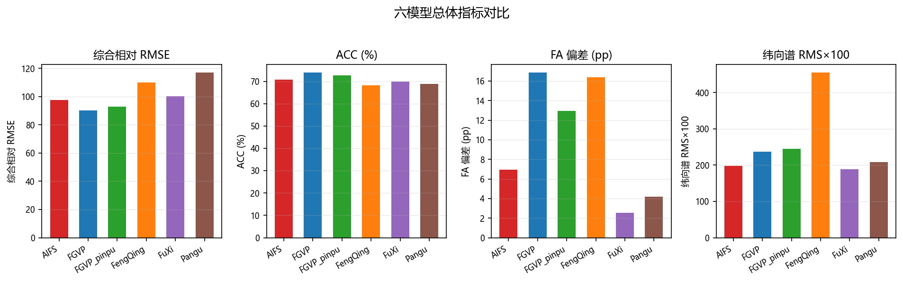
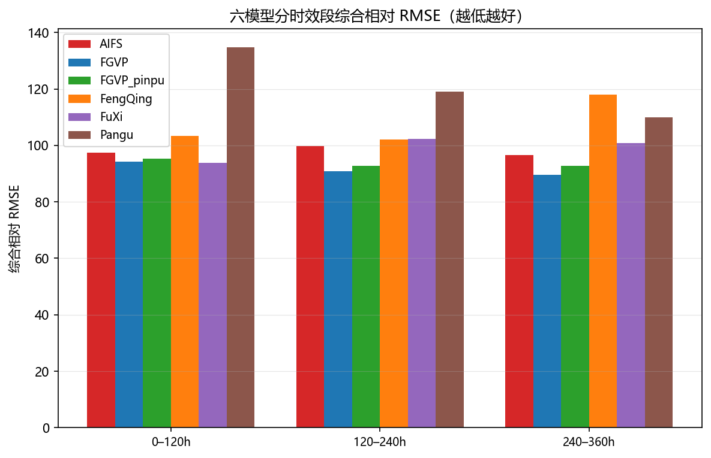
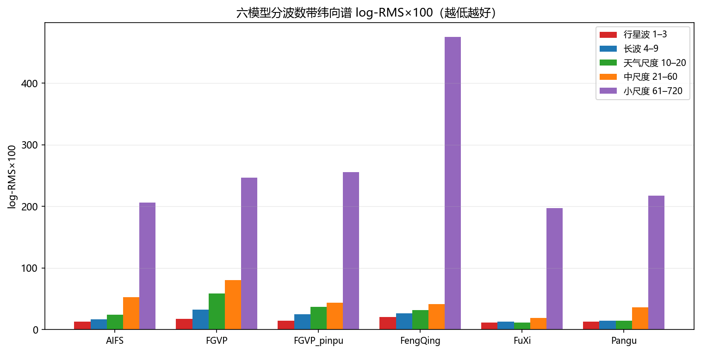
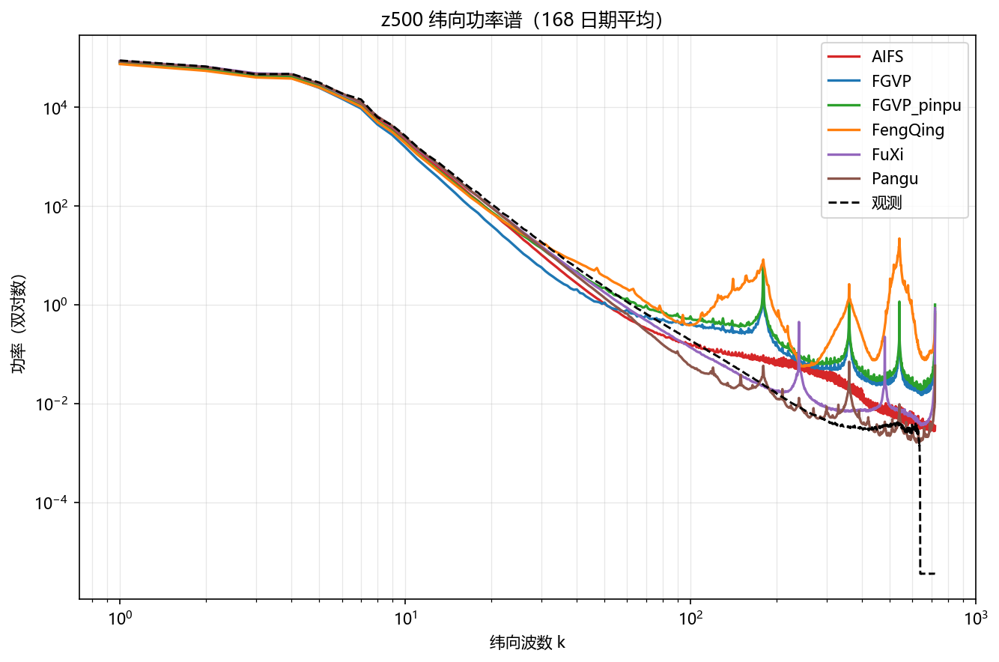
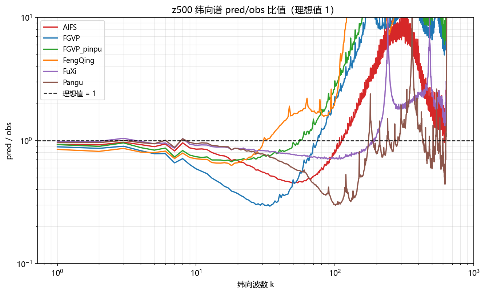

# XMETAI single（确定性版本）评估检验补充报告

AIFS、FGVP、FGVP_pinpu、FengQing、FuXi、Pangu 六模型输出与纬向 FFT、球谐谱补充分析

数据归档：AIFS / FGVP / FGVP_pinpu / FengQing / FuXi / Pangu 六个 single 批次归档

报告日期：20251215    模型：AIFS、FGVP、FGVP_pinpu、FengQing、FuXi、Pangu    评估层级：输出级复核

**报告性质：补充分析。本报告不修订、不替代原输出级评估检验报告，仅补充六个 single 输出的统一重算、纬向 FFT 和球谐带功率谱结果。**

# 1. 结论摘要

• 六个归档完整性检查通过，共同日期 168 天（20250701–20251215），全部模型 `n_ok = n_dates`，无失败起报点。
• 综合相对 RMSE 最好 FGVP（90.290），最差 Pangu（116.911）；ACC 最高 FGVP（73.843%）。
• 幅度真实性（FA 偏差）最好 FuXi（2.5476 pp），最差 FGVP（16.8454 pp）。
• 纬向 FFT 谱（全波数 1–720）log-RMS×100 最小 FuXi（189.07），最大 FengQing（454.67）；匹配尺度 1–128 口径下最小 FuXi（23.37）。
• 球谐带功率谱：归档未含 `spherical_bands_*` 文件（`vfc/metrics/spectrum.py` 只有纬向 FFT，球谐带功率暂无代码支撑），**本批未出**。
• 主模型 FGVP_pinpu 相对 FGVP：纬向谱 log-RMS×100 236.98 → 245.15，变差 8.17；综合相对 RMSE 90.290 → 92.813。
• 异常变量检查：Pangu 的 q700 RMSE 为其余模型中位数的 3.11 倍，超出 3× 阈值，详见 6.1。
• 选型取向：精度优先看综合相对 RMSE（FGVP），幅度与谱真实性优先看 FA 偏差（FuXi）与纬向谱（FuXi），三者不一定指向同一模型。

# 2. 数据范围与检验口径

| **模型** | **日期数** | **日期范围** | **共同日期** | **核心文件缺失** | **RMSE NaN（全区间）** |
| --- | --- | --- | --- | --- | --- |
| AIFS | 169 | 20250701–20251216 | 168 | 无 | 无 |
| FGVP | 184 | 20250701–20251231 | 168 | 无 | 15（全区间） |
| FGVP_pinpu | 168 | 20250701–20251215 | 168 | 无 | 无 |
| FengQing | 169 | 20250701–20251216 | 168 | 无 | 无 |
| FuXi | 184 | 20250701–20251231 | 168 | 无 | 15（全区间） |
| Pangu | 169 | 20250701–20251216 | 168 | 无 | 无 |

FGVP 的 15 天 RMSE 为 NaN（20251217–20251231）全部落在共同窗口之外，不影响本报告任何统计。
FuXi 的 15 天 RMSE 为 NaN（20251217–20251231）全部落在共同窗口之外，不影响本报告任何统计。

所有统计均使用六个模型的共同168天和60个 lead（6–360h）。RMSE 使用12个共同变量；FA 使用所有模型都提供的六个变量：u10m、u850、v10m、v850、ws850、z500；功率谱使用七个变量：msl、t2m、t700、u850、v850、ws850、z500。全部六个模型在整个共同日期区间上都有完整归档，无缺席模型。

## 2.1 指标定义

| **指标** | **计算方式** | **方向** |
| --- | --- | --- |
| 综合相对 RMSE | 每个日期、每个变量先除以六模型几何均值，再对12个变量取几何平均；100 为六模型基线。 | 越低越好 |
| ACC | z500 每个日期60个 lead 的平均 ACC，再对所有日期取平均。 | 越高越好 |
| FA 偏差 | 六个变量、全部 lead 的 \|pred/obs−1\|，再按日期和要素平均，单位 pp。 | 越低越好 |
| 纬向谱 log-RMS×100 | 对七个变量的纬向 FFT 谱计算 RMS[ln(pred/obs)]×100；报告同时给出全波数 1–720 和匹配尺度 1–128。 | 越低越好 |
| 球谐带 log-RMS×100 | 五个球谐总阶数频带上计算 RMS[ln(pred/obs)]×100，是所有日期、变量、lead 的总均方根。 | 越低越好；本批未出 |
| 球谐带比偏差 | 所有频带、变量、lead 与日期上的 mean \|pred/obs−1\|，单位 %。 | 越低越好；本批未出 |

配对比较采用168个日度样本的 Wilcoxon 符号秩检验，并对同一指标族的15个模型对做 Holm 多重校正。统计显著不代表业务重要性。

# 3. 总体结果

| **模型** | **综合相对RMSE** | **ACC (%)** | **FA偏差 (pp)** | **纬向谱 RMS×100** | **球谐谱 RMS×100** | **球谐比偏差 (%)** |
| --- | --- | --- | --- | --- | --- | --- |
| FGVP | 90.290 | 73.843 | 16.8454 | 236.98 | — | — |
| FGVP_pinpu | 92.813 | 72.566 | 12.9546 | 245.15 | — | — |
| AIFS | 97.547 | 70.723 | 6.9712 | 197.73 | — | — |
| FuXi | 100.177 | 69.904 | 2.5476 | 189.07 | — | — |
| FengQing | 110.132 | 68.137 | 16.3585 | 454.67 | — | — |
| Pangu | 116.911 | 68.886 | 4.1924 | 208.22 | — | — |

相关图：

图 1：六模型的综合相对 RMSE、ACC、FA 偏差与纬向谱 log-RMS×100 对比（共同日期平均，柱高越低越好，ACC 除外）。

## 3.1 排序随评价目标变化

| **评价口径** | **模型排序（平均秩，越低越好）** | **第一** | **解释** |
| --- | --- | --- | --- |
| RMSE + ACC + FA | FGVP 2.67 = FGVP_pinpu 2.67 < AIFS 3.00 = FuXi 3.00 < Pangu 4.33 < FengQing 5.33 | FGVP、FGVP_pinpu（二者并列 2.67） | 只看精度、相关与幅度，不看谱分布 |
| RMSE + ACC + FA + 球谐带功率谱 | — | — | 球谐带功率谱本批未出，该口径无法计算；下表用纬向 FFT 谱代替 |
| RMSE + ACC + FA + 纬向 FFT 谱 | FuXi 2.50 < AIFS 2.75 < FGVP 3.00 < FGVP_pinpu 3.25 < Pangu 4.00 < FengQing 5.50 | FuXi | 在上一口径基础上加入纬向 FFT 谱保真度 |

这里的“平均秩”只是各项指标的等权汇总，不代替业务权重；写“=”表示两模型在该口径下平均秩并列，不代表指标完全相同。加入纬向谱后平均秩最低的是 FuXi，不含谱口径是 FGVP、FGVP_pinpu（二者并列 2.67），两者不是同一组，说明谱保真度会改变模型取舍。两套口径的头部都出现并列，说明这组模型的整体水平接近，排名对指标权重的敏感度高，选型时需明确以哪一类应用为准。

# 4. RMSE 与时效表现

| **变量** | **AIFS** | **FGVP** | **FGVP_pinpu** | **FengQing** | **FuXi** | **Pangu** | **最佳** |
| --- | --- | --- | --- | --- | --- | --- | --- |
| msl | 479.9620 | 437.6767 | 450.2348 | 465.5104 | 489.7317 | 500.9796 | FGVP |
| q700 | 1.3611 | 1.3110 | 1.3485 | 1.5652 | 1.4747 | 4.4053 | FGVP |
| t2m | 1.9518 | 1.8467 | 1.8858 | 2.2653 | 2.0151 | 2.0845 | FGVP |
| t700 | 2.2197 | 2.0762 | 2.1724 | 2.9568 | 2.2916 | 2.3579 | FGVP |
| t850 | 2.4471 | 2.2875 | 2.4043 | 2.9899 | 2.5127 | 2.6176 | FGVP |
| u10m | 3.1702 | 2.8405 | 2.9209 | 3.1942 | 3.2412 | 3.3156 | FGVP |
| u850 | 4.5453 | 4.0952 | 4.2279 | 6.2858 | 4.6765 | 4.7849 | FGVP |
| v10m | 3.3368 | 3.0098 | 3.0947 | 3.3210 | 3.4114 | 3.4808 | FGVP |
| v850 | 4.5794 | 4.1224 | 4.2554 | 4.8132 | 4.7179 | 4.7960 | FGVP |
| ws10m | 2.3267 | 2.2433 | 2.2313 | 2.4335 | 2.3219 | 2.3854 | FGVP_pinpu |
| ws850 | 3.9240 | 3.7419 | 3.7631 | 5.0509 | 3.9823 | 4.0789 | FGVP |
| z500 | 502.4707 | 457.0878 | 475.7681 | 496.5850 | 514.1336 | 525.6539 | FGVP |

全局第一为 FGVP（综合相对 RMSE 90.290）；逐变量看，FGVP 在 11 个变量上最优、FGVP_pinpu 在 1 个变量上最优。逐变量 Wilcoxon 配对检验（未做多重校正，只作方向性提示）：AIFS vs FGVP 为 0 : 12（0 个变量无显著差异）；AIFS vs FGVP_pinpu 为 0 : 12（0 个变量无显著差异）；AIFS vs FengQing 为 9 : 2（1 个变量无显著差异）；AIFS vs FuXi 为 11 : 0（1 个变量无显著差异）；AIFS vs Pangu 为 12 : 0（0 个变量无显著差异）；FGVP vs FGVP_pinpu 为 11 : 1（0 个变量无显著差异）；FGVP vs FengQing 为 12 : 0（0 个变量无显著差异）；FGVP vs FuXi 为 12 : 0（0 个变量无显著差异）；FGVP vs Pangu 为 12 : 0（0 个变量无显著差异）；FGVP_pinpu vs FengQing 为 12 : 0（0 个变量无显著差异）；FGVP_pinpu vs FuXi 为 12 : 0（0 个变量无显著差异）；FGVP_pinpu vs Pangu 为 12 : 0（0 个变量无显著差异）；FengQing vs FuXi 为 4 : 8（0 个变量无显著差异）；FengQing vs Pangu 为 5 : 6（1 个变量无显著差异）；FuXi vs Pangu 为 12 : 0（0 个变量无显著差异）。

## 4.1 分时效综合相对 RMSE

| **时效段** | **AIFS** | **FGVP** | **FGVP_pinpu** | **FengQing** | **FuXi** | **Pangu** | **最佳** |
| --- | --- | --- | --- | --- | --- | --- | --- |
| 0–120h | 97.423 | 94.209 | 95.283 | 103.379 | 93.722 | 134.685 | FuXi |
| 120–240h | 99.663 | 90.847 | 92.812 | 102.073 | 102.190 | 119.099 | FGVP |
| 240–360h | 96.621 | 89.533 | 92.751 | 117.903 | 100.791 | 109.889 | FGVP |

口径与第 3 节一致：逐 lead 先按变量做几何均值归一，再对 12 个共享变量等权平均；未排除任何变量。

分时效看，0–120h 首选 FuXi；120–240h 首选 FGVP；240–360h 首选 FGVP。短时效与中长时效的领先者未必是同一个模型，选型时应按实际预报时效长度取。

图 2：六模型分时效段（6–120h / 126–240h / 246–360h）的综合相对 RMSE 对比。

# 5. 功率谱检验

归档保留两套功率谱定义：纬向 FFT 谱（`spectrum_*`）和球谐带功率（`spherical_bands_*`）。两者都只使用功率或功率谱，不包含相位；本报告分别给出完整结果，不用一套指标替代另一套。归档未含 `spherical_bands_*` 文件（`vfc/metrics/spectrum.py` 只有纬向 FFT，球谐带功率暂无代码支撑），**本批未出**。

## 5.1 球谐带分频结果

归档未含 `spherical_bands_*` 文件（`vfc/metrics/spectrum.py` 只有纬向 FFT，球谐带功率暂无代码支撑），**本批未出**。因此本节无表、无图，保留节位以便将来补数后直接填入。

## 5.2 球谐带分变量结果

归档未含 `spherical_bands_*` 文件（`vfc/metrics/spectrum.py` 只有纬向 FFT，球谐带功率暂无代码支撑），**本批未出**。本节同 5.1，一并留空。

## 5.3 球谐带配对检验

归档未含 `spherical_bands_*` 文件（`vfc/metrics/spectrum.py` 只有纬向 FFT，球谐带功率暂无代码支撑），**本批未出**。本节同 5.1，一并留空。

## 5.4 纬向 FFT 功率谱（完整）

纬向 FFT 对每个纬圈做一维 rFFT，经度方向波数 k=1..720，k=0 的纬向平均已置零。纬向谱与球谐谱不是同一种变换：纬向谱保留完整 1–720 波数，球谐带只汇总到总阶数 128。为避免把超高频近零观测功率的影响与可训练频带混为一谈，本节同时给出全波数和 1–128 匹配尺度结果。

| **口径** | **AIFS** | **FGVP** | **FGVP_pinpu** | **FengQing** | **FuXi** | **Pangu** | **最佳** | **解释** |
| --- | --- | --- | --- | --- | --- | --- | --- | --- |
| 全波数 1–720 | 197.73 | 236.98 | 245.15 | 454.67 | 189.07 | 208.22 | FuXi | 包含极高波数；受近零观测功率与数值端点影响较大 |
| 匹配尺度 1–128 | 62.72 | 78.52 | 56.78 | 48.19 | 23.37 | 65.44 | FuXi | 与球谐损失的最高阶数同范围，适合与球谐带对照 |

## 5.4.1 五个波数带结果

| **波数带** | **AIFS logRMS** | **AIFS 能量比** | **FGVP logRMS** | **FGVP 能量比** | **FGVP_pinpu logRMS** | **FGVP_pinpu 能量比** | **FengQing logRMS** | **FengQing 能量比** | **FuXi logRMS** | **FuXi 能量比** | **Pangu logRMS** | **Pangu 能量比** | **最佳** |
| --- | --- | --- | --- | --- | --- | --- | --- | --- | --- | --- | --- | --- | --- |
| 行星波 1–3 | 13.09 | 0.9423 | 17.77 | 0.8898 | 14.66 | 0.9283 | 20.47 | 0.8470 | 11.80 | 1.0048 | 13.11 | 0.9593 | FuXi |
| 长波 4–9 | 16.62 | 0.9116 | 32.31 | 0.7788 | 24.71 | 0.8347 | 26.54 | 0.7990 | 13.30 | 0.9695 | 14.39 | 0.9450 | FuXi |
| 天气尺度 10–20 | 24.36 | 0.8278 | 58.53 | 0.6079 | 37.36 | 0.7182 | 31.76 | 0.8511 | 11.75 | 0.9257 | 14.84 | 0.9013 | FuXi |
| 中尺度 21–60 | 52.68 | 0.6659 | 80.17 | 0.4958 | 43.55 | 0.6889 | 41.13 | 1.2012 | 19.06 | 0.8649 | 36.12 | 0.7711 | FuXi |
| 小尺度 61–720 | 206.03 | 0.5714 | 246.46 | 0.9825 | 255.61 | 1.2902 | 474.63 | 28.1764 | 197.37 | 0.8169 | 217.21 | 0.4952 | FuXi |

波数带按行星尺度到小尺度划分。log-RMS 最低的模型在行星波段是 FuXi、长波段是 FuXi、天气尺度段是 FuXi、中尺度段是 FuXi、小尺度段是 FuXi；能量比为该波数带内预测谱与观测谱的平均功率之比（先沿波数取平均再相除），越接近 1 表示该尺度上的能量越不偏。高波数段（小尺度 61–720）的 log-RMS 普遍高于低波数段，是纬向谱指标的固有特征：高波数观测功率接近零，比值的对数发散，这一段的绝对值不宜与低波数段直接比较；能量比在同一段仍有意义，因为它不依赖逐波数的分母。

图 3：六模型分波数带（行星波 / 长波 / 天气尺度 / 中尺度 / 小尺度）的纬向谱 log-RMS×100 对比。

## 5.4.2 平均功率谱与比值曲线

下列曲线是168个日度功率谱的平均。黑线为 ERA5，彩色线为六个模型的预测谱；比值为 pred/obs，理想值为 1，图中断面显示范围限定为 0.1–10。变量取 z500。

图 4：z500 纬向功率谱（168 个共同日期平均，双对数坐标）。

图 5：z500 纬向谱 pred/obs 比值随波数的变化（纵轴限定 0.1–10）。

## 5.4.3 1–128 波数逐变量结果

| **变量** | **AIFS** | **FGVP** | **FGVP_pinpu** | **FengQing** | **FuXi** | **Pangu** | **最佳** |
| --- | --- | --- | --- | --- | --- | --- | --- |
| msl | 18.32 | 26.84 | 15.47 | 27.93 | 6.09 | 20.42 | FuXi |
| t2m | 23.26 | 13.79 | 8.50 | 18.22 | 4.04 | 20.88 | FuXi |
| t700 | 96.44 | 96.42 | 41.04 | 95.09 | 47.74 | 96.77 | FGVP_pinpu |
| u850 | 95.01 | 115.16 | 92.74 | 28.77 | 30.40 | 95.74 | FengQing |
| v850 | 84.24 | 114.92 | 89.10 | 43.14 | 25.53 | 78.16 | FuXi |
| ws850 | 70.02 | 98.48 | 75.84 | 25.23 | 21.81 | 68.91 | FuXi |
| z500 | 51.72 | 84.04 | 74.77 | 98.96 | 27.96 | 77.21 | FuXi |

全波数 1–720 口径下的模型排序为 FuXi < AIFS < Pangu < FGVP < FGVP_pinpu < FengQing，1–128 匹配尺度口径下为 FuXi < FengQing < FGVP_pinpu < AIFS < Pangu < FGVP，两者不一致，说明高波数段（近零观测功率主导）会改变排序，涉及业务可训练尺度时应以匹配尺度口径为准。

## 5.5 FGVP_pinpu 相对 FGVP 的频谱专项对比

本节为FGVP_pinpu（主模型）与FGVP（对照）的逐项对比，用于判断频谱优化是否落地。

| **波数带** | **FGVP logRMS** | **FGVP_pinpu logRMS** | **变化（负为好）** | **判定** |
| --- | --- | --- | --- | --- |
| 行星波 1–3 | 17.77 | 14.66 | -3.11 | 改善 |
| 长波 4–9 | 32.31 | 24.71 | -7.61 | 改善 |
| 天气尺度 10–20 | 58.53 | 37.36 | -21.17 | 改善 |
| 中尺度 21–60 | 80.17 | 43.55 | -36.61 | 改善 |
| 小尺度 61–720 | 246.46 | 255.61 | 9.15 | 变差 |

**两种口径的总量**

| **口径** | **FGVP** | **FGVP_pinpu** | **变化（负为好）** |
| --- | --- | --- | --- |
| 全波数 1–720 | 236.98 | 245.15 | 8.17 |
| 匹配尺度 1–128 | 78.52 | 56.78 | -21.74 |
| 综合相对 RMSE | 90.290 | 92.813 | 2.52 |
| ACC (%) | 73.843 | 72.566 | -1.28 |
| FA 偏差 (pp) | 16.8454 | 12.9546 | -3.8907 |

**配对检验（纬向谱 log-RMS，逐日）**：Wilcoxon 符号秩检验 p = 0.0000（Holm 校正后），显著优者为 FGVP。

在全部六个模型中，FGVP_pinpu 的纬向谱 log-RMS×100 排名第 5，FGVP 排名第 4。

# 6. 异常与数据质量风险

## 6.1 Pangu q700 尺度异常（高优先级）

| **Lead (h)** | **AIFS** | **FGVP** | **FGVP_pinpu** | **FengQing** | **FuXi** | **Pangu** | **Pangu / 其余五模型中位数** |
| --- | --- | --- | --- | --- | --- | --- | --- |
| 6 | 0.2609 | 0.2891 | 0.2898 | 0.3018 | 0.2667 | 4.4117 | 15.259 |
| 12 | 0.4548 | 0.4708 | 0.4715 | 0.4989 | 0.4592 | 4.4350 | 9.419 |
| 18 | 0.5043 | 0.5155 | 0.5166 | 0.5512 | 0.5106 | 4.4250 | 8.585 |
| 24 | 0.5979 | 0.6014 | 0.6033 | 0.6484 | 0.6044 | 4.4236 | 7.332 |
| 30 | 0.6269 | 0.6305 | 0.6334 | 0.6812 | 0.6385 | 4.4094 | 6.962 |
| 36 | 0.6954 | 0.6940 | 0.6984 | 0.7546 | 0.7076 | 4.4324 | 6.347 |
| 42 | 0.7161 | 0.7142 | 0.7202 | 0.7765 | 0.7336 | 4.4223 | 6.140 |
| 48 | 0.7714 | 0.7635 | 0.7711 | 0.8325 | 0.7869 | 4.4211 | 5.731 |
| 54 | 0.7915 | 0.7851 | 0.7945 | 0.8551 | 0.8115 | 4.4068 | 5.547 |
| 60 | 0.8408 | 0.8286 | 0.8398 | 0.9049 | 0.8608 | 4.4298 | 5.269 |
| 66 | 0.8581 | 0.8460 | 0.8591 | 0.9230 | 0.8858 | 4.4195 | 5.144 |
| 72 | 0.9053 | 0.8865 | 0.9017 | 0.9692 | 0.9337 | 4.4182 | 4.880 |
| 78 | 0.9271 | 0.9087 | 0.9262 | 0.9925 | 0.9635 | 4.4041 | 4.750 |
| 84 | 0.9706 | 0.9455 | 0.9647 | 1.0350 | 1.0081 | 4.4271 | 4.561 |
| 90 | 0.9898 | 0.9640 | 0.9854 | 1.0546 | 1.0349 | 4.4168 | 4.462 |
| 96 | 1.0342 | 1.0001 | 1.0238 | 1.0959 | 1.0793 | 4.4157 | 4.270 |
| 102 | 1.0587 | 1.0230 | 1.0493 | 1.1207 | 1.1118 | 4.4016 | 4.158 |
| 108 | 1.0984 | 1.0554 | 1.0833 | 1.1588 | 1.1550 | 4.4244 | 4.028 |
| 114 | 1.1180 | 1.0738 | 1.1039 | 1.1803 | 1.1858 | 4.4141 | 3.948 |
| 120 | 1.1600 | 1.1060 | 1.1381 | 1.2195 | 1.2289 | 4.4132 | 3.804 |
| 126 | 1.1846 | 1.1273 | 1.1621 | 1.2449 | 1.2617 | 4.3993 | 3.714 |
| 132 | 1.2202 | 1.1551 | 1.1914 | 1.2796 | 1.2992 | 4.4221 | 3.624 |
| 138 | 1.2388 | 1.1711 | 1.2093 | 1.3006 | 1.3288 | 4.4116 | 3.561 |
| 144 | 1.2783 | 1.1987 | 1.2378 | 1.3376 | 1.3706 | 4.4110 | 3.451 |
| 150 | 1.3026 | 1.2183 | 1.2592 | 1.3634 | 1.4048 | 4.3971 | 3.376 |
| 156 | 1.3365 | 1.2439 | 1.2851 | 1.3960 | 1.4398 | 4.4198 | 3.307 |
| 162 | 1.3545 | 1.2617 | 1.3045 | 1.4156 | 1.4672 | 4.4094 | 3.255 |
| 168 | 1.3915 | 1.2933 | 1.3375 | 1.4510 | 1.5048 | 4.4087 | 3.168 |
| 174 | 1.4150 | 1.3202 | 1.3664 | 1.4764 | 1.5362 | 4.3948 | 3.106 |
| 180 | 1.4467 | 1.3529 | 1.3990 | 1.5082 | 1.5706 | 4.4172 | 3.053 |
| 186 | 1.4642 | 1.3762 | 1.4228 | 1.5287 | 1.5978 | 4.4068 | 3.010 |
| 192 | 1.4993 | 1.4085 | 1.4552 | 1.5659 | 1.6329 | 4.4062 | 2.939 |
| 198 | 1.5215 | 1.4332 | 1.4805 | 1.5957 | 1.6599 | 4.3921 | 2.887 |
| 204 | 1.5496 | 1.4614 | 1.5078 | 1.6307 | 1.6874 | 4.4145 | 2.849 |
| 210 | 1.5633 | 1.4807 | 1.5276 | 1.6552 | 1.7095 | 4.4041 | 2.817 |
| 216 | 1.5960 | 1.5121 | 1.5596 | 1.7000 | 1.7436 | 4.4036 | 2.759 |
| 222 | 1.6146 | 1.5351 | 1.5834 | 1.7381 | 1.7692 | 4.3896 | 2.719 |
| 228 | 1.6379 | 1.5579 | 1.6065 | 1.7858 | 1.7930 | 4.4120 | 2.694 |
| 234 | 1.6471 | 1.5708 | 1.6206 | 1.8242 | 1.8080 | 4.4015 | 2.672 |
| 240 | 1.6747 | 1.5949 | 1.6459 | 1.8897 | 1.8351 | 4.4010 | 2.628 |
| 246 | 1.6887 | 1.6138 | 1.6658 | 1.9465 | 1.8562 | 4.3868 | 2.598 |
| 252 | 1.7071 | 1.6356 | 1.6877 | 2.0108 | 1.8784 | 4.4093 | 2.583 |
| 258 | 1.7124 | 1.6478 | 1.7006 | 2.0625 | 1.8931 | 4.3988 | 2.569 |
| 264 | 1.7369 | 1.6699 | 1.7243 | 2.1290 | 1.9173 | 4.3980 | 2.532 |
| 270 | 1.7493 | 1.6860 | 1.7426 | 2.1839 | 1.9331 | 4.3838 | 2.506 |
| 276 | 1.7654 | 1.7029 | 1.7602 | 2.2204 | 1.9460 | 4.4062 | 2.496 |
| 282 | 1.7702 | 1.7133 | 1.7710 | 2.2448 | 1.9540 | 4.3956 | 2.482 |
| 288 | 1.7951 | 1.7369 | 1.7947 | 2.2618 | 1.9760 | 4.3946 | 2.448 |
| 294 | 1.8075 | 1.7540 | 1.8105 | 2.2666 | 1.9937 | 4.3803 | 2.419 |
| 300 | 1.8234 | 1.7708 | 1.8246 | 2.2679 | 2.0109 | 4.4027 | 2.413 |
| 306 | 1.8260 | 1.7779 | 1.8298 | 2.2666 | 2.0165 | 4.3920 | 2.400 |
| 312 | 1.8484 | 1.7980 | 1.8499 | 2.2880 | 2.0327 | 4.3911 | 2.374 |
| 318 | 1.8580 | 1.8108 | 1.8641 | 2.3084 | 2.0426 | 4.3766 | 2.348 |
| 324 | 1.8704 | 1.8245 | 1.8771 | 2.3418 | 2.0556 | 4.3988 | 2.343 |
| 330 | 1.8701 | 1.8281 | 1.8805 | 2.3668 | 2.0606 | 4.3880 | 2.333 |
| 336 | 1.8899 | 1.8454 | 1.8994 | 2.4157 | 2.0826 | 4.3871 | 2.310 |
| 342 | 1.8976 | 1.8552 | 1.9105 | 2.4546 | 2.0987 | 4.3725 | 2.289 |
| 348 | 1.9068 | 1.8645 | 1.9195 | 2.5038 | 2.1116 | 4.3945 | 2.289 |
| 354 | 1.9038 | 1.8658 | 1.9210 | 2.5371 | 2.1109 | 4.3839 | 2.282 |
| 360 | 1.9215 | 1.8826 | 1.9391 | 2.5915 | 2.1248 | 4.3830 | 2.260 |

Pangu 的 q700 RMSE 是其余模型中位数的 3.11 倍，超出「同量级」的可接受范围（阈值 3×）。该差异在所有 lead 上一致存在，不是个别时效的抖动，更像是量纲/单位或变量定义层面的问题；建议核对 q700 的预报与观测是否使用同一套单位与层次定义后，再采信该变量的结论，并在修复前不要用 q700 参与模型排名。

## 6.2 FA 幅度偏差

六个 FA 变量的幅度偏差（100×mean\|pred/obs−1\|）为：AIFS 6.9712 pp、FGVP 16.8454 pp、FGVP_pinpu 12.9546 pp、FengQing 16.3585 pp、FuXi 2.5476 pp、Pangu 4.1924 pp。偏差最小（幅度最真实）的是 FuXi，偏差最大的是 FGVP。FA 偏差是绝对值口径，丢掉了「偏强/偏弱」的方向，只能说明幅度失真多少，不能据此断言某个模型偏平滑或偏噪；要判方向需回到逐日 pred/obs 比值。

## 6.3 原始场独立复算不足（中高优先级）

本报告的纬向谱、综合相对 RMSE、ACC 与 FA 全部读自各模型归档目录里的逐日结果文件，没有回到原始预报场与观测场做独立复算。归档目录只含 `summary.csv`、`batch_meta.json` 与逐日结果 CSV，不含原始场，这一点无法在本报告内弥补。因此归档生成环节（变量映射、插值、单位换算、谱变换）如果出错，本报告会原样继承且无法自查。结论用于模型间横向比较是充分的；用于绝对谱保真度认定前，建议抽一个日期回到原始场复算一次谱。

## 6.4 ACC 定义风险（中高优先级）

z500 的首时效 ACC 已达 99.978%（最高模型 FGVP 全程 73.843%）。距平相关系数在近端接近饱和，对模型差异几乎不敏感，用它排名会把不同模型压成几乎同分，不能单独作为选型依据；建议与 RMSE、纬向谱三项同看。

# 7. 验收结论与选型建议

| **目标** | **推荐** | **结论依据** |
| --- | --- | --- |
| 综合精度优先（默认） | FGVP | 综合相对 RMSE 最低（90.290） |
| 大尺度形势场 | FGVP | ACC 最高（73.843%） |
| 幅度与谱真实性优先 | FuXi | 纬向谱 log-RMS×100 最低（189.07） |
| 强度与活跃度 | FuXi | FA 偏差最小（2.5476 pp） |
| 多维度均衡 | FuXi | 综合排名分最低（2.50） |
| 暂缓采用 | Pangu | 综合相对 RMSE 最高（116.911） |
| 谱优化版本（FGVP_pinpu） | FGVP_pinpu | 纬向谱 log-RMS×100 245.15，综合相对 RMSE 92.813 |

**总体判定：在 168 个共同日期（20250701–20251215）上，FGVP 的综合相对 RMSE 最低、FGVP 的 ACC 最高、FuXi 的纬向谱保真度最好、FuXi 的幅度最真实；四个口径没有指向同一个模型，验收时应按实际业务目标取权重，不宜只凭单一指标定论。**

# 附录：数据与复算证据

| **项目** | **值** |
| --- | --- |
| 归档文件 | AIFS / FGVP / FGVP_pinpu / FengQing / FuXi / Pangu 六个 single 批次归档 |
| 归档大小 | 1200.9 MB |
| SHA-256 | —（多目录归档，未逐文件计算） |
| 模型 | AIFS、FGVP、FGVP_pinpu、FengQing、FuXi、Pangu |
| 共同日期 | 168 天，20250701–20251215 |
| lead | 60 个，6–360h，间隔 6h |
| 分析结果目录 | report\六模型纬向FFT与球谐谱补充分析报告 |

**本补充报告不修订、不替代原评估报告；全部结论仅来自用户指定归档中的六个 single 输出，归档未含球谐带功率谱文件，相关章节已标注「本批未出」。**

## 附：图件清单

1. `overall_summary.png`（overall_summary）
2. `rmse_by_lead_range.png`（rmse_by_lead_range）
3. `zonal_spectrum_bands.png`（zonal_spectrum_bands）
4. `mean_power_spectrum.png`（mean_power_spectrum）
5. `spectrum_ratio.png`（spectrum_ratio）

