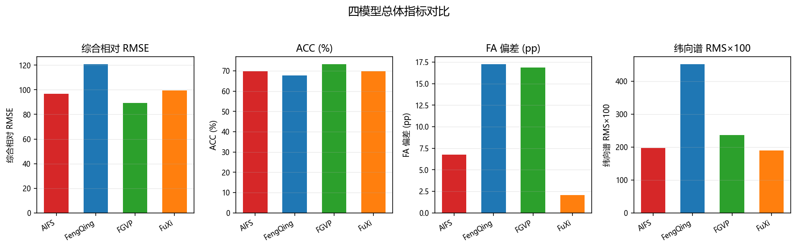
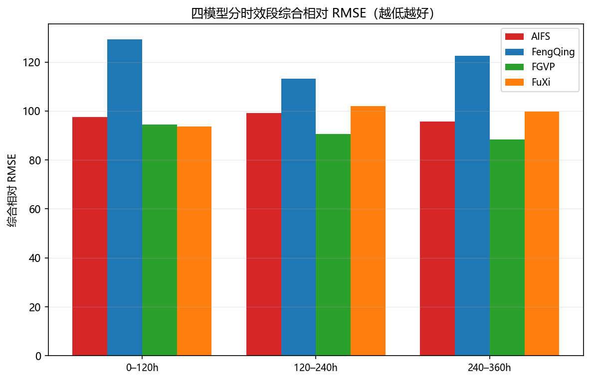
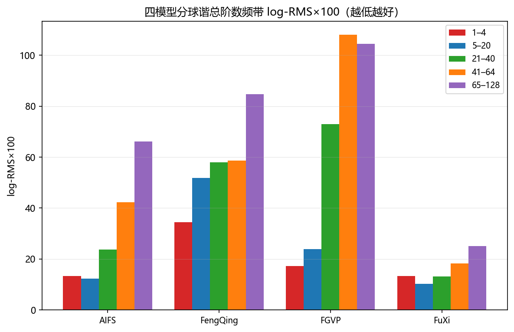
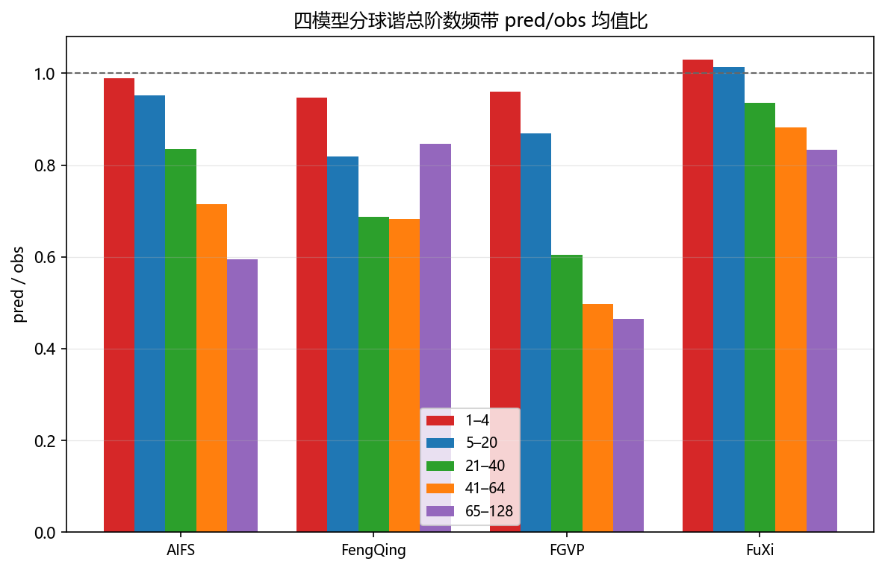
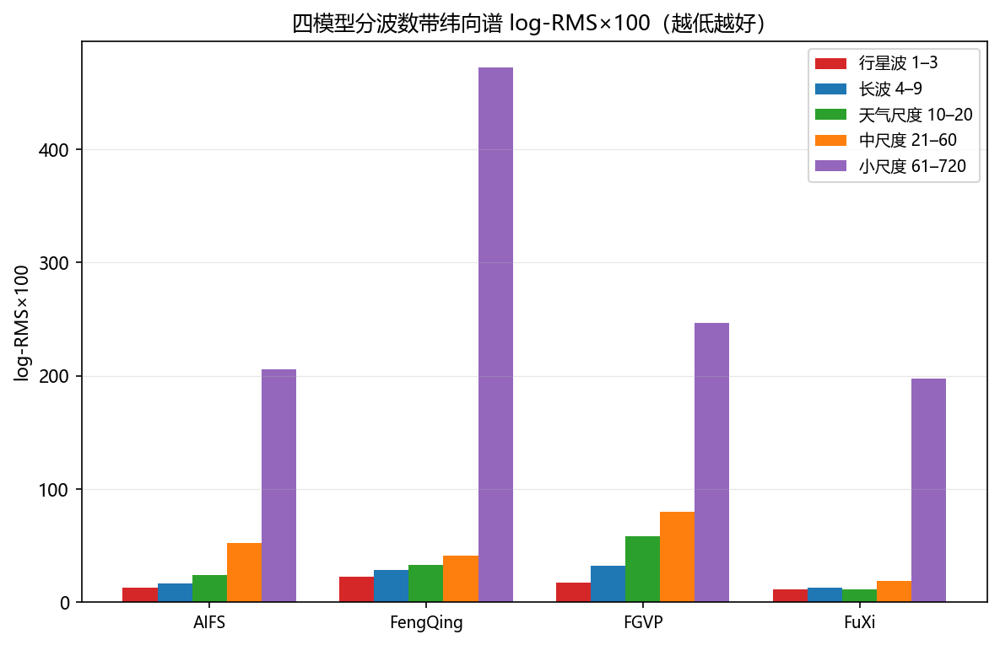
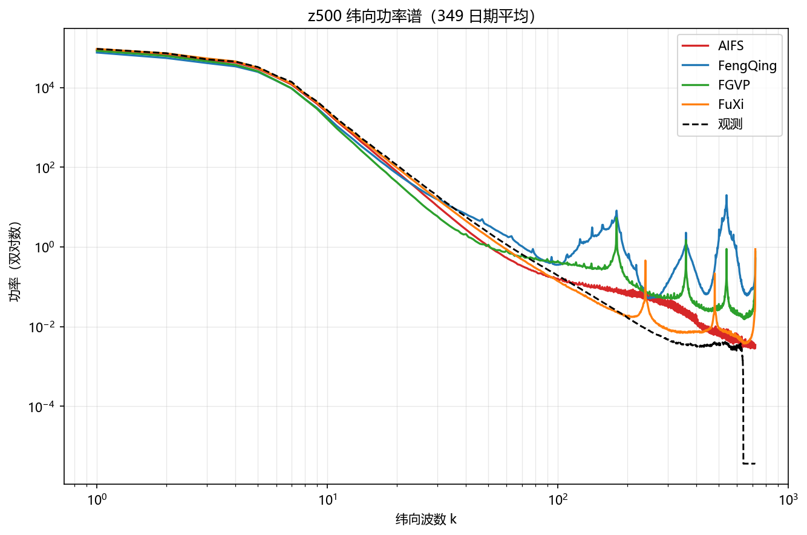
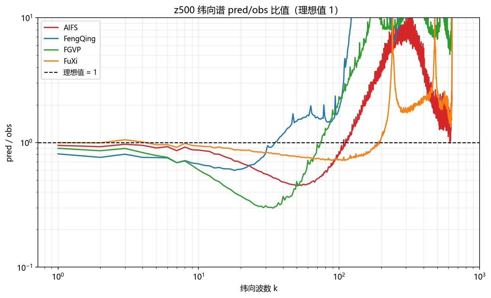

# XMETAI single（确定性版本）评估检验补充报告

AIFS、FGVP、FengQing、FuXi 四模型输出与纬向 FFT、球谐谱补充分析

数据归档：_XMETAI_test_results_single

报告日期：20251216    模型：AIFS、FGVP、FengQing、FuXi    评估层级：输出级复核

**报告性质：补充分析。本报告不修订、不替代原输出级评估检验报告，仅补充四个 single 输出的统一重算、纬向 FFT 和球谐带功率谱结果。**

# 1. 结论摘要

• 四个归档完整性检查通过，共同日期 349 天（20250102–20251216），全部模型 `n_ok = n_dates`，无失败起报点。
• 综合相对 RMSE 最好 FGVP（89.444），最差 FengQing（120.817）；ACC 最高 FGVP（73.327%）。
• 幅度真实性（FA 偏差）最好 FuXi（2.0581 pp），最差 FengQing（17.2689 pp）。
• 纬向 FFT 谱（全波数 1–720）log-RMS×100 最小 FuXi（189.23），最大 FengQing（452.05）；匹配尺度 1–128 口径下最小 FuXi（23.22）。
• 球谐带功率谱（五个球谐总阶数频带）log-RMS×100 最小 FuXi（16.88），最大 FGVP（75.84）；比偏差最小 FuXi（10.86%），最大 FGVP（33.36%）。
• 异常变量检查：FengQing 的 q700 RMSE 为其余模型中位数的 3.06 倍，超出 3× 阈值，详见 6.1。
• 选型取向：精度优先看综合相对 RMSE（FGVP），幅度与谱真实性优先看 FA 偏差（FuXi）与纬向谱（FuXi），三者不一定指向同一模型。

# 2. 数据范围与检验口径

| **模型** | **日期数** | **日期范围** | **共同日期** | **核心文件缺失** | **RMSE NaN（全区间）** |
| --- | --- | --- | --- | --- | --- |
| AIFS | 349 | 20250102–20251216 | 349 | 无 | 无 |
| FGVP | 349 | 20250102–20251216 | 349 | 无 | 无 |
| FengQing | 349 | 20250102–20251216 | 349 | 无 | 无 |
| FuXi | 349 | 20250102–20251216 | 349 | 无 | 无 |

所有统计均使用四个模型的共同349天和60个 lead（6–360h）。RMSE 使用12个共同变量；FA 使用所有模型都提供的六个变量：u10m、u850、v10m、v850、ws850、z500；功率谱使用七个变量：msl、t2m、t700、u850、v850、ws850、z500。全部四个模型在整个共同日期区间上都有完整归档，无缺席模型。

## 2.1 指标定义

| **指标** | **计算方式** | **方向** |
| --- | --- | --- |
| 综合相对 RMSE | 每个日期、每个变量先除以四模型几何均值，再对12个变量取几何平均；100 为四模型基线。 | 越低越好 |
| ACC | z500 每个日期60个 lead 的平均 ACC，再对所有日期取平均。 | 越高越好 |
| FA 偏差 | 六个变量、全部 lead 的 \|pred/obs−1\|，再按日期和要素平均，单位 pp。 | 越低越好 |
| 纬向谱 log-RMS×100 | 对七个变量的纬向 FFT 谱计算 RMS[ln(pred/obs)]×100；报告同时给出全波数 1–720 和匹配尺度 1–128。 | 越低越好 |
| 球谐带 log-RMS×100 | 五个球谐总阶数频带上计算 RMS[ln(pred/obs)]×100，是所有日期、变量、lead 的总均方根。 | 越低越好；球谐带补充谱指标 |
| 球谐带比偏差 | 所有频带、变量、lead 与日期上的 mean \|pred/obs−1\|，单位 %。 | 越低越好 |

配对比较采用349个日度样本的 Wilcoxon 符号秩检验，并对同一指标族的6个模型对做 Holm 多重校正。统计显著不代表业务重要性。

# 3. 总体结果

| **模型** | **综合相对RMSE** | **ACC (%)** | **FA偏差 (pp)** | **纬向谱 RMS×100** | **球谐谱 RMS×100** | **球谐比偏差 (%)** |
| --- | --- | --- | --- | --- | --- | --- |
| FGVP | 89.444 | 73.327 | 16.8789 | 237.23 | 75.84 | 33.36 |
| AIFS | 96.802 | 69.875 | 6.7537 | 197.51 | 37.58 | 20.23 |
| FuXi | 99.454 | 69.720 | 2.0581 | 189.23 | 16.88 | 10.86 |
| FengQing | 120.817 | 67.801 | 17.2689 | 452.05 | 59.80 | 30.92 |

相关图：

图 1：四模型的综合相对 RMSE、ACC、FA 偏差与纬向谱 log-RMS×100 对比（共同日期平均，柱高越低越好，ACC 除外）。

## 3.1 排序随评价目标变化

| **评价口径** | **模型排序（平均秩，越低越好）** | **第一** | **解释** |
| --- | --- | --- | --- |
| RMSE + ACC + FA | FGVP 1.67 < AIFS 2.00 < FuXi 2.33 < FengQing 4.00 | FGVP | 只看精度、相关与幅度，不看谱分布 |
| RMSE + ACC + FA + 球谐带功率谱 | AIFS 2.00 = FuXi 2.00 < FGVP 2.25 < FengQing 3.75 | AIFS、FuXi（二者并列 2.00） | 在上一口径基础上加入球谐带功率谱保真度 |

这里的“平均秩”只是三项指标的等权汇总，不代替业务权重；写“=”表示两模型在该口径下平均秩并列，不代表指标完全相同。加入球谐带功率谱后平均秩最低的是 AIFS、FuXi（二者并列 2.00），不含谱口径是 FGVP，两者不是同一组，说明谱保真度会改变模型取舍。两套口径的头部都出现并列，说明这组模型的整体水平接近，排名对指标权重的敏感度高，选型时需明确以哪一类应用为准。

# 4. RMSE 与时效表现

| **变量** | **AIFS** | **FengQing** | **FGVP** | **FuXi** | **最佳** |
| --- | --- | --- | --- | --- | --- |
| msl | 482.7470 | 466.6112 | 437.2372 | 491.9444 | FGVP |
| q700 | 1.3697 | 4.3656 | 1.3191 | 1.4873 | FGVP |
| t2m | 2.0049 | 2.3071 | 1.8973 | 2.0723 | FGVP |
| t700 | 2.2728 | 2.9787 | 2.1165 | 2.3468 | FGVP |
| t850 | 2.5021 | 3.0188 | 2.3318 | 2.5766 | FGVP |
| u10m | 3.1691 | 3.1743 | 2.8443 | 3.2395 | FGVP |
| u850 | 4.5517 | 6.2446 | 4.1035 | 4.6846 | FGVP |
| v10m | 3.3278 | 3.2907 | 2.9960 | 3.4041 | FGVP |
| v850 | 4.5730 | 4.7711 | 4.1107 | 4.7142 | FGVP |
| ws10m | 2.3164 | 2.4168 | 2.2375 | 2.3149 | FGVP |
| ws850 | 3.9199 | 5.0165 | 3.7428 | 3.9838 | FGVP |
| z500 | 511.4982 | 494.7457 | 462.8146 | 523.1491 | FGVP |

全局第一为 FGVP（综合相对 RMSE 89.444）；逐变量看，FGVP 在 12 个变量上最优。逐变量 Wilcoxon 配对检验（未做多重校正，只作方向性提示）：AIFS vs FengQing 为 8 : 3（1 个变量无显著差异）；AIFS vs FGVP 为 0 : 12（0 个变量无显著差异）；AIFS vs FuXi 为 11 : 0（1 个变量无显著差异）；FengQing vs FGVP 为 0 : 12（0 个变量无显著差异）；FengQing vs FuXi 为 4 : 8（0 个变量无显著差异）；FGVP vs FuXi 为 12 : 0（0 个变量无显著差异）。

## 4.1 分时效综合相对 RMSE

| **时效段** | **AIFS** | **FengQing** | **FGVP** | **FuXi** | **最佳** |
| --- | --- | --- | --- | --- | --- |
| 0–120h | 97.497 | 129.215 | 94.499 | 93.603 | FuXi |
| 120–240h | 99.246 | 113.275 | 90.684 | 101.990 | FGVP |
| 240–360h | 95.763 | 122.457 | 88.283 | 99.840 | FGVP |

口径与第 3 节一致：逐 lead 先按变量做几何均值归一，再对 12 个共享变量等权平均；未排除任何变量。

分时效看，0–120h 首选 FuXi；120–240h 首选 FGVP；240–360h 首选 FGVP。短时效与中长时效的领先者未必是同一个模型，选型时应按实际预报时效长度取。

图 2：四模型分时效段（6–120h / 126–240h / 246–360h）的综合相对 RMSE 对比。

# 5. 功率谱检验

归档保留两套功率谱定义：纬向 FFT 谱（`spectrum_*`）和球谐带功率（`spherical_bands_*`）。两者都只使用功率或功率谱，不包含相位；本报告分别给出完整结果，不用一套指标替代另一套。

## 5.1 球谐带分频结果

| **频带** | **AIFS logRMS** | **AIFS 均值比** | **FengQing logRMS** | **FengQing 均值比** | **FGVP logRMS** | **FGVP 均值比** | **FuXi logRMS** | **FuXi 均值比** | **最佳** |
| --- | --- | --- | --- | --- | --- | --- | --- | --- | --- |
| 1–4 | 13.41 | 0.9885 | 34.53 | 0.9465 | 17.33 | 0.9594 | 13.34 | 1.0292 | FuXi |
| 5–20 | 12.25 | 0.9515 | 51.90 | 0.8189 | 23.91 | 0.8683 | 10.31 | 1.0142 | FuXi |
| 21–40 | 23.75 | 0.8351 | 58.02 | 0.6872 | 73.00 | 0.6040 | 13.22 | 0.9354 | FuXi |
| 41–64 | 42.28 | 0.7156 | 58.69 | 0.6832 | 107.95 | 0.4972 | 18.24 | 0.8828 | FuXi |
| 65–128 | 66.19 | 0.5943 | 84.77 | 0.8465 | 104.44 | 0.4645 | 25.16 | 0.8330 | FuXi |

球谐带 log-RMS×100 最低的模型在1–4 段是 FuXi、5–20 段是 FuXi、21–40 段是 FuXi、41–64 段是 FuXi、65–128 段是 FuXi；均值比是该频带内 pred/obs 的总平均，越接近 1 表示该尺度上的能量越不偏。最高频带（65–128）的总阶数最高、观测功率最小，比值的对数对微小差异最敏感，该频带的 log-RMS 绝对值不宜与低频带直接比较——这是频谱类指标的固有特征，不是模型在该尺度上一定更差；均值比在同一频带仍有意义，因为它不依赖逐点的分母。按频带看，log-RMS 最低的模型分别是AIFS 拿下 0 个频带、FengQing 拿下 0 个频带、FGVP 拿下 0 个频带、FuXi 拿下 5 个频带。

图 3：四模型分球谐总阶数频带（1–4 / 5–20 / 21–40 / 41–64 / 65–128）的球谐带 log-RMS×100 对比。

图 4：四模型分球谐总阶数频带的 pred/obs 均值比对比（虚线为理想值 1）。

## 5.2 球谐带分变量结果

| **变量** | **AIFS** | **FengQing** | **FGVP** | **FuXi** | **最佳** |
| --- | --- | --- | --- | --- | --- |
| msl | 18.75 | 42.45 | 43.18 | 12.29 | FuXi |
| t2m | 11.78 | 15.51 | 13.89 | 6.47 | FuXi |
| t700 | 40.82 | 52.18 | 72.51 | 18.65 | FuXi |
| u850 | 39.41 | 58.86 | 83.48 | 15.84 | FuXi |
| v850 | 45.08 | 67.11 | 92.65 | 20.68 | FuXi |
| ws850 | 29.55 | 70.88 | 68.16 | 13.48 | FuXi |
| z500 | 57.21 | 85.31 | 112.93 | 24.38 | FuXi |

逐变量的球谐带 log-RMS×100 排序为 FuXi（15.97） < AIFS（34.66） < FengQing（56.04） < FGVP（69.54），按 §5.1 的频带口径汇总为 FuXi（16.06） < AIFS（31.57） < FengQing（57.58） < FGVP（65.33），两者一致。两者用的是同一批带功率样本，只是聚合维度不同（这里按变量汇总全部频带，§5.1 按频带汇总全部变量），排序不一致时说明模型间的优劣集中在个别频带上，选型时要指明关注哪一段尺度。

## 5.3 球谐带配对检验

| **指标** | **模型对** | **A相对B** | **Holm p** | **显著** | **胜者** |
| --- | --- | --- | --- | --- | --- |
| 1–4 | AIFS vs FGVP | -22.20 | 0.0000 | 是 | AIFS |
| 1–4 | AIFS vs FengQing | -53.70 | 0.0000 | 是 | AIFS |
| 1–4 | AIFS vs FuXi | -2.89 | 0.0164 | 是 | AIFS |
| 1–4 | FGVP vs FuXi | +24.82 | 0.0000 | 是 | FuXi |
| 1–4 | FengQing vs FGVP | +68.04 | 0.0000 | 是 | FGVP |
| 1–4 | FengQing vs FuXi | +109.75 | 0.0000 | 是 | FuXi |
| 5–20 | AIFS vs FGVP | -47.03 | 0.0000 | 是 | AIFS |
| 5–20 | AIFS vs FengQing | -76.53 | 0.0000 | 是 | AIFS |
| 5–20 | AIFS vs FuXi | +16.59 | 0.0000 | 是 | FuXi |
| 5–20 | FGVP vs FuXi | +120.09 | 0.0000 | 是 | FuXi |
| 5–20 | FengQing vs FGVP | +125.68 | 0.0000 | 是 | FGVP |
| 5–20 | FengQing vs FuXi | +396.69 | 0.0000 | 是 | FuXi |
| 21–40 | AIFS vs FGVP | -66.68 | 0.0000 | 是 | AIFS |
| 21–40 | AIFS vs FengQing | -58.73 | 0.0000 | 是 | AIFS |
| 21–40 | AIFS vs FuXi | +80.00 | 0.0000 | 是 | FuXi |
| 21–40 | FGVP vs FuXi | +440.17 | 0.0000 | 是 | FuXi |
| 21–40 | FengQing vs FGVP | -19.26 | 0.0000 | 是 | FengQing |
| 21–40 | FengQing vs FuXi | +336.15 | 0.0000 | 是 | FuXi |
| 41–64 | AIFS vs FGVP | -59.45 | 0.0000 | 是 | AIFS |
| 41–64 | AIFS vs FengQing | -29.57 | 0.0000 | 是 | AIFS |
| 41–64 | AIFS vs FuXi | +134.35 | 0.0000 | 是 | FuXi |
| 41–64 | FGVP vs FuXi | +477.92 | 0.0000 | 是 | FuXi |
| 41–64 | FengQing vs FGVP | -42.42 | 0.0000 | 是 | FengQing |
| 41–64 | FengQing vs FuXi | +232.74 | 0.0000 | 是 | FuXi |
| 65–128 | AIFS vs FGVP | -37.23 | 0.0000 | 是 | AIFS |
| 65–128 | AIFS vs FengQing | -21.94 | 0.0000 | 是 | AIFS |
| 65–128 | AIFS vs FuXi | +169.66 | 0.0000 | 是 | FuXi |
| 65–128 | FGVP vs FuXi | +329.59 | 0.0000 | 是 | FuXi |
| 65–128 | FengQing vs FGVP | -19.58 | 0.0000 | 是 | FengQing |
| 65–128 | FengQing vs FuXi | +245.46 | 0.0000 | 是 | FuXi |

逐频带在349个日度样本上做 Wilcoxon 符号秩检验，每个频带各自对6个模型对做 Holm 校正（指标是频带本身，同一频带内的模型对构成一个检验族）。全部 30 个「频带 × 模型对」组合里有 30 个达到显著，其余组合的差异被样本量或频带内的离散度淹没；统计显著不代表业务重要性。

## 5.4 纬向 FFT 功率谱（完整）

纬向 FFT 对每个纬圈做一维 rFFT，经度方向波数 k=1..720，k=0 的纬向平均已置零。纬向谱与球谐谱不是同一种变换：纬向谱保留完整 1–720 波数，球谐带只汇总到总阶数 128。为避免把超高频近零观测功率的影响与可训练频带混为一谈，本节同时给出全波数和 1–128 匹配尺度结果。

| **口径** | **AIFS** | **FengQing** | **FGVP** | **FuXi** | **最佳** | **解释** |
| --- | --- | --- | --- | --- | --- | --- |
| 全波数 1–720 | 197.51 | 452.05 | 237.23 | 189.23 | FuXi | 包含极高波数；受近零观测功率与数值端点影响较大 |
| 匹配尺度 1–128 | 62.84 | 47.27 | 78.76 | 23.22 | FuXi | 与球谐损失的最高阶数同范围，适合与球谐带对照 |

## 5.4.1 五个波数带结果

| **波数带** | **AIFS logRMS** | **AIFS 能量比** | **FengQing logRMS** | **FengQing 能量比** | **FGVP logRMS** | **FGVP 能量比** | **FuXi logRMS** | **FuXi 能量比** | **最佳** |
| --- | --- | --- | --- | --- | --- | --- | --- | --- | --- |
| 行星波 1–3 | 12.75 | 0.9443 | 22.47 | 0.8248 | 17.30 | 0.8930 | 11.46 | 1.0073 | FuXi |
| 长波 4–9 | 16.35 | 0.9153 | 28.26 | 0.7841 | 32.28 | 0.7764 | 13.08 | 0.9773 | FuXi |
| 天气尺度 10–20 | 23.99 | 0.8312 | 33.27 | 0.8293 | 58.37 | 0.6092 | 11.41 | 0.9313 | FuXi |
| 中尺度 21–60 | 52.45 | 0.6675 | 40.95 | 1.1634 | 79.93 | 0.4969 | 18.85 | 0.8662 | FuXi |
| 小尺度 61–720 | 205.81 | 0.5705 | 471.87 | 27.3631 | 246.73 | 0.9937 | 197.55 | 0.8182 | FuXi |

波数带按行星尺度到小尺度划分。log-RMS 最低的模型在行星波段是 FuXi、长波段是 FuXi、天气尺度段是 FuXi、中尺度段是 FuXi、小尺度段是 FuXi；能量比为该波数带内预测谱与观测谱的平均功率之比（先沿波数取平均再相除），越接近 1 表示该尺度上的能量越不偏。高波数段（小尺度 61–720）的 log-RMS 普遍高于低波数段，是纬向谱指标的固有特征：高波数观测功率接近零，比值的对数发散，这一段的绝对值不宜与低波数段直接比较；能量比在同一段仍有意义，因为它不依赖逐波数的分母。

图 5：四模型分波数带（行星波 / 长波 / 天气尺度 / 中尺度 / 小尺度）的纬向谱 log-RMS×100 对比。

## 5.4.2 平均功率谱与比值曲线

下列曲线是349个日度功率谱的平均。黑线为 ERA5，彩色线为四个模型的预测谱；比值为 pred/obs，理想值为 1，图中断面显示范围限定为 0.1–10。变量取 z500。

图 6：z500 纬向功率谱（349 个共同日期平均，双对数坐标）。

图 7：z500 纬向谱 pred/obs 比值随波数的变化（纵轴限定 0.1–10）。

## 5.4.3 1–128 波数逐变量结果

| **变量** | **AIFS** | **FengQing** | **FGVP** | **FuXi** | **最佳** |
| --- | --- | --- | --- | --- | --- |
| msl | 18.46 | 29.38 | 26.40 | 6.35 | FuXi |
| t2m | 23.84 | 19.58 | 13.95 | 3.95 | FuXi |
| t700 | 96.80 | 92.80 | 95.81 | 47.68 | FuXi |
| u850 | 94.85 | 27.60 | 116.02 | 30.22 | FengQing |
| v850 | 84.32 | 40.82 | 115.63 | 25.42 | FuXi |
| ws850 | 69.98 | 27.01 | 99.56 | 21.72 | FuXi |
| z500 | 51.65 | 93.70 | 83.92 | 27.21 | FuXi |

全波数 1–720 口径下的模型排序为 FuXi < AIFS < FGVP < FengQing，1–128 匹配尺度口径下为 FuXi < FengQing < AIFS < FGVP，两者不一致，说明高波数段（近零观测功率主导）会改变排序，涉及业务可训练尺度时应以匹配尺度口径为准。

# 6. 异常与数据质量风险

## 6.1 FengQing q700 尺度异常（高优先级）

| **Lead (h)** | **AIFS** | **FengQing** | **FGVP** | **FuXi** | **FengQing / 其余三模型中位数** |
| --- | --- | --- | --- | --- | --- |
| 6 | 0.2620 | 4.3508 | 0.2901 | 0.2676 | 16.260 |
| 12 | 0.4552 | 4.3757 | 0.4713 | 0.4596 | 9.521 |
| 18 | 0.5067 | 4.3673 | 0.5177 | 0.5127 | 8.518 |
| 24 | 0.5991 | 4.3664 | 0.6032 | 0.6059 | 7.239 |
| 30 | 0.6298 | 4.3509 | 0.6335 | 0.6414 | 6.868 |
| 36 | 0.6983 | 4.3758 | 0.6975 | 0.7108 | 6.266 |
| 42 | 0.7199 | 4.3673 | 0.7188 | 0.7378 | 6.067 |
| 48 | 0.7745 | 4.3664 | 0.7679 | 0.7909 | 5.638 |
| 54 | 0.7954 | 4.3509 | 0.7898 | 0.8159 | 5.470 |
| 60 | 0.8445 | 4.3758 | 0.8339 | 0.8655 | 5.182 |
| 66 | 0.8623 | 4.3674 | 0.8523 | 0.8912 | 5.065 |
| 72 | 0.9089 | 4.3665 | 0.8923 | 0.9392 | 4.804 |
| 78 | 0.9306 | 4.3509 | 0.9142 | 0.9693 | 4.675 |
| 84 | 0.9745 | 4.3758 | 0.9519 | 1.0146 | 4.490 |
| 90 | 0.9938 | 4.3673 | 0.9707 | 1.0417 | 4.395 |
| 96 | 1.0374 | 4.3664 | 1.0063 | 1.0863 | 4.209 |
| 102 | 1.0618 | 4.3509 | 1.0290 | 1.1190 | 4.098 |
| 108 | 1.1020 | 4.3757 | 1.0619 | 1.1623 | 3.971 |
| 114 | 1.1215 | 4.3673 | 1.0802 | 1.1932 | 3.894 |
| 120 | 1.1631 | 4.3665 | 1.1120 | 1.2360 | 3.754 |
| 126 | 1.1879 | 4.3511 | 1.1335 | 1.2692 | 3.663 |
| 132 | 1.2248 | 4.3759 | 1.1620 | 1.3086 | 3.573 |
| 138 | 1.2438 | 4.3676 | 1.1782 | 1.3396 | 3.511 |
| 144 | 1.2831 | 4.3668 | 1.2058 | 1.3812 | 3.403 |
| 150 | 1.3072 | 4.3514 | 1.2252 | 1.4155 | 3.329 |
| 156 | 1.3423 | 4.3761 | 1.2516 | 1.4524 | 3.260 |
| 162 | 1.3612 | 4.3678 | 1.2696 | 1.4808 | 3.209 |
| 168 | 1.3992 | 4.3670 | 1.3019 | 1.5190 | 3.121 |
| 174 | 1.4226 | 4.3516 | 1.3287 | 1.5513 | 3.059 |
| 180 | 1.4555 | 4.3763 | 1.3619 | 1.5871 | 3.007 |
| 186 | 1.4727 | 4.3679 | 1.3850 | 1.6147 | 2.966 |
| 192 | 1.5082 | 4.3672 | 1.4173 | 1.6500 | 2.896 |
| 198 | 1.5299 | 4.3517 | 1.4416 | 1.6769 | 2.845 |
| 204 | 1.5587 | 4.3764 | 1.4698 | 1.7051 | 2.808 |
| 210 | 1.5718 | 4.3680 | 1.4893 | 1.7270 | 2.779 |
| 216 | 1.6041 | 4.3672 | 1.5206 | 1.7601 | 2.723 |
| 222 | 1.6225 | 4.3518 | 1.5436 | 1.7854 | 2.682 |
| 228 | 1.6474 | 4.3765 | 1.5673 | 1.8101 | 2.657 |
| 234 | 1.6572 | 4.3681 | 1.5813 | 1.8264 | 2.636 |
| 240 | 1.6863 | 4.3672 | 1.6063 | 1.8529 | 2.590 |
| 246 | 1.7014 | 4.3517 | 1.6255 | 1.8734 | 2.558 |
| 252 | 1.7224 | 4.3764 | 1.6473 | 1.8959 | 2.541 |
| 258 | 1.7291 | 4.3680 | 1.6601 | 1.9107 | 2.526 |
| 264 | 1.7548 | 4.3671 | 1.6825 | 1.9342 | 2.489 |
| 270 | 1.7674 | 4.3516 | 1.6984 | 1.9499 | 2.462 |
| 276 | 1.7851 | 4.3764 | 1.7149 | 1.9638 | 2.452 |
| 282 | 1.7896 | 4.3681 | 1.7248 | 1.9725 | 2.441 |
| 288 | 1.8139 | 4.3673 | 1.7481 | 1.9955 | 2.408 |
| 294 | 1.8248 | 4.3519 | 1.7646 | 2.0142 | 2.385 |
| 300 | 1.8401 | 4.3767 | 1.7810 | 2.0319 | 2.379 |
| 306 | 1.8414 | 4.3685 | 1.7880 | 2.0390 | 2.372 |
| 312 | 1.8636 | 4.3676 | 1.8076 | 2.0553 | 2.344 |
| 318 | 1.8721 | 4.3521 | 1.8202 | 2.0634 | 2.325 |
| 324 | 1.8848 | 4.3769 | 1.8340 | 2.0751 | 2.322 |
| 330 | 1.8838 | 4.3687 | 1.8391 | 2.0806 | 2.319 |
| 336 | 1.9036 | 4.3677 | 1.8570 | 2.1015 | 2.294 |
| 342 | 1.9094 | 4.3521 | 1.8670 | 2.1155 | 2.279 |
| 348 | 1.9193 | 4.3769 | 1.8770 | 2.1270 | 2.280 |
| 354 | 1.9151 | 4.3687 | 1.8795 | 2.1266 | 2.281 |
| 360 | 1.9329 | 4.3676 | 1.8967 | 2.1401 | 2.260 |

FengQing 的 q700 RMSE 是其余模型中位数的 3.06 倍，超出「同量级」的可接受范围（阈值 3×）。该差异在所有 lead 上一致存在，不是个别时效的抖动，更像是量纲/单位或变量定义层面的问题；建议核对 q700 的预报与观测是否使用同一套单位与层次定义后，再采信该变量的结论，并在修复前不要用 q700 参与模型排名。

## 6.2 FA 幅度偏差

六个 FA 变量的幅度偏差（100×mean\|pred/obs−1\|）为：AIFS 6.7537 pp、FengQing 17.2689 pp、FGVP 16.8789 pp、FuXi 2.0581 pp。偏差最小（幅度最真实）的是 FuXi，偏差最大的是 FengQing。FA 偏差是绝对值口径，丢掉了「偏强/偏弱」的方向，只能说明幅度失真多少，不能据此断言某个模型偏平滑或偏噪；要判方向需回到逐日 pred/obs 比值。

## 6.3 原始场独立复算不足（中高优先级）

本报告的纬向谱、综合相对 RMSE、ACC 与 FA 全部读自各模型归档目录里的逐日结果文件，没有回到原始预报场与观测场做独立复算。归档目录只含 `summary.csv`、`batch_meta.json` 与逐日结果 CSV，不含原始场，这一点无法在本报告内弥补。因此归档生成环节（变量映射、插值、单位换算、谱变换）如果出错，本报告会原样继承且无法自查。结论用于模型间横向比较是充分的；用于绝对谱保真度认定前，建议抽一个日期回到原始场复算一次谱。

## 6.4 ACC 定义风险（中高优先级）

z500 的首时效 ACC 已达 99.975%（最高模型 FGVP 全程 73.327%）。距平相关系数在近端接近饱和，对模型差异几乎不敏感，用它排名会把不同模型压成几乎同分，不能单独作为选型依据；建议与 RMSE、纬向谱三项同看。

# 7. 验收结论与选型建议

| **目标** | **推荐** | **结论依据** |
| --- | --- | --- |
| 综合精度优先（默认） | FGVP | 综合相对 RMSE 最低（89.444） |
| 大尺度形势场 | FGVP | ACC 最高（73.327%） |
| 幅度与谱真实性优先 | FuXi | 纬向谱 log-RMS×100 最低（189.23） |
| 强度与活跃度 | FuXi | FA 偏差最小（2.0581 pp） |
| 多维度均衡 | AIFS | 综合排名分最低（2.00） |
| 暂缓采用 | FengQing | 综合相对 RMSE 最高（120.817） |

**总体判定：在 349 个共同日期（20250102–20251216）上，FGVP 的综合相对 RMSE 最低、FGVP 的 ACC 最高、FuXi 的纬向谱保真度最好、FuXi 的幅度最真实；四个口径没有指向同一个模型，验收时应按实际业务目标取权重，不宜只凭单一指标定论。**

# 附录：数据与复算证据

| **项目** | **值** |
| --- | --- |
| 归档文件 | _XMETAI_test_results_single |
| 归档大小 | 668.3 MB |
| SHA-256 | —（多目录归档，未逐文件计算） |
| 模型 | AIFS、FengQing、FGVP、FuXi |
| 共同日期 | 349 天，20250102–20251216 |
| lead | 60 个，6–360h，间隔 6h |
| 分析结果目录 | report\四模型纬向FFT与球谐谱补充分析报告_ref |

**本补充报告不修订、不替代原评估报告；全部结论仅来自用户指定归档中的四个 single 输出，球谐带功率取自归档内 `spherical_bands_<日期>_<变量>.csv`。**

## 附：图件清单

1. `overall_summary.png`（overall_summary）
2. `rmse_by_lead_range.png`（rmse_by_lead_range）
3. `spherical_bands_logrms.png`（spherical_bands_logrms）
4. `spherical_bands_ratio.png`（spherical_bands_ratio）
5. `zonal_spectrum_bands.png`（zonal_spectrum_bands）
6. `mean_power_spectrum.png`（mean_power_spectrum）
7. `spectrum_ratio.png`（spectrum_ratio）

